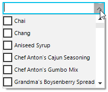
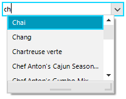
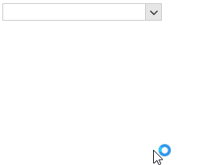

## Environment
 
|Product Version|Product|Author|
|----|----|----|
|2020.3.1020|RadCheckedDropDownList for WinForms|[Desislava Yordanova](https://www.telerik.com/blogs/author/desislava-yordanova)|
 
## Description

[RadCheckedDropDownList]()  combines [RadDropDownList]() and [RadAutoCompleteBox]() in order to provide functionality to check multiple items in the drop down area and tokenize them in the text area.

The [AutoCompleteMode]() property controls the auto-complete behavior and can be set to *None*, *Suggest*, *Append* and *SuggestAppend*. 

Similar to **RadDropDownList**, **RadCheckedDropDownList** also provides two pop ups. The first one is opened when the user presses the arrow button next to the editable area. It lists the content in the **Items** collection and a check box is shown next to each item. The second pop up is displayed when the user starts typing in the editable part and the items that match the user's input are shown in it. However, the displayed suggestions in the auto-complete pop up doesn't show a check box.

|Default drop down|AutoComplete drop down|
|----|----|
||| 

A common requirement is to show a check box next to each item in the auto complete pop up in order to allow the end users to filter the items first and then select multiple items from the sub list.

>caption Figure 1: Checkboxes in AutoComplete Items


## Solution 
 
It can be achieved by using a custom **RadListVisualItem** which contains a **RadCheckBoxElement**. In the CheckedDropDownListElement.AutoCompleteEditableAreaElement.AutoCompleteTextBox.ListElement.**CreatingVisualItem** event, the default visual item can be replaced with the custom one.

````C#
static List<string> checkedItems = new List<string>();

private void RadForm1_Load(object sender, EventArgs e)
{ 
    this.productsTableAdapter.Fill(this.nwindDataSet.Products);
    this.radCheckedDropDownList1.DisplayMember = "ProductName";
    this.radCheckedDropDownList1.DataSource = this.productsBindingSource;

    this.radCheckedDropDownList1.AutoCompleteMode = AutoCompleteMode.Suggest;
    this.radCheckedDropDownList1.CheckedDropDownListElement.AutoCompleteEditableAreaElement.AutoCompleteTextBox.ListElement.CreatingVisualItem 
        += ListElement_CreatingVisualItem;

    this.radCheckedDropDownList1.CheckedDropDownListElement.AutoCompleteEditableAreaElement.AutoCompleteTextBox.AutoCompleteDropDown.PopupClosing 
        += AutoCompleteDropDown_PopupClosing;
    this.radCheckedDropDownList1.CheckedDropDownListElement.AutoCompleteEditableAreaElement.AutoCompleteTextBox.AutoCompleteDropDown.PopupClosed 
        += AutoCompleteDropDown_PopupClosed;
}

private void AutoCompleteDropDown_PopupClosed(object sender, RadPopupClosedEventArgs args)
{
    foreach (RadCheckedListDataItem item in this.radCheckedDropDownList1.Items)
    {
        if (checkedItems.Contains(item.Text) && item.Checked == false)
        {
            item.Checked = true;
        }
    }
}

private void AutoCompleteDropDown_PopupClosing(object sender, RadPopupClosingEventArgs args)
{
    if (this.radCheckedDropDownList1.CheckedDropDownListElement.AutoCompleteEditableAreaElement.AutoCompleteTextBox.AutoCompleteDropDown.Bounds.Contains(Cursor.Position))
    {
        args.Cancel = true;
    }
}

private void ListElement_CreatingVisualItem(object sender, Telerik.WinControls.UI.CreatingVisualListItemEventArgs args)
{
    args.VisualItem = new CustomRadCheckedListVisualItem();
}

public class CustomRadCheckedListVisualItem : RadListVisualItem
{
    public CustomRadCheckedListVisualItem()
    {
    }

    protected override Type ThemeEffectiveType    
    {
        get   
        {
            return typeof(RadListVisualItem);    
        }
    }

    protected virtual RadLabelElement CreateLabelElement()
    {
        return new RadLabelElement();
    }

    protected virtual RadToggleButtonElement CreateCheckBoxElement()
    {
        return new RadCheckBoxElement();
    }

    private RadLabelElement label;
    private RadToggleButtonElement checkBox;
    private StackLayoutPanel stackLayoutPanel;

    protected override void CreateChildElements()
    {
        base.CreateChildElements();

        this.checkBox = this.CreateCheckBoxElement();
        this.label = this.CreateLabelElement();

        this.checkBox.ToggleStateChanging += checkBox_ToggleStateChanging;
        this.label.StretchHorizontally = true;
        this.label.Margin = new System.Windows.Forms.Padding(1, 0, 0, 0);
        this.label.NotifyParentOnMouseInput = false;
        this.label.ShouldHandleMouseInput = false;
        this.label.TextAlignment = System.Drawing.ContentAlignment.MiddleLeft;

        this.stackLayoutPanel = new StackLayoutPanel();
        this.stackLayoutPanel.Orientation = Orientation.Horizontal;
        this.stackLayoutPanel.Children.Add(checkBox);           
        this.stackLayoutPanel.Children.Add(label);
        this.Children.Add(this.stackLayoutPanel);
    }

    private void checkBox_ToggleStateChanging(object sender, StateChangingEventArgs args)
    {
        if (args.NewValue == Telerik.WinControls.Enumerations.ToggleState.On &&
            !checkedItems.Contains(this.Data.Text))
        {
            checkedItems.Add(this.Data.Text);
        }
        else if (checkedItems.Contains(this.Data.Text))
        {
            checkedItems.Remove(this.Data.Text);
        }
    }

    protected override void SynchronizeProperties()
    {
        base.SynchronizeProperties();

        if (!(this.Data is RadListDataItem))
        {
            return;
        }

        this.DrawText = false;
        this.label.Text = this.Data.Text;
    }
}

 
````
````VB.NET
Shared checkedItems As List(Of String) = New List(Of String)()

Private Sub RadForm1_Load(sender As Object, e As EventArgs) Handles MyBase.Load
    Me.ProductsTableAdapter.Fill(Me.NwindDataSet.Products)
    Me.RadCheckedDropDownList1.DisplayMember = "ProductName"
    Me.RadCheckedDropDownList1.DataSource = Me.ProductsBindingSource
    Me.RadCheckedDropDownList1.AutoCompleteMode = AutoCompleteMode.Suggest
    AddHandler Me.RadCheckedDropDownList1.CheckedDropDownListElement.AutoCompleteEditableAreaElement.AutoCompleteTextBox.ListElement.CreatingVisualItem, _
        AddressOf ListElement_CreatingVisualItem
    AddHandler Me.RadCheckedDropDownList1.CheckedDropDownListElement.AutoCompleteEditableAreaElement.AutoCompleteTextBox.AutoCompleteDropDown.PopupClosing, _
        AddressOf AutoCompleteDropDown_PopupClosing
    AddHandler Me.RadCheckedDropDownList1.CheckedDropDownListElement.AutoCompleteEditableAreaElement.AutoCompleteTextBox.AutoCompleteDropDown.PopupClosed, _
        AddressOf AutoCompleteDropDown_PopupClosed
End Sub

Private Sub AutoCompleteDropDown_PopupClosed(ByVal sender As Object, ByVal args As RadPopupClosedEventArgs)
    For Each item As RadCheckedListDataItem In Me.RadCheckedDropDownList1.Items

        If checkedItems.Contains(item.Text) AndAlso item.Checked = False Then
            item.Checked = True
        End If
    Next
End Sub

Private Sub AutoCompleteDropDown_PopupClosing(ByVal sender As Object, ByVal args As RadPopupClosingEventArgs)
    If Me.RadCheckedDropDownList1.CheckedDropDownListElement.AutoCompleteEditableAreaElement.AutoCompleteTextBox.AutoCompleteDropDown.Bounds.Contains(Cursor.Position) Then
        args.Cancel = True
    End If
End Sub

Private Sub ListElement_CreatingVisualItem(ByVal sender As Object, ByVal args As Telerik.WinControls.UI.CreatingVisualListItemEventArgs)
    args.VisualItem = New CustomRadCheckedListVisualItem()
End Sub

Public Class CustomRadCheckedListVisualItem
    Inherits RadListVisualItem

    Public Sub New()
    End Sub

    Protected Overrides ReadOnly Property ThemeEffectiveType As Type
        Get
            Return GetType(RadListVisualItem)
        End Get
    End Property

    Protected Overridable Function CreateLabelElement() As RadLabelElement
        Return New RadLabelElement()
    End Function

    Protected Overridable Function CreateCheckBoxElement() As RadToggleButtonElement
        Return New RadCheckBoxElement()
    End Function

    Private label As RadLabelElement
    Private checkBox As RadToggleButtonElement
    Private stackLayoutPanel As StackLayoutPanel

    Protected Overrides Sub CreateChildElements()
        MyBase.CreateChildElements()
        Me.checkBox = Me.CreateCheckBoxElement()
        Me.label = Me.CreateLabelElement()
        AddHandler Me.checkBox.ToggleStateChanging, AddressOf checkBox_ToggleStateChanging
        Me.label.StretchHorizontally = True
        Me.label.Margin = New System.Windows.Forms.Padding(1, 0, 0, 0)
        Me.label.NotifyParentOnMouseInput = False
        Me.label.ShouldHandleMouseInput = False
        Me.label.TextAlignment = System.Drawing.ContentAlignment.MiddleLeft
        Me.stackLayoutPanel = New StackLayoutPanel()
        Me.stackLayoutPanel.Orientation = Orientation.Horizontal
        Me.stackLayoutPanel.Children.Add(checkBox)
        Me.stackLayoutPanel.Children.Add(label)
        Me.Children.Add(Me.stackLayoutPanel)
    End Sub

    Private Sub checkBox_ToggleStateChanging(ByVal sender As Object, ByVal args As StateChangingEventArgs)
        If args.NewValue = Telerik.WinControls.Enumerations.ToggleState.[On] AndAlso Not checkedItems.Contains(Me.Data.Text) Then
            checkedItems.Add(Me.Data.Text)
        ElseIf checkedItems.Contains(Me.Data.Text) Then
            checkedItems.Remove(Me.Data.Text)
        End If
    End Sub

    Protected Overrides Sub SynchronizeProperties()
        MyBase.SynchronizeProperties()

        If Not (TypeOf Me.Data Is RadListDataItem) Then
            Return
        End If

        Me.DrawText = False
        Me.label.Text = Me.Data.Text
    End Sub
End Class
 

```` 

The achieved behavior is illustrated below:

 

# See Also

* [RadCheckedDropDownList]()
* [AutoCompleteModes]()

