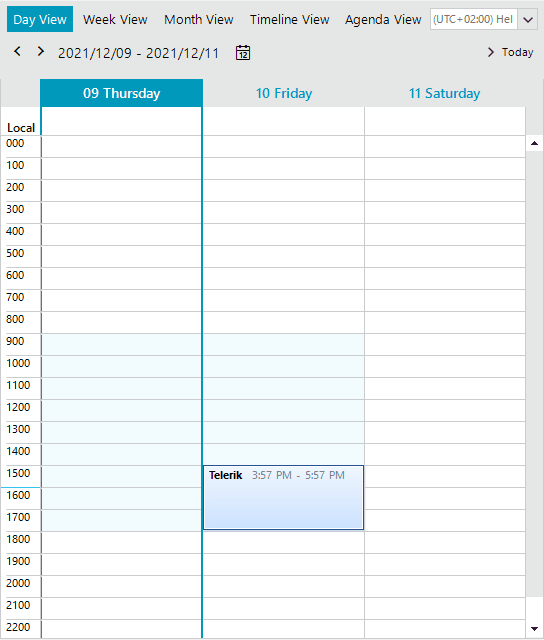

## Environment
<table>
	<tr>
		<td>Product Version</td>
		<td>2021.3.1123</td>
	</tr>
	<tr>
		<td>Product</td>
		<td>RadScheduler for WinForms</td>
	</tr>
</table>


## Description

This tutorial demonstrates how to show a confirmation message box when the appointment resizing has finished. If the end user confirms the changes, they will be applied to the appointment respectively.

## Solution

Create a custom [AppointmentResizingBehavior]() and override its **EndResize** method. If the changes are not confirmed, you should restore the initial start/end. Here is a sample implementation which result is illustrated on the below gif file:
 



````C#

public RadForm1()
{
    InitializeComponent();

    this.radScheduler1.Appointments.Add(new Appointment(DateTime.Now.AddDays(1),TimeSpan.FromHours(2),"Telerik")); 
    this.radScheduler1.SchedulerElement.ResizeBehavior = new CustomAppointmentResizingBehavior(this.radScheduler1.SchedulerElement);
}

public class CustomAppointmentResizingBehavior : AppointmentResizingBehavior
{
    public CustomAppointmentResizingBehavior(SchedulerVisualElement activeOwner) : base(activeOwner)
    {
        owner = activeOwner;
    }

    DateTime start;
    DateTime end;
    bool startResize = false;
    SchedulerVisualElement owner;

    public override bool Resize(Point mousePosition, IEvent appointment)
    { 
        if (! this.owner.Scheduler.SelectionBehavior.IsAppointmentSelected(appointment) || startResize == false)
        {
            startResize = true;
            start = appointment.Start;
            end = appointment.End;
        }
        return base.Resize(mousePosition, appointment);
    }

    public override bool EndResize(IEvent appointment)
    { 
        startResize = false;
        if (appointment!=null && (appointment.Start != start || appointment.End != end))
        {
            DialogResult dr = RadMessageBox.Show("Are you sure?", "Confirm resizing",
                MessageBoxButtons.YesNo, RadMessageIcon.Question);
            if (dr == DialogResult.No)
            {
                appointment.Start = start;
                appointment.End = end;
            }
        }
        return base.EndResize(appointment);
    }
}

````
````VB.NET

Public Sub New()
    InitializeComponent()
    Me.RadScheduler1.Appointments.Add(New Appointment(DateTime.Now.AddDays(1), TimeSpan.FromHours(2), "Telerik"))
    Me.RadScheduler1.SchedulerElement.ResizeBehavior = New CustomAppointmentResizingBehavior(Me.RadScheduler1.SchedulerElement)
End Sub

Public Class CustomAppointmentResizingBehavior
    Inherits AppointmentResizingBehavior

    Public Sub New(ByVal activeOwner As SchedulerVisualElement)
        MyBase.New(activeOwner)
        owner = activeOwner
    End Sub

    Private start As DateTime
    Private [end] As DateTime
    Private startResize As Boolean = False
    Private owner As SchedulerVisualElement

    Public Overrides Function Resize(ByVal mousePosition As Point, ByVal appointment As IEvent) As Boolean
        If Not Me.owner.Scheduler.SelectionBehavior.IsAppointmentSelected(appointment) OrElse startResize = False Then
            startResize = True
            start = appointment.Start
            [end] = appointment.[End]
        End If

        Return MyBase.Resize(mousePosition, appointment)
    End Function

    Public Overrides Function EndResize(ByVal appointment As IEvent) As Boolean
        startResize = False

        If appointment IsNot Nothing AndAlso (appointment.Start <> start OrElse appointment.[End] <> [end]) Then
            Dim dr As DialogResult = RadMessageBox.Show("Are you sure?", "Confirm resizing", MessageBoxButtons.YesNo, RadMessageIcon.Question)

            If dr = DialogResult.No Then
                appointment.Start = start
                appointment.[End] = [end]
            End If
        End If

        Return MyBase.EndResize(appointment)
    End Function
End Class

````

# See Also

* [AppointmentResizingBehavior]()