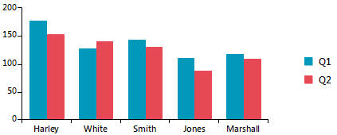
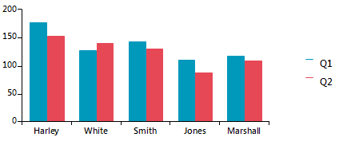

## Environment
 
|Product Version|Product|Author|
|----|----|----|
|2019.2.508|RadChartView for WinForms|[Desislava Yordanova](https://www.telerik.com/blogs/author/desislava-yordanova)|
 

## Description

The **LegendItemElement** in **RadChartView** consists of a **LegendItemTitle** and a **LegendItemMarker**:



A common requirement is to change the square shape of the marker element. This article demonstrates how to achieve it.

## Solution 

Before populating **RadChartView** with data, subscribe to the ChartElement.LegendElement.**VisualItemCreating** event, create the default **LegendItemElement** and assign an **ElementShape** to the ItemElement.MarkerElement.**Shape** property:


#### Apply a HeartShape to legend items

````C#
        public RadForm1()
        {
            InitializeComponent();

            this.radChartView1.ChartElement.LegendElement.VisualItemCreating += LegendElement_VisualItemCreating;

            BarSeries barSeries = new BarSeries("Performance", "RepresentativeName");
            barSeries.LegendTitle = "Q1";
            barSeries.DataPoints.Add(new CategoricalDataPoint(177, "Harley"));
            barSeries.DataPoints.Add(new CategoricalDataPoint(128, "White"));
            barSeries.DataPoints.Add(new CategoricalDataPoint(143, "Smith"));
            barSeries.DataPoints.Add(new CategoricalDataPoint(111, "Jones"));
            barSeries.DataPoints.Add(new CategoricalDataPoint(118, "Marshall"));
            this.radChartView1.Series.Add(barSeries);
            BarSeries barSeries2 = new BarSeries("Performance", "RepresentativeName");
            barSeries2.LegendTitle = "Q2";
            barSeries2.DataPoints.Add(new CategoricalDataPoint(153, "Harley"));
            barSeries2.DataPoints.Add(new CategoricalDataPoint(141, "White"));
            barSeries2.DataPoints.Add(new CategoricalDataPoint(130, "Smith"));
            barSeries2.DataPoints.Add(new CategoricalDataPoint(88, "Jones"));
            barSeries2.DataPoints.Add(new CategoricalDataPoint(109, "Marshall"));
            this.radChartView1.Series.Add(barSeries2);

            this.radChartView1.ShowLegend = true;
        }

        private void LegendElement_VisualItemCreating(object sender, LegendItemElementCreatingEventArgs e)
        {
            e.ItemElement = new LegendItemElement(e.LegendItem);
            e.ItemElement.MarkerElement.Shape = new HeartShape();
        }
       
````
````VB.NET
    
       Public Sub New()
        InitializeComponent()
        AddHandler Me.RadChartView1.ChartElement.LegendElement.VisualItemCreating, AddressOf LegendElement_VisualItemCreating
        Dim barSeries As BarSeries = New BarSeries("Performance", "RepresentativeName")
        barSeries.LegendTitle = "Q1"
        barSeries.DataPoints.Add(New CategoricalDataPoint(177, "Harley"))
        barSeries.DataPoints.Add(New CategoricalDataPoint(128, "White"))
        barSeries.DataPoints.Add(New CategoricalDataPoint(143, "Smith"))
        barSeries.DataPoints.Add(New CategoricalDataPoint(111, "Jones"))
        barSeries.DataPoints.Add(New CategoricalDataPoint(118, "Marshall"))
        Me.RadChartView1.Series.Add(barSeries)
        Dim barSeries2 As BarSeries = New BarSeries("Performance", "RepresentativeName")
        barSeries2.LegendTitle = "Q2"
        barSeries2.DataPoints.Add(New CategoricalDataPoint(153, "Harley"))
        barSeries2.DataPoints.Add(New CategoricalDataPoint(141, "White"))
        barSeries2.DataPoints.Add(New CategoricalDataPoint(130, "Smith"))
        barSeries2.DataPoints.Add(New CategoricalDataPoint(88, "Jones"))
        barSeries2.DataPoints.Add(New CategoricalDataPoint(109, "Marshall"))
        Me.RadChartView1.Series.Add(barSeries2)
        Me.RadChartView1.ShowLegend = True
    End Sub

    Private Sub LegendElement_VisualItemCreating(ByVal sender As Object, ByVal e As LegendItemElementCreatingEventArgs)
        e.ItemElement = New LegendItemElement(e.LegendItem)
        e.ItemElement.MarkerElement.Shape = New HeartShape()
    End Sub
    
````

You can also create your own **ElementShape**. Create a derivative of the **ElementShape** class and override its **CreatePath** method. The following code snippet demonstrates how to draw a single line as it is demonstrated below:



#### Apply a custom LineShape to legend items

````C#

        private void LegendElement_VisualItemCreating(object sender, LegendItemElementCreatingEventArgs e)
        {
            e.ItemElement = new LegendItemElement(e.LegendItem);
            e.ItemElement.MarkerElement.Shape = new LineShape();
        }

        public class LineShape : ElementShape
        {
            public override GraphicsPath CreatePath(Rectangle bounds)
            {
                GraphicsPath path = new GraphicsPath();
                
                Point start = new Point(bounds.X, bounds.Y);
                Point end = new Point(bounds.X + bounds.Width, bounds.Y);
                path.AddLine(start, end);
                return path;
            }
        }
       
````
````VB.NET
    
    Private Sub LegendElement_VisualItemCreating(ByVal sender As Object, ByVal e As LegendItemElementCreatingEventArgs)
        e.ItemElement = New LegendItemElement(e.LegendItem)
        e.ItemElement.MarkerElement.Shape = New LineShape()
    End Sub

    Public Class LineShape
        Inherits ElementShape

        Public Overrides Function CreatePath(ByVal bounds As Rectangle) As GraphicsPath
            Dim path As GraphicsPath = New GraphicsPath()
            Dim start As Point = New Point(bounds.X, bounds.Y)
            Dim [end] As Point = New Point(bounds.X + bounds.Width, bounds.Y)
            path.AddLine(start, [end])
            Return path
        End Function
    End Class
    
````

