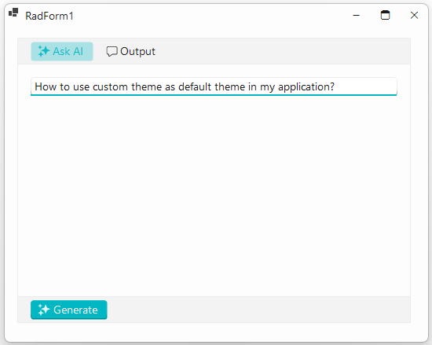
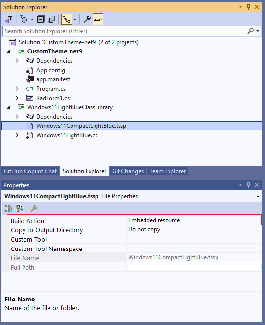
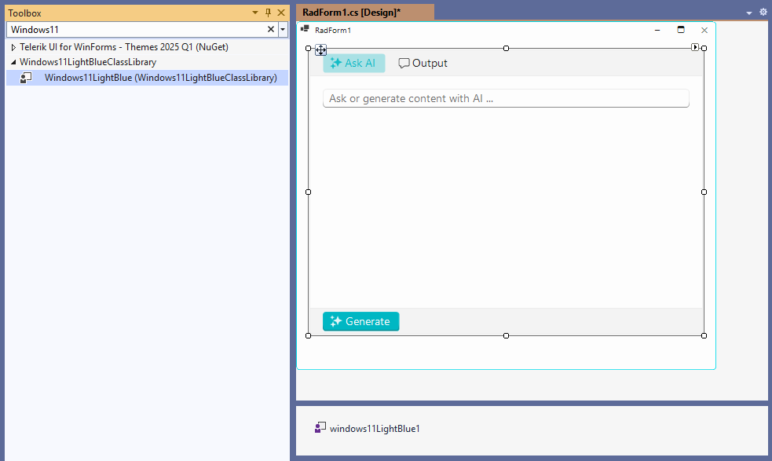

## Environment

|Product Version|Product|Author|
|----|----|----|
|2025.1.211|Theme Tutorials for WinForms|[Nadya Todorova](https://www.telerik.com/blogs/author/nadya-karaivanova)|

## Description

As you may already know, Telerik Presentation Framework allows users to customize any pre-defined themes that Telerik UI for WinForms offers. We provide an opportunity thanks to [Visual Style Builder]() tool to customize the appearance of our controls to achieve the desired style for your application.

Let's pretend, we already have applied customizations and there is a custom theme already setup. For the perpose of this example, I prepared my custom **Windows11CompactLightBlue** theme which overrides the **Windows11Compact** theme. I generate variation by using [Windows11CompactTheme Blending]() feature. I created a theme variation and use LightBlue accent color to provide my theme new fresh look. Now, it is time to start using my custom theme.

This tutorial demonstrates how to use the newly created Windows11CompactLightBlue theme as default theme in my application. 

>caption Figure 1: Using custom theme as default theme in the application:



## Solution

First, it would be necessary to create theme a component. Following the instructions provided in [Creating a theme component](https://docs.telerik.com/devtools/winforms/styling-and-appearance/advanced-topics/adding-custom-redistributable-themes-to-your-application/creating-a-theme-component) article, we should:

1. Add a new Class Library project to the current solution.

2. Add Windows11CompactLightBlue.tssp file into the Library project. It is important to set the **Build Action** of the .tssp to *Embedded Resource*.

3. Add a new Windows11LightBlue class to represent my theme component to the project.


````C#

namespace Windows11LightBlueClassLibrary
{
    public class Windows11LightBlue : RadThemeComponentBase
    {
        static bool loaded;
        public Windows11LightBlue()
        {
            ThemeRepository.RegisterTheme(this);
        }
        public override void Load()
        {
            if (!loaded || this.IsDesignMode)
            {
                loaded = true;
                Assembly resourceAssembly = typeof(Windows11LightBlue).Assembly;
                this.LoadResource(resourceAssembly, "Windows11LightBlueClassLibrary.Windows11CompactLightBlue.tssp");
            }
        }
        public override string ThemeName
        {
            get { return "Windows11CompactLightBlue"; }
        }
    }
}


````

>caption Figure 1: Here is how my ClassLibrary looks:



4. Once the Windows11LightBlueClassLibrary gets ready, we should define the custom Windows11CompactLightBlue theme as default in the entire application. This can be done inside the App.config file of our application. For more information, follow the instrucions defined here: [Custom theme as Default](https://docs.telerik.com/devtools/winforms/styling-and-appearance/default-theme#custom-theme-as-default)

````XML

<?xml version="1.0" encoding="utf-8" ?>
<configuration>
  <startup>
  </startup>
  <appSettings>
    <!--define the custom Windows11CompactLightBlue for the entire application-->
    <add key="TelerikWinFormsThemeName" value="Windows11CompactLightBlue" />
    <add key="TelerikWinFormsThemeType" value="Windows11LightBlueClassLibrary.Windows11LightBlue"/>
    <add key="TelerikWinFormsThemeAssemblyName" value="Windows11LightBlueClassLibrary, Version=1.0.0.0, Culture=neutral, PublicKeyToken=null" />
  </appSettings>
</configuration>

````

5. Build the whole solution. Now, we can find our Windows11CompactLightBlue theme in the VS Toolbox at design time and simply drag-drop it onto RadForm as any other component. You can see the Windows11LightBlue instance in the compoenent tray. From now on, any Telerik control that you add to RadForm would have the custom theme applied automatically.



6. If you do not want to add the theme at design time, you can create an instance of the theme in the start up of the application, for example in Program.cs:

````C#

internal static class Program
{
    /// <summary>
    /// The main entry point for the application.
    /// </summary>
    [STAThread]
    static void Main()
    {
        new Windows11LightBlueClassLibrary.Windows11LightBlue();
        Application.EnableVisualStyles();
        Application.SetCompatibleTextRenderingDefault(false);
        Application.Run(new RadForm1());
    }
}

````

We are finished :partying_face:!  The Windows11CompactLightBlue theme is now used as default for entire application both at design time or run time.


> [!TIP] 
> Complete projects on .NET9 and NET Framework 48 are available in our SDK repo [here].

## See Also

- [Using a default theme for the entire application](https://docs.telerik.com/devtools/winforms/styling-and-appearance/using-a-default-theme-for-the-entire-application#using-a-default-theme-for-the-entire-application)
- [Using custom themes](https://docs.telerik.com/devtools/winforms/styling-and-appearance/using-custom-themes)
