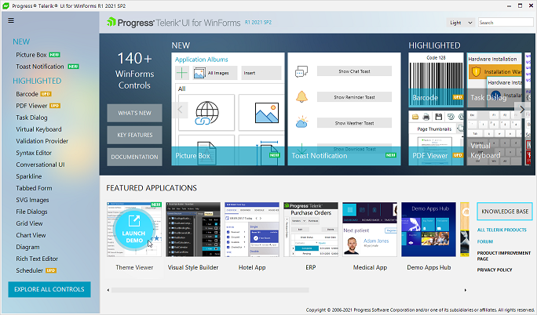
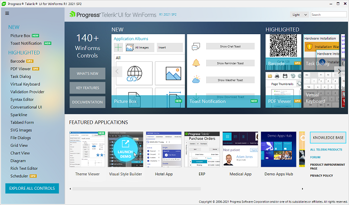
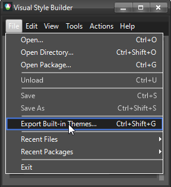
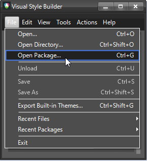
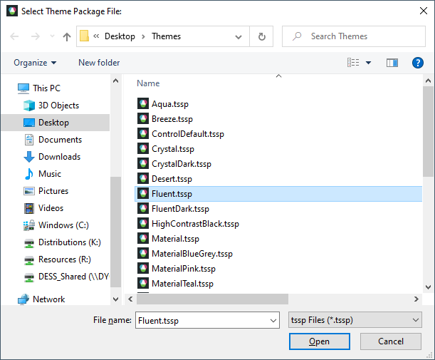
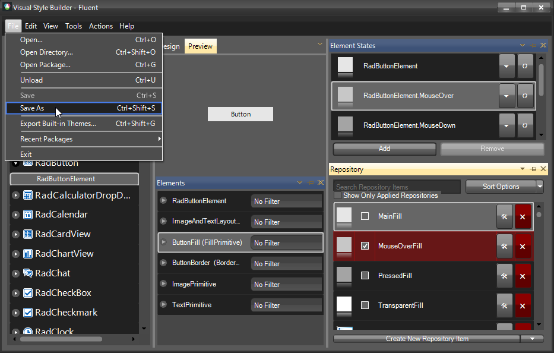
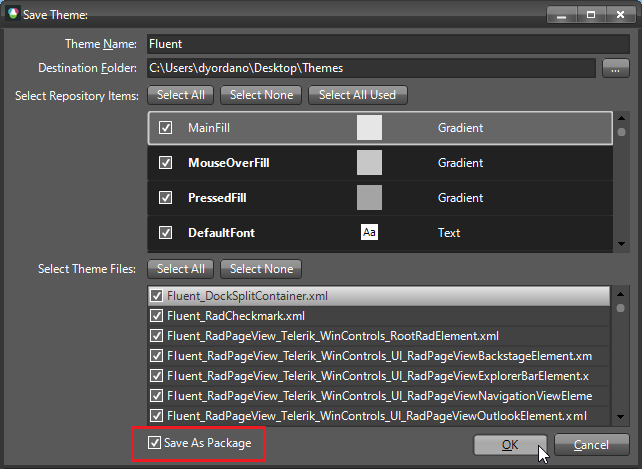

## Environment
|Product Version|Product|Author|
|----|----|----|
|2021.1.223|Visual Style Builder for WinForms|[Desislava Yordanova](https://www.telerik.com/blogs/author/desislava-yordanova)|

## Description

Telerik UI for WinForms suite offers a variety of [built-in themes]() that a developer can use while building an application. This can bring a diverse look and feel to every project. Very often, developers need some custom design according to their requirements. Here comes the benefit of using [custom themes]().

Creating a theme from scratch is a very time-consuming process since you will need to define different style settings for all inner control's elements and element states respectively. That is why, we usually recommend our customers to save a considerable amount of time by updating one of the predefined themes that come out-of-the-box with the installation of the Telerik UI for WinForms suite. The theme can be modified in [Visual Style Builder]().

## Solution

The first step is to choose which theme exactly you are going to customize, e.g. Fluent, Crystal, etc. You can have a look at each separate theme and what design it offers in [Theme Viewer]() which can be started directly from the Demo application:

>caption Starting Theme Viewer

Once you identify which theme is as close as possible to your desired look, we will continue working with [Visual Style Builder]() which also can be started from the Demo application:

>caption Starting Visual Style Builder

An alternative approach to access [Visual Style Builder]() is simply click on the Windows Start button and type "Visual Style Builder". 

Once, the VSB tool is started, follow the illustrated steps:

1\. Export the built-in themes in a local folder:

>caption Export themes

2\. Load the theme you are going to customize, e.g. Fluent:

>caption Load a theme

>caption Choose the Fluent theme package from the just exported themes

Now, you have the Fluent theme loaded in Visual Style Builder:

3\. Customize any style settings that you need. You can apply changes only to certain controls and specific element states. In other words, make the changes you need and keep the rest of the style settings as they are. More information about the changes you can make in VSB is available in the [Working With Visual Style Builder]() section in the online documentation.

4\. Save the changes once you are done with the style settings adjustments and you have achieved the desired look.

Below the grid that displays the XML files you can see a checkbox called **Save As Package**. This option allows you to save the theme as a zipped package encapsulating all XML files checked for saving. Choose to save the theme as a package and a single file with a **.tssp** extension will be generated and stored at the desired location.

5\. Load the modified Fluent theme in your project as a custom theme package and apply it either to a specific control or to the entire application. [Read more...]()

# See Also

* [Change the row hot tracking color in RadGridView by using VSB]()
* [Using Custom Themes]() 
* [Tutorial - Create a Custom Theme Component]()

