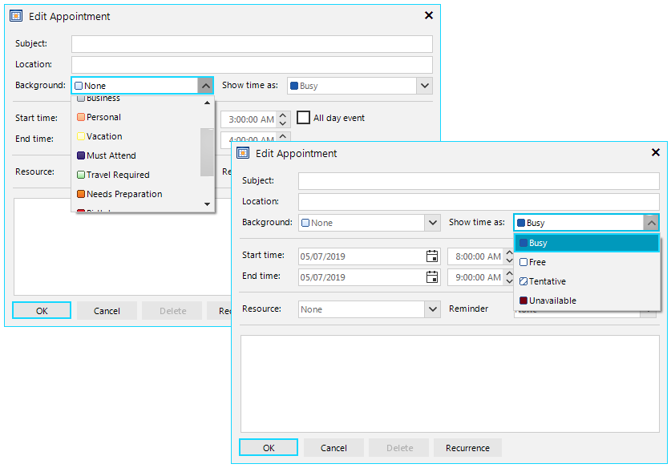
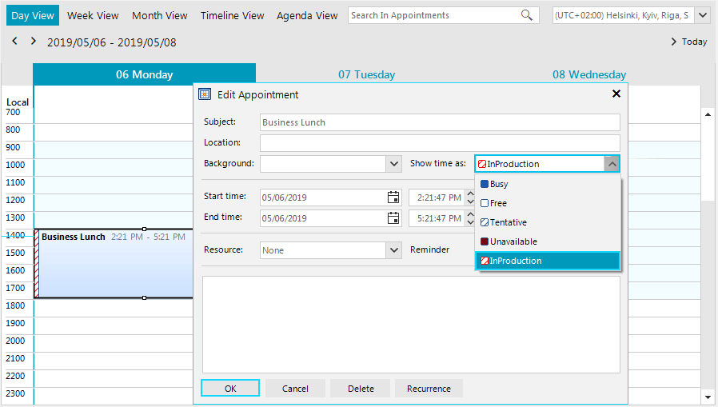
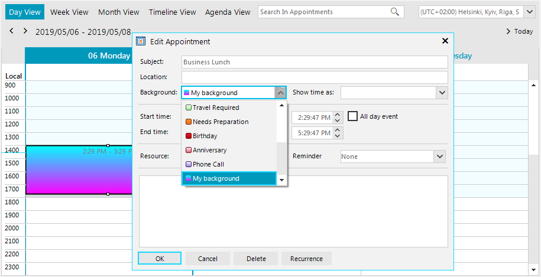

## Environment
 
|Product Version|Product|Author|
|----|----|----|
|2019.1.219|RadScheduler for WinForms|[Desislava Yordanova](https://www.telerik.com/blogs/author/desislava-yordanova)|
 

## Description

**RadScheduler** offers a predefined list of available statuses and backgrounds for its appointments. They are stored in the **Statuses** and **Backgrounds** collections respectively:



However, if none of the available options is suitable for your specific scenario, you can add your custom status or background. 

## Solution 

### Adding a custom status

It is necessary to define a new **AppointmentStatusInfo** instance and specify the status' ID, display name and colors.



#### Define a custom AppointmentStatusInfo

````C#

AppointmentStatusInfo myStatus = new AppointmentStatusInfo(100, "InProduction", Color.Red, Color.White, AppointmentStatusFillType.Hatch);
this.radScheduler1.Statuses.Add(myStatus);
Appointment myEvent = new Appointment(DateTime.Now, TimeSpan.FromHours(3), "Business Lunch");
myEvent.StatusId = 100;  
this.radScheduler1.Appointments.Add(myEvent);      
       
````
````VB.NET
Dim myStatus As AppointmentStatusInfo = New AppointmentStatusInfo(100, "InProduction", Color.Red, Color.White, AppointmentStatusFillType.Hatch)
Me.RadScheduler1.Statuses.Add(myStatus)
Dim myEvent As Appointment = New Appointment(DateTime.Now, TimeSpan.FromHours(3), "Business Lunch")
myEvent.StatusId = 100
Me.RadScheduler1.Appointments.Add(myEvent)   
    
````

### Adding a custom background

It is necessary to define a new **AppointmentBackgroundInfo** instance and specify the background's ID, display name and colors.



#### Define a custom AppointmentBackgroundInfo

````C#

AppointmentBackgroundInfo myBackground = new AppointmentBackgroundInfo(12, "My background", Color.Cyan, Color.Fuchsia);
this.radScheduler1.Backgrounds.Add(myBackground);
Appointment myEvent = new Appointment(DateTime.Now, TimeSpan.FromHours(3), "Business Lunch");
myEvent.BackgroundId = 12;
this.radScheduler1.Appointments.Add(myEvent); 
     
       
````
````VB.NET
Dim myBackground As AppointmentBackgroundInfo = New AppointmentBackgroundInfo(12, "My background", Color.Cyan, Color.Fuchsia)
Me.radScheduler1.Backgrounds.Add(myBackground)
Dim myEvent As Appointment = New Appointment(DateTime.Now, TimeSpan.FromHours(3), "Business Lunch")
myEvent.BackgroundId = 12
Me.radScheduler1.Appointments.Add(myEvent)
    
````

      
    

