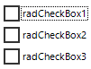
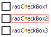

## Environment
 
|Product Version|Product|Author|
|----|----|----|
|2021.3.1123|RadCheckBox for WinForms|[Desislava Yordanova](https://www.telerik.com/blogs/author/desislava-yordanova)|
 
## Description

When the **AllowShowFocusCues** property is enabled for a certain control, pressing the Tab key will indicate that the control is focused by showing a thin dotted rectangular frame. The style of the frame cannot be customized.

>caption Default Focus Cue



However, this article demonstrates a sample approach how to change the color for the dotted focus border:

>caption Customized Color for the Focus Cue



 
## Solution 

Create a derivative of **RadCheckBox** and its **RadCheckBoxElement** and override its **PaintFocusCues** method where the ControlPaint.[DrawFocusRectangle](https://docs.microsoft.com/en-us/dotnet/api/system.windows.forms.controlpaint.drawfocusrectangle?view=windowsdesktop-6.0) method is used. However, we will use the Graphics object and calculated rectangle to draw the focus cue with the desired color:

````C#

public class CustomCheckBox : RadCheckBox
{
    public override string ThemeClassName  
    { 
        get 
        { 
            return typeof(RadCheckBox).FullName;  
        }
    }

    protected override RadButtonElement CreateButtonElement()
    {
        return new CustomRadCheckBoxElement();
    }
}

public class CustomRadCheckBoxElement : RadCheckBoxElement
{
    protected override Type ThemeEffectiveType     
    { 
        get    
        { 
            return typeof(RadCheckBoxElement);     
        }
    }

    protected override void PaintFocusCues(Telerik.WinControls.Paint.IGraphics graphics, Rectangle clipRectange)
    {
        Rectangle focusRect = GetFocusRect();
        if (focusRect.Width <= 0 || focusRect.Height <= 0)
        {
            return;
        }

        Graphics real = (Graphics)graphics.UnderlayGraphics;
        //ControlPaint.DrawFocusRectangle(real, focusRect);
        var pen = new Pen(Color.Red, 1);
        pen.DashStyle = DashStyle.Dot;
        real.DrawRectangle(pen, focusRect.X, focusRect.Y, focusRect.Width-1, focusRect.Height);
    }
}

````
````VB.NET
Public Class CustomCheckBox
    Inherits RadCheckBox

    Public Overrides Property ThemeClassName As String
        Get
            Return GetType(RadCheckBox).FullName
        End Get
        Set(value As String)
            MyBase.ThemeClassName = value
        End Set
    End Property

    Protected Overrides Function CreateButtonElement() As RadButtonElement
        Return New CustomRadCheckBoxElement()
    End Function
End Class

Public Class CustomRadCheckBoxElement
    Inherits RadCheckBoxElement

    Protected Overrides ReadOnly Property ThemeEffectiveType As Type
        Get
            Return GetType(RadCheckBoxElement)
        End Get
    End Property

    Protected Overrides Sub PaintFocusCues(ByVal graphics As Telerik.WinControls.Paint.IGraphics, ByVal clipRectange As Rectangle)
        Dim focusRect As Rectangle = GetFocusRect()

        If focusRect.Width <= 0 OrElse focusRect.Height <= 0 Then
            Return
        End If

        Dim real As Graphics = CType(graphics.UnderlayGraphics, Graphics)
        Dim pen = New Pen(Color.Red, 1)
        pen.DashStyle = DashStyle.Dot
        real.DrawRectangle(pen, focusRect.X, focusRect.Y, focusRect.Width - 1, focusRect.Height)
    End Sub
End Class

````


 

 


    
   
  
    
 
