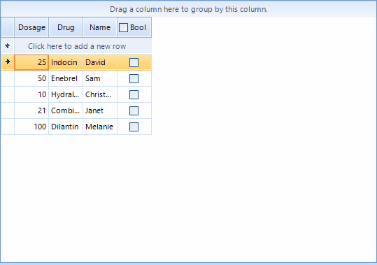

## Environment
 
|Product Version|Product|Author|
|----|----|----|
|2019.1.219|RadGridView for WinForms|[Dimitar Karamfilov](https://www.telerik.com/blogs/author/dimitar-karamfilov)|
 

## Description
 
This article describes how you can change the behavior of the header checkbox in the GridViewCheckBoxColumn. This allows to specify which cell should be checked or perform a completely different action when the checkbox state is changed.  



## Solution 

In this example I am using the value in another cell in order to determine which cells should be changed. I am using the __ShouldCheckDataRows__ property to disable the default behavior. In the HeaderCellToggleStateChanged event handler I am changing the value of the cells that meet specific criteria.


#### Customize the header checkbox behavior

````C#
private void RadForm1_Load(object sender, EventArgs e)
{
    var checkBoxColumn = radGridView1.Columns[3] as GridViewCheckBoxColumn;
    checkBoxColumn.EnableHeaderCheckBox = true;
    checkBoxColumn.ShouldCheckDataRows = false;
    checkBoxColumn.ReadOnly = true;
    radGridView1.HeaderCellToggleStateChanged += RadGridView1_HeaderCellToggleStateChanged;
}

private void RadGridView1_HeaderCellToggleStateChanged(object sender, GridViewHeaderCellEventArgs e)
{
    foreach (GridViewDataRowInfo row in radGridView1.Rows)
    {
        var value = (int)row.Cells[0].Value;
        if (value < 50)
        {
            row.Cells[3].Value = !(bool)row.Cells[3].Value;
        }
    }
}
````
````VB.NET
Private Sub RadForm1_Load(ByVal sender As Object, ByVal e As EventArgs)
	Dim checkBoxColumn = TryCast(radGridView1.Columns(3), GridViewCheckBoxColumn)
	checkBoxColumn.EnableHeaderCheckBox = True
	checkBoxColumn.ShouldCheckDataRows = False
	checkBoxColumn.ReadOnly = True
	AddHandler radGridView1.HeaderCellToggleStateChanged, AddressOf RadGridView1_HeaderCellToggleStateChanged
End Sub

Private Sub RadGridView1_HeaderCellToggleStateChanged(ByVal sender As Object, ByVal e As GridViewHeaderCellEventArgs)
	For Each row As GridViewDataRowInfo In radGridView1.Rows
		Dim value = CInt(Math.Truncate(row.Cells(0).Value))
		If value < 50 Then
			row.Cells(3).Value = Not CBool(row.Cells(3).Value)
		End If
	Next row
End Sub
````