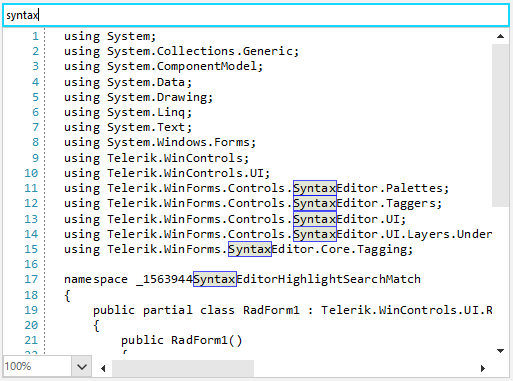
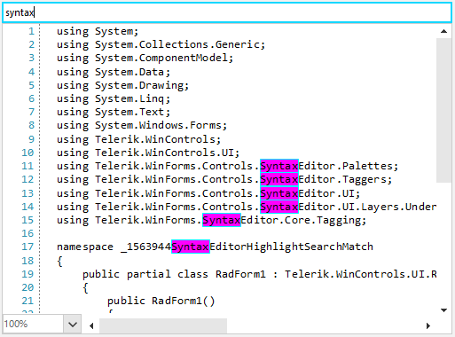

## Environment
 
|Product Version|Product|Author|
|----|----|----|
|2022.1.222|RadSyntaxEditor for WinForms|[Desislava Yordanova](https://www.telerik.com/blogs/author/desislava-yordanova)|


## Description

This article demonstrates how to change the default highlight colors for the [Find and Replace]() functionality in RadSyntaxEditor.

>caption Default Highlight Style
 


## Solution

With the help of a **TextSearchHighlightTagger** RadSyntaxEditor finds the exact matches according to the search criteria. The SyntaxEditorElement.**TextFormatDefinitions** stores a collection of ITextFormatDefinitionKey defining the style (format colors) for different keywords, search results, etc.

We will define a new **TextFormatDefinition** for the **SelectedWordFormatDefinition** of the TextSearchHighlightTagger where the desired border and background colors will be specified:

>caption Customized Highlight Style




````C#     
       
public RadForm1()
{
    InitializeComponent();

    TextFormatDefinition def = new TextFormatDefinition(null,
                               new SolidBrush(Color.Fuchsia),
                               null,
                               new Telerik.WinForms.Controls.SyntaxEditor.UI.Pen(new SolidBrush(Color.Aqua), 1));
    this.radSyntaxEditor1.SyntaxEditorElement.TextFormatDefinitions.Remove("SelectedWordFormatDefinition");
    this.radSyntaxEditor1.SyntaxEditorElement.TextFormatDefinitions.AddLast(TextSearchHighlightTagger.SelectedWordFormatDefinition.Name, def);
}

private void radTextBox1_TextChanged(object sender, EventArgs e)
{
    this.radSyntaxEditor1.SyntaxEditorElement.HighlightAllMatches(this.radTextBox1.Text); 
} 

````
````VB.NET

Public Sub New()
    InitializeComponent()
    Dim def As Telerik.WinForms.Controls.SyntaxEditor.UI.TextFormatDefinition = New TextFormatDefinition(Nothing, New SolidBrush(Color.Fuchsia), _
                                        Nothing, New Telerik.WinForms.Controls.SyntaxEditor.UI.Pen(New SolidBrush(Color.Aqua), 1))
    Me.RadSyntaxEditor1.SyntaxEditorElement.TextFormatDefinitions.Remove("SelectedWordFormatDefinition")
    Me.RadSyntaxEditor1.SyntaxEditorElement.TextFormatDefinitions.AddLast( _
        Telerik.WinForms.Controls.SyntaxEditor.Taggers.TextSearchHighlightTagger.SelectedWordFormatDefinition.Name, def)
End Sub
Private Sub RadTextBox1_TextChanged(sender As Object, e As EventArgs) Handles RadTextBox1.TextChanged
    Me.RadSyntaxEditor1.SyntaxEditorElement.HighlightAllMatches(Me.RadTextBox1.Text)
End Sub

````

# See Also

* [Find and Replace]()
* [How to Achieve Underline Text in RadSyntaxEditor]()
* [How to Achieve Multiple Highlight Rules in SyntaxEditor]()