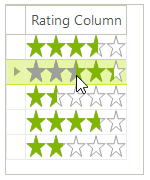
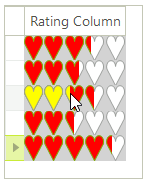

## Environment
 
<table>
    <tr>
        <td>Product Version</td>
        <td>2019.2.618</td>
    </tr>
    <tr>
        <td>Product</td>
        <td>RadGridView for WinForms</td>
    </tr>
    <tr>
        <td>Author</td>
        <td>Nadya Karaivanova</td>
    </tr>
</table>

## Description

By default, [GridViewRatingColumn]() supports star-shaped elements (**RatingStarVisualElements**). A common requirement is to change the shape, e.g. use heart rating elements and apply a certain style to the [hover and value]() elements of the rating. 

>caption Star-shaped rating elements 



## Solution

Following [this]() article for creating custom cell elements, we will create a derivative of the **GridViewRatingColumn** which uses a custom defined cell element that contains a **RadRatingElement** with 5 **RatingHeartVisualElements**. The main steps that need to be performed are:

1. Create a cusom column class that inherits from **GridViewRatingColumn**. Override its **GetCellType** mehtod to replace the default data cell element with the custom one.
2. Create a derivative of the **GridDataCellElement** and in the **CreateChildElements** method add the **RadRatingElement** containing 5 **RatingHeartVisualElements**. Ensure that the cell's value is properly updated when you select a new value from the rating element.
3. Overriding the **IsEditable** property ensures that the cell won't enter edit mode since the rating element offers a permanent one. 
4. Synchronize the **GridViewRatingColumn**'s specific properties with the rating element in the **OnColumnPropertyChanged** method. 
5. Also, we will handle the **CellFormatting** event where to apply red color for the value element and yellow one for the hover element. The background color for the entire rating element will be changed to gray. 

You can find below a complete code snippet which result is illustrated in the below screenshot:

>caption Heart-shaped rating elements 



The custom column's implementation:

#### Custom column

````C#

    public class CustomColumn : GridViewRatingColumn
    {
        public CustomColumn(string fieldName) : base(fieldName)
        {
        }

        public override Type GetCellType(GridViewRowInfo row)
        {
            if (row is GridViewDataRowInfo)
            {
                return typeof(CustomHeartCellElement);
            }
            return base.GetCellType(row);
        }
    }

````
````VB.NET

Public Class CustomColumn
    Inherits GridViewRatingColumn

    Public Sub New(ByVal fieldName As String)
        MyBase.New(fieldName)
    End Sub

    Public Overrides Function GetCellType(ByVal row As GridViewRowInfo) As Type
        If TypeOf row Is GridViewDataRowInfo Then
            Return GetType(CustomHeartCellElement)
        End If

        Return MyBase.GetCellType(row)
    End Function
End Class

````

The custom cell's implementation:

#### Custom cell element

````C#

    public class CustomHeartCellElement : GridDataCellElement
    {
        private RadRatingElement rating;

        public CustomHeartCellElement(GridViewColumn column, GridRowElement row)
            : base(column, row)
        {
            foreach (RatingHeartVisualElement item in this.rating.Items)
            {
                item.Margin = new Padding(0);
            }
        }

        protected override void CreateChildElements()
        {
            base.CreateChildElements();
            this.rating = new RadRatingElement();
            this.rating.StretchHorizontally = true;
            this.rating.StretchVertically = true;
            this.rating.ShouldHandleMouseInput = true;

            this.rating.CaptionElement.Visibility = ElementVisibility.Collapsed;
            this.rating.DescriptionElement.Visibility = ElementVisibility.Collapsed;
            this.rating.SubCaptionElement.Visibility = ElementVisibility.Collapsed;

            this.rating.ValueChanged += ratingElement_ValueChanged;

            for (int i = 0; i < 5; i++)
            {
                RatingHeartVisualElement heart = new RatingHeartVisualElement();
                heart.MinSize = new System.Drawing.Size(10, 10);
                this.rating.Items.Add(heart);
            }
            this.rating.IsInRadGridView = true;

            this.Children.Add(rating);
        }


        protected override void DisposeManagedResources()
        {
            base.DisposeManagedResources();

            this.rating = null;
        }


        protected override void InitializeFields()
        {
            base.InitializeFields();
            this.ShouldHandleMouseInput = false;
            this.ClipDrawing = true;
        }

        public override bool IsEditable
        {
            get
            {
                return false;
            }
        }

        public RadRatingElement RatingElement
        {
            get
            {
                return rating;
            }
        }

        private void ratingElement_ValueChanged(object sender, EventArgs e)
        {
            base.Value = this.rating.Value;
        }

        protected override void OnColumnPropertyChanged(RadPropertyChangedEventArgs e)
        {
            base.OnColumnPropertyChanged(e);

            GridViewRatingColumn column = (GridViewRatingColumn)this.ColumnInfo;

            if (e.Property == GridViewRatingColumn.MaximumProperty)
            {
                this.rating.Maximum = column.Maximum;
            }
            else if (e.Property == GridViewRatingColumn.MinimumProperty)
            {
                this.rating.Minimum = column.Minimum;
            }
            else if (e.Property == GridViewRatingColumn.ShouldPaintHoverProperty)
            {
                this.rating.ShouldPaintHover = column.ShouldPaintHover;
            }
            else if (e.Property == GridViewRatingColumn.SelectionModeProperty)
            {
                this.rating.SelectionMode = column.SelectionMode;
            }
            else if (e.Property == GridViewRatingColumn.ReadOnlyProperty)
            {
                this.rating.ReadOnly = column.ReadOnly;
            }
            else if (e.Property == GridViewRatingColumn.DirectionProperty)
            {
                this.rating.Direction = column.Direction;
            }
            else if (e.Property == GridViewRatingColumn.ToolTipPrecisionProperty)
            {
                this.rating.ToolTipPrecision = column.ToolTipPrecision;
            }
            else if (e.Property == GridViewRatingColumn.PercentageRoundingProperty)
            {
                this.rating.PercentageRounding = column.PercentageRounding;
            }
            else if (e.Property == GridViewRatingColumn.ToolTipFormatStringProperty)
            {
                this.rating.ToolTipFormatString = column.ToolTipFormatString;
            }
        }


        //Attaches the specified data.
        public override void Attach(GridViewColumn data, object context)
        {
            base.Attach(data, context);

            if (this.RowElement != null)
            {
                this.GridViewElement.EditorManager.RegisterPermanentEditorType(typeof(RadRatingElement));
            }
        }

        //Updates the information core.
        protected override void UpdateInfoCore()
        {
            base.UpdateInfoCore();

            GridViewRatingColumn column = this.ColumnInfo as GridViewRatingColumn;
            if (column != null)
            {
                this.rating.Maximum = column.Maximum;
                this.rating.Minimum = column.Minimum;
                this.rating.ShouldPaintHover = column.ShouldPaintHover;
                this.rating.SelectionMode = column.SelectionMode;
                this.rating.ReadOnly = column.ReadOnly;
                this.rating.Direction = column.Direction;
                this.rating.ToolTipPrecision = column.ToolTipPrecision;
                this.rating.PercentageRounding = column.PercentageRounding;
                this.rating.ToolTipFormatString = column.ToolTipFormatString;
            }
        }

        //Sets the actual text of the cell.
        protected override void SetContentCore(object value)
        {
            GridViewRatingColumn column = this.ColumnInfo as GridViewRatingColumn;

            if (column == null)
            {
                return;
            }

            double convertedValue = column.Minimum;
            if (value == null)
            {
                this.rating.Value = null;
            }
            else if (double.TryParse(value.ToString(), out convertedValue))
            {
                this.rating.Value = convertedValue;
            }
        }
    }

````
````VB.NET
Public Class CustomHeartCellElement
    Inherits GridDataCellElement

    Private rating As RadRatingElement

    Public Sub New(ByVal column As GridViewColumn, ByVal row As GridRowElement)
        MyBase.New(column, row)

        For Each item As RatingHeartVisualElement In Me.rating.Items
            item.Margin = New Padding(0)
        Next
    End Sub

    Protected Overrides Sub CreateChildElements()
        MyBase.CreateChildElements()
        Me.rating = New RadRatingElement()
        Me.rating.StretchHorizontally = True
        Me.rating.StretchVertically = True
        Me.rating.ShouldHandleMouseInput = True
        Me.rating.CaptionElement.Visibility = ElementVisibility.Collapsed
        Me.rating.DescriptionElement.Visibility = ElementVisibility.Collapsed
        Me.rating.SubCaptionElement.Visibility = ElementVisibility.Collapsed
        AddHandler Me.rating.ValueChanged, AddressOf ratingElement_ValueChanged

        For i As Integer = 0 To 5 - 1
            Dim heart As RatingHeartVisualElement = New RatingHeartVisualElement()
            heart.MinSize = New System.Drawing.Size(10, 10)
            Me.rating.Items.Add(heart)
        Next

        Me.rating.IsInRadGridView = True
        Me.Children.Add(rating)
    End Sub

    Protected Overrides Sub DisposeManagedResources()
        MyBase.DisposeManagedResources()
        Me.rating = Nothing
    End Sub

    Protected Overrides Sub InitializeFields()
        MyBase.InitializeFields()
        Me.ShouldHandleMouseInput = False
        Me.ClipDrawing = True
    End Sub

    Public Overrides ReadOnly Property IsEditable As Boolean
        Get
            Return False
        End Get
    End Property

    Public ReadOnly Property RatingElement As RadRatingElement
        Get
            Return rating
        End Get
    End Property

    Private Sub ratingElement_ValueChanged(ByVal sender As Object, ByVal e As EventArgs)
        MyBase.Value = Me.rating.Value
    End Sub

    Protected Overrides Sub OnColumnPropertyChanged(ByVal e As RadPropertyChangedEventArgs)
        MyBase.OnColumnPropertyChanged(e)
        Dim column As GridViewRatingColumn = CType(Me.ColumnInfo, GridViewRatingColumn)

        If e.[Property].Equals(GridViewRatingColumn.MaximumProperty) Then
            Me.rating.Maximum = column.Maximum
        ElseIf e.[Property].Equals(GridViewRatingColumn.MinimumProperty) Then
            Me.rating.Minimum = column.Minimum
        ElseIf e.[Property].Equals(GridViewRatingColumn.ShouldPaintHoverProperty) Then
            Me.rating.ShouldPaintHover = column.ShouldPaintHover
        ElseIf e.[Property].Equals(GridViewRatingColumn.SelectionModeProperty) Then
            Me.rating.SelectionMode = column.SelectionMode
        ElseIf e.[Property].Equals(GridViewRatingColumn.ReadOnlyProperty) Then
            Me.rating.[ReadOnly] = column.[ReadOnly]
        ElseIf e.[Property].Equals(GridViewRatingColumn.DirectionProperty) Then
            Me.rating.Direction = column.Direction
        ElseIf e.[Property].Equals(GridViewRatingColumn.ToolTipPrecisionProperty) Then
            Me.rating.ToolTipPrecision = column.ToolTipPrecision
        ElseIf e.[Property].Equals(GridViewRatingColumn.PercentageRoundingProperty) Then
            Me.rating.PercentageRounding = column.PercentageRounding
        ElseIf e.[Property].Equals(GridViewRatingColumn.ToolTipFormatStringProperty) Then
            Me.rating.ToolTipFormatString = column.ToolTipFormatString
        End If
    End Sub

    Public Overrides Sub Attach(ByVal data As GridViewColumn, ByVal context As Object)
        MyBase.Attach(data, context)

        If Me.RowElement IsNot Nothing Then
            Me.GridViewElement.EditorManager.RegisterPermanentEditorType(GetType(RadRatingElement))
        End If
    End Sub

    Protected Overrides Sub UpdateInfoCore()
        MyBase.UpdateInfoCore()
        Dim column As GridViewRatingColumn = TryCast(Me.ColumnInfo, GridViewRatingColumn)

        If column IsNot Nothing Then
            Me.rating.Maximum = column.Maximum
            Me.rating.Minimum = column.Minimum
            Me.rating.ShouldPaintHover = column.ShouldPaintHover
            Me.rating.SelectionMode = column.SelectionMode
            Me.rating.[ReadOnly] = column.[ReadOnly]
            Me.rating.Direction = column.Direction
            Me.rating.ToolTipPrecision = column.ToolTipPrecision
            Me.rating.PercentageRounding = column.PercentageRounding
            Me.rating.ToolTipFormatString = column.ToolTipFormatString
        End If
    End Sub

    Protected Overrides Sub SetContentCore(ByVal value As Object)
        Dim column As GridViewRatingColumn = TryCast(Me.ColumnInfo, GridViewRatingColumn)

        If column Is Nothing Then
            Return
        End If

        Dim convertedValue As Double = column.Minimum

        If value Is Nothing Then
            Me.rating.Value = Nothing
        ElseIf Double.TryParse(value.ToString(), convertedValue) Then
            Me.rating.Value = convertedValue
        End If
    End Sub
End Class

````

And how to use the custom column and cell:

````C#

        public Form1()
        {
            InitializeComponent();

            radGridView1.CellFormatting += RadGridView1_CellFormatting;

            CustomColumn column = new CustomColumn("Rating Column");
            radGridView1.Columns.Add(column);
            radGridView1.Rows.Add(10);
            radGridView1.Rows.Add(20);
            radGridView1.Rows.Add(30);
            radGridView1.Rows.Add(40);
            radGridView1.Rows.Add(50);
        }

        private void RadGridView1_CellFormatting(object sender, CellFormattingEventArgs e)
        {
            CustomHeartCellElement cell = e.CellElement as CustomHeartCellElement;

            if (cell != null)
            {
                cell.RatingElement.BackColor = Color.LightGray;
                cell.RatingElement.DrawFill = true;
                cell.RatingElement.GradientStyle = GradientStyles.Solid;
                foreach (RatingHeartVisualElement heart in cell.RatingElement.Items)
                {
                    heart.ValueElement.Fill.BackColor = Color.Red;
                    heart.ValueElement.Fill.GradientStyle = GradientStyles.Solid;
                    heart.HoverElement.Fill.BackColor = Color.Yellow;
                    heart.HoverElement.Fill.GradientStyle = GradientStyles.Solid;
                }
            }
        }
    }

````
````VB.NET

    Public Sub New()
        InitializeComponent()
        AddHandler RadGridView1.CellFormatting, AddressOf RadGridView1_CellFormatting
        Dim column As CustomColumn = New CustomColumn("Rating Column")
        RadGridView1.Columns.Add(column)
        RadGridView1.Rows.Add(10)
        RadGridView1.Rows.Add(20)
        RadGridView1.Rows.Add(30)
        RadGridView1.Rows.Add(40)
        RadGridView1.Rows.Add(50)
    End Sub

    Private Sub RadGridView1_CellFormatting(ByVal sender As Object, ByVal e As UI.CellFormattingEventArgs)
        Dim cell As CustomHeartCellElement = TryCast(e.CellElement, CustomHeartCellElement)

        If cell IsNot Nothing Then
            cell.RatingElement.BackColor = Color.LightGray
            cell.RatingElement.DrawFill = True
            cell.RatingElement.GradientStyle = GradientStyles.Solid

            For Each heart As RatingHeartVisualElement In cell.RatingElement.Items
                heart.ValueElement.Fill.BackColor = Color.Red
                heart.ValueElement.Fill.GradientStyle = GradientStyles.Solid
                heart.HoverElement.Fill.BackColor = Color.Yellow
                heart.HoverElement.Fill.GradientStyle = GradientStyles.Solid
            Next
        End If
    End Sub
End Class

````


