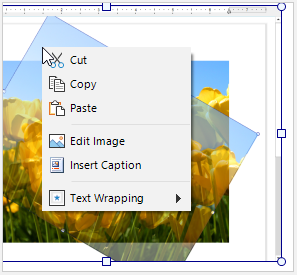
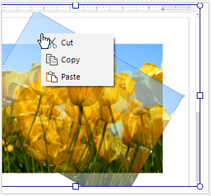

## Environment
 
|Product Version|Product|Author|
|----|----|----|
|2022.2.622|RadRichTextEditor for WinForms|[Desislava Yordanova](https://www.telerik.com/blogs/author/desislava-yordanova)|


## Description

RadRichTextEditor internally uses a **ContextMenuContentBuilder** which is responsible for populating the menu items according to the currently selected element in the document. 

The following article demonstrates a sample approach how to eliminate the last two groups of context menu items for a selected image, e.g. *Edit Image*, *Insert Caption*, *Text Wrapping*:

>caption Default context menu for an image element




## Solution

Create a custom **ContextMenuContentBuilder**. It allows overriding multiple methods that are responsible for creating and populating the different groups of items according to the document element they are related to:

* **CreateImageCommands** - Creates the image commands menu items.
* **CreateListCommands** - Creates the list commands menu items.
* **CreateFloatingBlockCommands** - Creates the floating block commands menu items.
* **CreateFieldCommands** - Creates the field commands menu items.
* **CreateTableCommands** - Creates the table commands menu items.
* **CreateTextEditCommands** - Creates the text edit commands menu items.
* **CreateHyperlinkCommands** - Creates the hyperlink commands menu items.
* **CreateSpellCheckingSuggestions** - Creates the spell checking suggestions menu items.
* **CreateClipboardCommands** - Creates the clipboard commands menu items (cut, copy, paste, etc.).
* **CreateHeaderFooterCommands** - Creates the headers/footers commands.
* **CreateTrackChangesCommands** - Creates the track changes commands menu items (accept, reject, etc.).
* **CreateCodeBlockCommands** - Creates the code block commands menu items.

For the image element example, we will override the **CreateImageCommands** and **CreateFloatingBlockCommands** methods
 

 
````C#  

public RadForm1()
{
    InitializeComponent();

    Telerik.WinControls.RichTextEditor.UI.ContextMenu contextMenu = (Telerik.WinControls.RichTextEditor.UI.ContextMenu)this.radRichTextEditor1.RichTextBoxElement.ContextMenu;
    contextMenu.ContentBuilder = new CustomContextMenuContentBuilder();
} 

public class CustomContextMenuContentBuilder : ContextMenuContentBuilder
{
    protected override ContextMenuGroup CreateImageCommands()
    {
        //return base.CreateImageCommands();
        return null;
    }

    protected override ContextMenuGroup CreateFloatingBlockCommands()
    {
        //return base.CreateFloatingBlockCommands();
        return null;
    }
}

         
````
````VB.NET

Public Sub New()
    InitializeComponent()
    Dim contextMenu As Telerik.WinControls.RichTextEditor.UI.ContextMenu = CType(Me.RadRichTextEditor1.RichTextBoxElement.ContextMenu, Telerik.WinControls.RichTextEditor.UI.ContextMenu)
    contextMenu.ContentBuilder = New CustomContextMenuContentBuilder()
End Sub

Public Class CustomContextMenuContentBuilder
    Inherits Telerik.WinForms.RichTextEditor.RichTextBoxUI.Menus.ContextMenuContentBuilder

    Protected Overrides Function CreateImageCommands() As ContextMenuGroup
        Return Nothing
    End Function

    Protected Overrides Function CreateFloatingBlockCommands() As ContextMenuGroup
        Return Nothing
    End Function
End Class


````

>note Make sure that you added *using* for C# and *imports* for VB **Telerik.WinForms.RichTextEditor.RichTextBoxUI.Menus**.

# See Also

* [Context Menu]()
