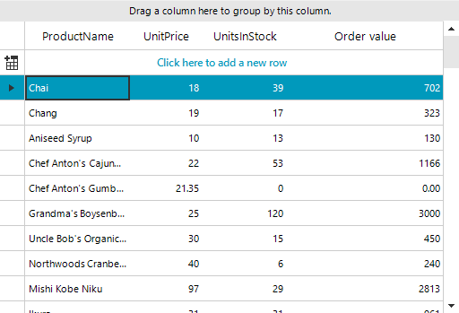

## Environment
 
|Product Version|Product|Author|
|----|----|----|
|2021.1.223|RadGridView for WinForms|[Nadya Karaivanova](https://www.telerik.com/blogs/author/nadya-karaivanova)|
 
## Description

This article will demonstrate how you can customize a specific cell depending on the changing value in another cell. For example if there is a calculated column in the grid, the calculated cell always change its value when one of the depending on it cells changes its value. You may want to indicate the user somehow that the value in the calculated cell is about to be changed. This example shows how you can color a cell when another cell in being edited in a way to indicate that its value would change, and after edit, reset the color to its default one.


 
## Solution 

To achieve this, we can use the [Style](https://docs.telerik.com/devtools/winforms/controls/gridview/cells/formating-examples/style-property) property that **GridViewCellInfo** offers. The **GridViewCellInfo.Style** property gives direct access to the cell’s visual properties and allows to customize it.
We should subsribe to the **CellEditorInitialized** event and set the desired cell style. Then, reset it in the **CellEndEvent** event.

````C#
public partial class Form1 : Form
{
    public Form1()
    {
        InitializeComponent();
        this.radGridView1.AutoSizeColumnsMode = GridViewAutoSizeColumnsMode.Fill;
        GridViewDecimalColumn col = new GridViewDecimalColumn();
        col.Name = "Calculated Column";
        col.HeaderText = "Order value";
        radGridView1.Columns.Add(col);
        radGridView1.Columns["Calculated Column"].Expression = "UnitsInStock * UnitPrice";
        this.radGridView1.CellEditorInitialized += this.RadGridView1_CellEditorInitialized;
        this.radGridView1.CellEndEdit += this.RadGridView1_CellEndEdit;
    }
    GridViewCellInfo cell;
    private void RadGridView1_CellEditorInitialized(object sender, GridViewCellEventArgs e)
    {
        GridSpinEditor editor = radGridView1.ActiveEditor as GridSpinEditor;
        if (editor != null && e.Column.Name == "UnitsInStock" || e.Column.Name == "UnitPrice")
            cell = radGridView1.Rows[e.RowIndex].Cells[3];
        StyleCell(cell);
    }
    private void StyleCell(GridViewCellInfo cell)
    {
        cell.Style.CustomizeFill = true;
        cell.Style.GradientStyle = GradientStyles.Solid;
        cell.Style.BackColor = Color.Red;
    }
    private void RadGridView1_CellEndEdit(object sender, GridViewCellEventArgs e)
    {
        cell.Style.CustomizeFill = false;
    }
    private void Form1_Load(object sender, EventArgs e)
    {
        this.productsTableAdapter.Fill(this.nwindDataSet1.Products);

    }
}


````
````VB.NET
Public Partial Class Form1
    Inherits Form
    Public Sub New()
        InitializeComponent()
        Me.radGridView1.AutoSizeColumnsMode = GridViewAutoSizeColumnsMode.Fill
        Dim col As GridViewDecimalColumn = New GridViewDecimalColumn()
        col.Name = "Calculated Column"
        col.HeaderText = "Order value"
        radGridView1.Columns.Add(col)
        radGridView1.Columns("Calculated Column").Expression = "UnitsInStock * UnitPrice"
        AddHandler Me.radGridView1.CellEditorInitialized, AddressOf Me.RadGridView1_CellEditorInitialized
        AddHandler Me.radGridView1.CellEndEdit, AddressOf Me.RadGridView1_CellEndEdit
    End Sub

    Private cell As GridViewCellInfo
    Private Sub RadGridView1_CellEditorInitialized(ByVal sender As Object, ByVal e As GridViewCellEventArgs)
        Dim editor As GridSpinEditor = TryCast(radGridView1.ActiveEditor, GridSpinEditor)
        If editor IsNot Nothing AndAlso e.Column.Name = "UnitsInStock" OrElse e.Column.Name = "UnitPrice" Then cell = radGridView1.Rows(e.RowIndex).Cells(3)
        StyleCell(cell)
    End Sub

    Private Sub StyleCell(ByVal cell As GridViewCellInfo)
        cell.Style.CustomizeFill = True
        cell.Style.GradientStyle = GradientStyles.Solid
        cell.Style.BackColor = Color.Red
    End Sub

    Private Sub RadGridView1_CellEndEdit(ByVal sender As Object, ByVal e As GridViewCellEventArgs)
        cell.Style.CustomizeFill = False
    End Sub

    Private Sub Form1_Load(ByVal sender As Object, ByVal e As EventArgs)
        Me.productsTableAdapter.Fill(Me.nwindDataSet1.Products)
    End Sub
End Class

````


