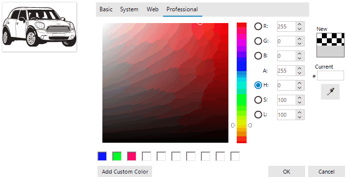

## Environment
 
|Product Version|Product|Author|
|----|----|----|
|2021.3.119|SVG Images for WinForms|[Desislava Yordanova](https://www.telerik.com/blogs/author/desislava-yordanova)|
 
## Description

Telerik UI for WinForms suite offers support for [vector images](). This article demonstrates a sample approach how you can change the color used in the vector image. 
 


## Solution 

First, you need to open the svg file in Notepad and have a look of its definition and what elements are contained, e.g. paths, polygons, etc. Then, you can look for the respective elements in the **RadSvgImage** and customize the respective **Stroke** or **Fill**:

>note It is important to note that depending on the internal structure of the svg image you may need to customize more internal elements.

````C#

public partial class RadForm1 : Telerik.WinControls.UI.RadForm
{
    RadSvgImage miniSVG = null;
    RadPictureBox radPictureBox1 = new RadPictureBox() { Size = new Size(150,100), Location = new Point(10,10) };
    RadColorSelector radColorSelector1 = new RadColorSelector() { Location = new Point(200,10) }; 

    public RadForm1()
    {
        InitializeComponent(); 
        radPictureBox1.Location = new Point(10,10);
        this.Controls.Add(this.radPictureBox1);
        miniSVG = RadSvgImage.FromFile(@"..\..\mini.svg");
        this.radPictureBox1.SvgImage = miniSVG;
        this.Controls.Add(this.radColorSelector1); 
        radColorSelector1.ColorChanged += radColorSelector1_ColorChanged;
    }

    private void radColorSelector1_ColorChanged(object sender, ColorChangedEventArgs args)
    {
        IEnumerable<SvgPath> paths = miniSVG.Document.Children.FindSvgElementsOf<SvgPath>();
        IEnumerable<SvgPolygon> polygons = miniSVG.Document.Children.FindSvgElementsOf<SvgPolygon>();
        foreach (SvgPath path in paths)
        { 
            path.Stroke = new SvgColourServer(args.SelectedColor);
            path.Fill = new SvgColourServer(args.SelectedColor);
        }

        foreach (SvgPolygon polygon in polygons)
        { 
            polygon.Stroke = new SvgColourServer(args.SelectedColor);
            polygon.Fill = new SvgColourServer(args.SelectedColor);
        }
       
        // clear the cache of RadSvgImage
        miniSVG.ClearCache();
        this.radPictureBox1.SvgImage = null;
        this.radPictureBox1.SvgImage = miniSVG;
    }
}

````
````VB.NET

Private miniSVG As RadSvgImage = Nothing
Private radPictureBox1 As RadPictureBox = New RadPictureBox() With {
    .Size = New Size(150, 100),
    .Location = New Point(10, 10)
}
Private radColorSelector1 As RadColorSelector = New RadColorSelector() With {
    .Location = New Point(200, 10)
}

Public Sub New()
    InitializeComponent()
    radPictureBox1.Location = New Point(10, 10)
    Me.Controls.Add(Me.radPictureBox1)
    miniSVG = RadSvgImage.FromFile("..\..\mini.svg")
    Me.radPictureBox1.SvgImage = miniSVG
    Me.Controls.Add(Me.radColorSelector1)
    AddHandler radColorSelector1.ColorChanged, AddressOf radColorSelector1_ColorChanged
End Sub

Private Sub radColorSelector1_ColorChanged(ByVal sender As Object, ByVal args As ColorChangedEventArgs)
    Dim paths As IEnumerable(Of SvgPath) = miniSVG.Document.Children.FindSvgElementsOf(Of SvgPath)()
    Dim polygons As IEnumerable(Of SvgPolygon) = miniSVG.Document.Children.FindSvgElementsOf(Of SvgPolygon)()

    For Each path As SvgPath In paths
        path.Stroke = New SvgColourServer(args.SelectedColor)
        path.Fill = New SvgColourServer(args.SelectedColor)
    Next

    For Each polygon As SvgPolygon In polygons
        polygon.Stroke = New SvgColourServer(args.SelectedColor)
        polygon.Fill = New SvgColourServer(args.SelectedColor)
    Next

    miniSVG.ClearCache()
    Me.radPictureBox1.SvgImage = Nothing
    Me.radPictureBox1.SvgImage = miniSVG
End Sub

```` 

# See Also

* [Vector Images]() 


    
   
  
    
 
