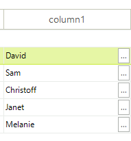

 
|Product Version|Product|Author|
|----|----|----|
|2019.2.618|RadGridView for WinForms|[Dimitar Karamfilov]|

# Problem 

You want to make the button in the command column smaller and show other value. 



# Solution

You can use the __CellFormatting__ event to achieve this. Here is a complete example that shows this.

````C#
public RadForm1()
{
    InitializeComponent();
    radGridView1.AutoSizeColumnsMode = GridViewAutoSizeColumnsMode.Fill;
    radGridView1.DataSource = GetTable();

    var col = new GridViewCommandColumn() { UseDefaultText = true, DefaultText = "..." };
    radGridView1.Columns.Add(col);
    col.FieldName = "Name";
    

    radGridView1.CellFormatting += RadGridView1_CellFormatting;
    radGridView1.CommandCellClick += RadGridView1_CommandCellClick;
}

private void RadGridView1_CommandCellClick(object sender, GridViewCellEventArgs e)
{
    RadMessageBox.Show(e.Value.ToString());
}

private void RadGridView1_CellFormatting(object sender, CellFormattingEventArgs e)
{
    if (e.CellElement is GridCommandCellElement)
    {
        var cell = e.CellElement as GridCommandCellElement;
        cell.DrawText = true;
        cell.Text = cell.Value + "";
        cell.CommandButton.StretchHorizontally = false;
        cell.CommandButton.Alignment = ContentAlignment.MiddleRight;
        cell.CommandButton.FitToSizeMode = RadFitToSizeMode.FitToParentPadding;
        cell.CommandButton.Margin = new Padding(0, 2,2, 2);
    }
}

````
````VB
Public Sub New()
	InitializeComponent()
	radGridView1.AutoSizeColumnsMode = GridViewAutoSizeColumnsMode.Fill
	radGridView1.DataSource = GetTable()

	Dim col = New GridViewCommandColumn() With {
		.UseDefaultText = True,
		.DefaultText = "..."
	}
	radGridView1.Columns.Add(col)
	col.FieldName = "Name"


	AddHandler radGridView1.CellFormatting, AddressOf RadGridView1_CellFormatting
	AddHandler radGridView1.CommandCellClick, AddressOf RadGridView1_CommandCellClick
End Sub

Private Sub RadGridView1_CommandCellClick(ByVal sender As Object, ByVal e As GridViewCellEventArgs)
	RadMessageBox.Show(e.Value.ToString())
End Sub

Private Sub RadGridView1_CellFormatting(ByVal sender As Object, ByVal e As CellFormattingEventArgs)
	If TypeOf e.CellElement Is GridCommandCellElement Then
		Dim cell = TryCast(e.CellElement, GridCommandCellElement)
		cell.DrawText = True
		cell.Text = cell.Value & ""
		cell.CommandButton.StretchHorizontally = False
		cell.CommandButton.Alignment = ContentAlignment.MiddleRight
		cell.CommandButton.FitToSizeMode = RadFitToSizeMode.FitToParentPadding
		cell.CommandButton.Margin = New Padding(0, 2,2, 2)
	End If
End Sub
````


