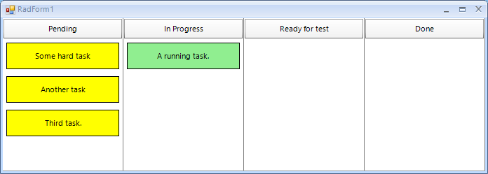

## Environment
<table>
	<tr>
		<td>Product Version</td>
		<td>2015.3.1104</td>
	</tr>
	<tr>
		<td>Product</td>
		<td>UI for WinForms</td>
	</tr>
</table>

## Description

This tutorial demonstrates how to achieve a Dashboard control in a Telerik WinForms project.

## Solution

A complete C# and VB project is available in the following SKD: [here](https://github.com/telerik/winforms-sdk/tree/master/DashboardDemo).

>note As of **R3 2021** Telerik UI for WinForms suite offers a [RadTaskBoard](https://docs.telerik.com/devtools/winforms/controls/task-board/task-board-overview) control (also known as Kanban Board) which is a powerful new control designed to enable users to track their tasks in a simple, agile-style manner. The control provides a clean and user-friendly interface for a functional task management application.
>