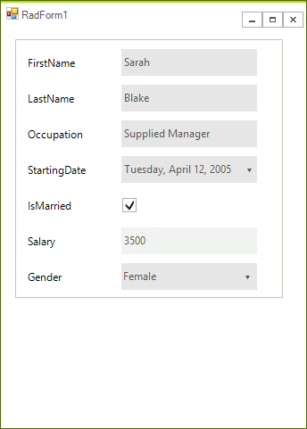

## Environment
|Product Version|Product|Author|
|----|----|----|
|2019.1.117|RadDataEntry for WinForms|[Hristo Merdjanov](https://www.telerik.com/blogs/author/hristo-merdjanov)|


## Description

The editors and labels displayed in the **RadDataEntry** are generated dynamically while initializing the control. This article demonstrates how the control can be auto-sized so that it will fit all of added controls without displaying scroll bars. 

>caption Figure 1: Auto-sized Data Entry


## Solution

The locations of the panels are determined while initializing the controls, besides their size, the location along Y is also controlled by the RadDataEntry.**ItemSpace** property. A suitable place to adjust the size is the RadDataEntry.**ItemInitialized** event and in the handler check if the panel`s bounds would exceed the bounds of the control. 

#### ItemInitialized Event

````C#
public partial class RadForm1 : Telerik.WinControls.UI.RadForm
{
    public RadForm1()
    {
        InitializeComponent();

        this.radDataEntry1.ItemInitialized += this.RadDataEntry1_ItemInitialized;;
        this.radDataEntry1.FitToParentWidth = true;
        this.radDataEntry1.ItemDefaultSize = new Size(250, 30);
        this.radDataEntry1.ItemSpace = 10;

        this.radDataEntry1.DataSource = new Employee()
        {
            FirstName = "Sarah",
            LastName = "Blake",
            Occupation = "Supplied Manager",
            StartingDate = new DateTime(2005, 04, 12),
            IsMarried = true,
            Salary = 3500,
            Gender = Gender.Female
        };
    }

    private void RadDataEntry1_ItemInitialized(object sender, Telerik.WinControls.UI.ItemInitializedEventArgs e)
    {
        if (e.Panel.Location.Y + e.Panel.Height > this.radDataEntry1.Height)
        {
            this.radDataEntry1.Height += e.Panel.Location.Y + e.Panel.Height - this.radDataEntry1.Height + this.radDataEntry1.ItemSpace;
        }
    }
}


````
````VB.NET
Public Class RadForm1

    Public Sub New()
        InitializeComponent()

        AddHandler Me.RadDataEntry1.ItemInitialized, AddressOf Me.RadDataEntry1_ItemInitialized
        Me.RadDataEntry1.FitToParentWidth = True
        Me.RadDataEntry1.ItemDefaultSize = New Size(250, 30)
        Me.RadDataEntry1.ItemSpace = 10

        Me.RadDataEntry1.DataSource = New Employee() With {
            .FirstName = "Sarah",
            .LastName = "Blake",
            .Occupation = "Supplied Manager",
            .StartingDate = New DateTime(2005, 4, 12),
            .IsMarried = True,
            .Salary = 3500,
            .Gender = Gender.Female
        }
    End Sub

    Private Sub RadDataEntry1_ItemInitialized(ByVal sender As Object, ByVal e As Telerik.WinControls.UI.ItemInitializedEventArgs)
        If e.Panel.Location.Y + e.Panel.Height > Me.RadDataEntry1.Height Then
            Me.RadDataEntry1.Height += e.Panel.Location.Y + e.Panel.Height - Me.RadDataEntry1.Height + Me.RadDataEntry1.ItemSpace
        End If
    End Sub
End Class


````

{{endregion}} 

#### Sample Data Class

````C#
public class Employee
{
    public string FirstName
        {
            get;
            set;
        }

    public string LastName
        {
            get;
            set;
        }

    public string Occupation
        {
            get;
            set;
        }

    public DateTime StartingDate
        {
            get;
            set;
        }

    public bool IsMarried
        {
            get;
            set;
        }

    public int Salary
        {
            get;
            set;
        }

    public Gender Gender
        {
            get;
            set;
        }
}

public enum Gender
{
    Female,
    Male
}


````
````VB.NET
Public Class Employee
    Public Property FirstName As String
    Public Property LastName As String
    Public Property Occupation As String
    Public Property StartingDate As DateTime
    Public Property IsMarried As Boolean
    Public Property Salary As Integer
    Public Property Gender As Gender
End Class

Public Enum Gender
    Female
    Male
End Enum


````

{{endregion}} 


# See Also

 * [Getting Started with DataEntry]()
 * [Programmatically Arrange Items ]()


