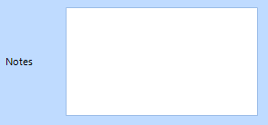
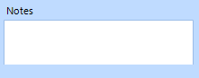

## Environment
<table>
	<tr>
		<td>Product Version</td>
		<td>2018.1 220</td>
	</tr>
	<tr>
		<td>Product</td>
		<td>RadEditors (TextBox, MaskedEditBox, DateTimePicker, TimePicker, SpinEditor, ColorBox, BrowseEditor, Clock, AutoCompleteBox, TextBoxControl, PopupEditor) for WinForms</td>
	</tr>
</table>


## Description
An example on how to programmatically rearrange the DataEntry item child controls.

### Before



### After



## Solution

The **RadDataEntry** `ItemInitialized` event is appropriate for adjusting the position of the whole panel that holds the label and editor per field.

```
void radDataEntry1_ItemInitialized(object sender, Telerik.WinControls.UI.ItemInitializedEventArgs e)
{
    if (e.Panel.Controls[1].Text == "FirstName")
    {
        e.Panel.Size = new Size(150, 25);
        e.Panel.Controls[1].Text = "Name";
    }
    else
    {
        e.Panel.Location = new Point(e.Panel.Location.X, e.Panel.Location.Y - 25);
    }
}
```

However, when the `DataSource` is set, the item's RadLabel and Editor will be automatically arranged horizontally. 

To override this automatic arrangement, subscribe to the **LocationChanged** event of the respective control in order to override the automatically set location of the layout arrangement. 


```
int y = 70;

private void RadDataEntry1_ItemInitialized(object sender, Telerik.WinControls.UI.ItemInitializedEventArgs e)
{
    if (e.Panel.Controls[1].Text == "ProductName")
    {
        e.Panel.Size = new Size(300, 120);
        e.Panel.Location = new Point(210, radDataEntry1.ItemSpace);
        e.Panel.Controls[0].Location = new Point(20, y);
        e.Panel.Controls[1].Location = new Point(0, 0);
        e.Panel.Controls[1].Size = new Size(100, 100);
        e.Panel.Controls[0].LocationChanged -= RadForm2_LocationChanged;
        e.Panel.Controls[0].LocationChanged += RadForm2_LocationChanged;
        e.Panel.Controls[1].LocationChanged -= RadForm2_LocationChanged;
        e.Panel.Controls[1].LocationChanged += RadForm2_LocationChanged;
    }
}

private void RadForm2_LocationChanged(object sender, EventArgs e)
{
    RadTextBox tb = sender as RadTextBox;
    if (tb != null && tb.Location.Y != y)
    {
        tb.Location = new Point(0, y);
    }

    RadLabel lbl = sender as RadLabel;
    if (lbl != null)
    {
        lbl.Location = new Point(0, 0);
    }
}

```

Note
If you change the editor, you can subscribe to the LocationChanged event in the event handler where you specify the editor.


## See Also
- [RadDataEntry - Overview](https://docs.telerik.com/devtools/winforms/dataentry/dataentry)
- [RadDataEntry - Structure](https://docs.telerik.com/devtools/winforms/dataentry/control-element-structure-)
- [RadDataEntry - Programmatically Arrange Items](https://docs.telerik.com/devtools/winforms/dataentry/programmatically-arrange-items-)
- [RadDataEntry ItemInitialized API Reference](https://docs.telerik.com/devtools/winforms/api/html/e_telerik_wincontrols_ui_raddataentry_iteminitialized.htm)


