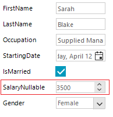

## Environment
 
|Product Version|Product|Author|
|----|----|----|
|2022.1.222|RadDataEntry for WinForms|[Desislava Yordanova](https://www.telerik.com/blogs/author/desislava-yordanova)|


## Description

**RadDataEntry** generates a **RadSpinEditor** for fields which type is among the following: Byte, SByte, UInt16, UInt32, UInt64, Int16, Int32, Int64, Single, Double, Decimal. In case of a nullable numeric field, the default RadTextBox is generated. This is because the **Value** property of **RadSpinEditor** is **typeof(decimal)**. Hence, if you bind a nullable field, it wouldn't be properly bound.

This article demonstrates a sample approach how to use the **NullableValue** property that **RadSpinEditor** offers and generate a numeric editor for an **int?** field in the Employee class:

#### Employee

````C#           
 
private class Employee
{
    public string FirstName
    {
        get;
        set;
    }
    public string LastName
    {
        get;
        set;
    }
    public string Occupation
    {
        get;
        set;
    }
    public DateTime StartingDate
    {
        get;
        set;
    }
    public bool IsMarried
    {
        get;
        set;
    } 

    public int? SalaryNullable
    {
        get;
        set;
    }
    public Gender Gender
    {
        get;
        set;
    }
}
private enum Gender
{
    Female,
    Male
} 

````
````VB.NET

Private Class Employee
    Public Property FirstName As String
    Public Property LastName As String
    Public Property Occupation As String
    Public Property StartingDate As DateTime
    Public Property IsMarried As Boolean
    Public Property SalaryNullable As Integer?
    Public Property Gender As Gender
End Class

Private Enum Gender
    Female
    Male
End Enum

````



## Solution

Follow the steps:

1\. Subscribe to the **BindingCreating** event which allows you to specify which property to bind the field to. Here you should bind the "SalaryNullable" field from the data source to the "**NullableValue**" property of **RadSpinEditor** (as it supports null values). 

2\. Then, in the **BindingCreated** event you will enable the binding formatting.

3\. Last, but not least, subscribe to the **EditorInitializing** event where you should specify that a RadSpinEditor will be used for the SalaryNullable field. 

````C#        
    
public RadForm1()
{
    InitializeComponent();
    this.radDataEntry1.EditorInitializing += RadDataEntry1_EditorInitializing;
    this.radDataEntry1.BindingCreating += RadDataEntry1_BindingCreating;
    this.radDataEntry1.BindingCreated += RadDataEntry1_BindingCreated;

    Employee emp = new Employee()
    {
        FirstName = "Sarah",
        LastName = "Blake",
        Occupation = "Supplied Manager",
        StartingDate = new DateTime(2005, 04, 12),
        IsMarried = true,
        SalaryNullable = 3500,
        Gender = Gender.Female
    };
    this.radDataEntry1.DataSource = emp;
}

private void RadDataEntry1_BindingCreating(object sender, BindingCreatingEventArgs e)
{
    if (e.DataMember == "SalaryNullable")
    {
        e.PropertyName = "NullableValue";
    }
}

private void RadDataEntry1_EditorInitializing(object sender, EditorInitializingEventArgs e)
{
    if (e.Property.Name == "SalaryNullable")
    {
        RadSpinEditor spinEditor = new RadSpinEditor();
        spinEditor.Maximum = 10000; 
        e.Editor = spinEditor;
    }
}

void RadDataEntry1_BindingCreated(object sender, BindingCreatedEventArgs e)
{
    if (e.DataMember == "SalaryNullable")
    {
        e.Binding.FormattingEnabled = true; 
    }
} 

````
````VB.NET

Public Sub New()
    InitializeComponent()
    AddHandler Me.RadDataEntry1.EditorInitializing, AddressOf RadDataEntry1_EditorInitializing
    AddHandler Me.RadDataEntry1.BindingCreating, AddressOf RadDataEntry1_BindingCreating
    AddHandler Me.RadDataEntry1.BindingCreated, AddressOf RadDataEntry1_BindingCreated
    Dim emp As Employee = New Employee() With {
        .FirstName = "Sarah",
        .LastName = "Blake",
        .Occupation = "Supplied Manager",
        .StartingDate = New DateTime(2005, 4, 12),
        .IsMarried = True,
        .SalaryNullable = 3500,
        .Gender = Gender.Female
    }
    Me.RadDataEntry1.DataSource = emp
End Sub

Private Sub RadDataEntry1_BindingCreating(ByVal sender As Object, ByVal e As BindingCreatingEventArgs)
    If e.DataMember = "SalaryNullable" Then
        e.PropertyName = "NullableValue"
    End If
End Sub

Private Sub RadDataEntry1_EditorInitializing(ByVal sender As Object, ByVal e As EditorInitializingEventArgs)
    If e.[Property].Name = "SalaryNullable" Then
        Dim spinEditor As RadSpinEditor = New RadSpinEditor()
        spinEditor.Maximum = 10000
        e.Editor = spinEditor
    End If
End Sub

Private Sub RadDataEntry1_BindingCreated(ByVal sender As Object, ByVal e As BindingCreatedEventArgs)
    If e.DataMember = "SalaryNullable" Then
        e.Binding.FormattingEnabled = True
    End If
End Sub

````

# See Also

* [Change Auto Generated Editor]()
* [Handle Unsupported Values]()