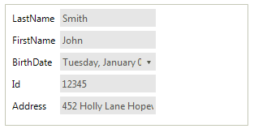
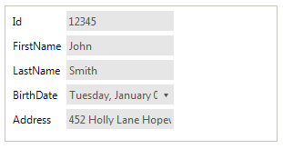

## Environment
<table>
	<tr>
		<td>Product Version</td>
		<td>2018.1 220</td>
	</tr>
	<tr>
		<td>Product</td>
		<td>RadDataEntry for WinForms</td>
	</tr>
</table>


## Description

By default, **RadDataEntry** generates the editors for the fields ordered in the way they are defined in the **DataSource** object. A common scenario is to change the fields' order according to certain criteria.

## Solution

Consider you have a class **Person** as follows:

#### Define Person class

{{source=..\SamplesCS\KnowledgeBase\DataEntryPropertiesOrder.cs region=DefineClass}} 
{{source=..\SamplesVB\KnowledgeBase\DataEntryPropertiesOrder.vb region=DefineClass}}

````C#
public class Person
{
    public string LastName { get; set; }
    public string FirstName { get; set; }
    public DateTime BirthDate { get; set; }
    public int Id { get; set; }
    public string Address { get; set; }
    public Person(string lastName, string firstName, DateTime dateOfBirth, int id, string address)
    {
        this.LastName = lastName;
        this.FirstName = firstName;
        this.BirthDate = dateOfBirth;
        this.Id = id;
        this.Address = address;
    }
}

````
````VB.NET
Public Class Person
    Public Property LastName As String
    Public Property FirstName As String
    Public Property BirthDate As DateTime
    Public Property Id As Integer
    Public Property Address As String
    Public Sub New(ByVal lastName As String, ByVal firstName As String, ByVal dateOfBirth As DateTime, ByVal id As Integer, ByVal address As String)
        Me.LastName = lastName
        Me.FirstName = firstName
        Me.BirthDate = dateOfBirth
        Me.Id = id
        Me.Address = address
    End Sub
End Class

````

{{endregion}} 

Then, set the RadDataEntry.**DataSource** property:

#### Set DataSource

{{source=..\SamplesCS\KnowledgeBase\DataEntryPropertiesOrder.cs region=SetDataSource}} 
{{source=..\SamplesVB\KnowledgeBase\DataEntryPropertiesOrder.vb region=SetDataSource}}

````C#
this.radDataEntry1.DataSource = new List<Person> { new Person("Smith", "John", new DateTime(1980, 1, 1), 12345, "452 Holly Lane Hopewell, VA 23860") };

````
````VB.NET
Me.radDataEntry1.DataSource = New List(Of Person) From {
    New Person("Smith", "John", New DateTime(1980, 1, 1), 12345, "452 Holly Lane Hopewell, VA 23860")
}

````

{{endregion}}

In the below screenshot it is demonstrated how the properties are displayed - in the order they are defined in the **Person** class:



Now, we will change the properties' order. 

1\. For this purpose, we will use the **RadSortOrderAttribute** which is available in the **Telerik.WinControls.UI** namespace. Thus, each property will have a specific number indicating the sort order.

{{source=..\SamplesCS\KnowledgeBase\DataEntryPropertiesOrder.cs region=OrderedPerson}} 
{{source=..\SamplesVB\KnowledgeBase\DataEntryPropertiesOrder.vb region=OrderedPerson}}

````C#
public class OrderedPerson
{
    [RadSortOrder(3)]
    public string LastName { get; set; }
    [RadSortOrder(2)]
    public string FirstName { get; set; }
    [RadSortOrder(4)]
    public DateTime BirthDate { get; set; }
    [RadSortOrder(1)]
    public int Id { get; set; }
    [RadSortOrder(5)]
    public string Address { get; set; }
    public OrderedPerson(string lastName, string firstName, DateTime dateOfBirth, int id, string address)
    {
        this.LastName = lastName;
        this.FirstName = firstName;
        this.BirthDate = dateOfBirth;
        this.Id = id;
        this.Address = address;
    }
}

````
````VB.NET
Public Class OrderedPerson
    <RadSortOrder(3)>
    Public Property LastName As String
    <RadSortOrder(2)>
    Public Property FirstName As String
    <RadSortOrder(4)>
    Public Property BirthDate As DateTime
    <RadSortOrder(1)>
    Public Property Id As Integer
    <RadSortOrder(5)>
    Public Property Address As String
    Public Sub New(ByVal lastName As String, ByVal firstName As String, ByVal dateOfBirth As DateTime, ByVal id As Integer, ByVal address As String)
        Me.LastName = lastName
        Me.FirstName = firstName
        Me.BirthDate = dateOfBirth
        Me.Id = id
        Me.Address = address
    End Sub
End Class

````

{{endregion}}

2\. Create a custom **IComparer** which will sort the properties considering the value of the **RadSortOrderAttribute**.

{{source=..\SamplesCS\KnowledgeBase\DataEntryPropertiesOrder.cs region=Comparer}} 
{{source=..\SamplesVB\KnowledgeBase\DataEntryPropertiesOrder.vb region=Comparer}}

````C#
public class PropertyDescriptorComparer : System.Collections.IComparer
{
    public int Compare(object x, object y)
    {
        if (x == y)
            return 0;
        if (x == null)
            return 1;
        if (y == null)
            return -1;
        PropertyDescriptor propertyDescriptorX = x as PropertyDescriptor;
        PropertyDescriptor propertyDescriptorY = y as PropertyDescriptor;
        RadSortOrderAttribute propertyOrderAttributeX =
            propertyDescriptorX.Attributes[typeof(RadSortOrderAttribute)] as RadSortOrderAttribute;
        RadSortOrderAttribute propertyOrderAttributeY =
            propertyDescriptorY.Attributes[typeof(RadSortOrderAttribute)] as RadSortOrderAttribute;
        if (Equals(propertyOrderAttributeX, propertyOrderAttributeY))
            return 0;
        if (propertyOrderAttributeX == null)
            return 1;
        if (propertyOrderAttributeY == null)
            return -1;
        return propertyOrderAttributeX.Value.CompareTo(propertyOrderAttributeY.Value);
    }
}

````
````VB.NET
Public Class PropertyDescriptorComparer
    Implements System.Collections.IComparer
    Public Function [Compare](x As Object, y As Object) As Integer Implements IComparer.[Compare]
        If x.Equals(y) Then Return 0
        If x Is Nothing Then Return 1
        If y Is Nothing Then Return -1
        Dim propertyDescriptorX As PropertyDescriptor = TryCast(x, PropertyDescriptor)
        Dim propertyDescriptorY As PropertyDescriptor = TryCast(y, PropertyDescriptor)
        Dim propertyOrderAttributeX As RadSortOrderAttribute = TryCast(propertyDescriptorX.Attributes(GetType(RadSortOrderAttribute)), RadSortOrderAttribute)
        Dim propertyOrderAttributeY As RadSortOrderAttribute = TryCast(propertyDescriptorY.Attributes(GetType(RadSortOrderAttribute)), RadSortOrderAttribute)
        If Equals(propertyOrderAttributeX, propertyOrderAttributeY) Then Return 0
        If propertyOrderAttributeX Is Nothing Then Return 1
        If propertyOrderAttributeY Is Nothing Then Return -1
        Return propertyOrderAttributeX.Value.CompareTo(propertyOrderAttributeY.Value)
    End Function
End Class

````

{{endregion}}

3\. Last, but not least, create a derivative of **BindingList<T&gt;** which implements the [ITypedList interface](https://msdn.microsoft.com/en-us/library/system.componentmodel.itypedlist(v=vs.110).aspx). Thus, you can implement the [GetItemProperties](https://msdn.microsoft.com/en-us/library/system.componentmodel.itypedlist.getitemproperties(v=vs.110).aspx) method which will make use of the newly created comparer to sort the properties and control their order. It is necessary to implement the [GetListName](https://msdn.microsoft.com/en-us/library/system.componentmodel.itypedlist.getlistname(v=vs.110).aspx) method as well. 

{{source=..\SamplesCS\KnowledgeBase\DataEntryPropertiesOrder.cs region=CustomList}} 
{{source=..\SamplesVB\KnowledgeBase\DataEntryPropertiesOrder.vb region=CustomList}}

````C#
public class DataEntrySort<T> : BindingList<T>, ITypedList
{
    public PropertyDescriptorCollection GetItemProperties(PropertyDescriptor[] listAccessors)
    {
        PropertyDescriptorCollection typePropertiesCollection = TypeDescriptor.GetProperties(typeof(T));
        return typePropertiesCollection.Sort(new PropertyDescriptorComparer());
    }
    public string GetListName(PropertyDescriptor[] listAccessors)
    {
        return string.Format("A list with Properties for {0}", typeof(T).Name);
    }
}

````
````VB.NET
Public Class DataEntrySort(Of T)
    Inherits BindingList(Of T)
    Implements ITypedList
    Public Function GetItemProperties(listAccessors As PropertyDescriptor()) As PropertyDescriptorCollection Implements ITypedList.GetItemProperties
        Dim typePropertiesCollection As PropertyDescriptorCollection = TypeDescriptor.GetProperties(GetType(T))
        Return typePropertiesCollection.Sort(New PropertyDescriptorComparer())
    End Function
    Public Function GetListName(listAccessors As PropertyDescriptor()) As String Implements ITypedList.GetListName
        Return String.Format("A list with Properties for {0}", GetType(T).Name)
    End Function
End Class

````

{{endregion}}

4\. Now, you can use the new **BindingList<T&gt;** you have just implemented:

{{source=..\SamplesCS\KnowledgeBase\DataEntryPropertiesOrder.cs region=UseList}} 
{{source=..\SamplesVB\KnowledgeBase\DataEntryPropertiesOrder.vb region=UseList}}

````C#
this.radDataEntry1.DataSource = new DataEntrySort<OrderedPerson> { new OrderedPerson("Smith", "John", new DateTime(1980,1, 1), 12345, "452 Holly Lane Hopewell, VA 23860") };

````
````VB.NET
Me.radDataEntry1.DataSource = New DataEntrySort(Of OrderedPerson) From {
    New OrderedPerson("Smith", "John", New DateTime(1980, 1, 1), 12345, "452 Holly Lane Hopewell, VA 23860")
}

````

{{endregion}}

The properties are ordered according to the specified **RadSortOrder** attribute:



>note A complete solution providing a C# and VB.NET project is available [here](https://github.com/telerik/winforms-sdk/tree/master/DataEntry/DataEntryPropertiesOrder).

# See Also

 * [Getting Started with DataEntry]()
 * [Programmatically Arrange Items ]()


