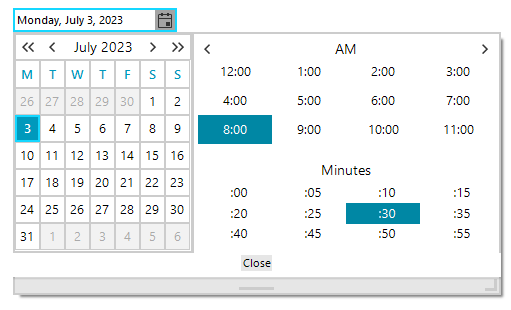
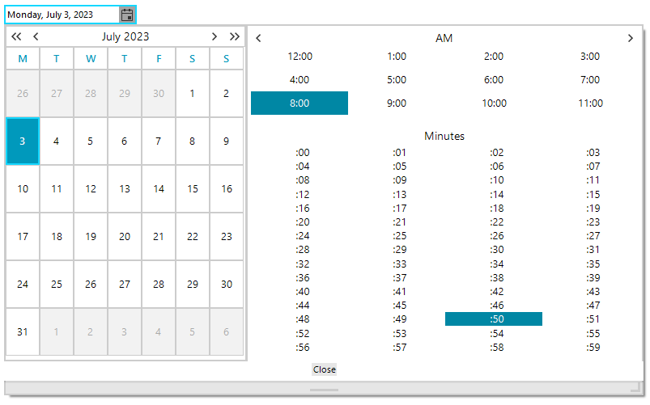

## Environment
 
|Product Version|Product|Author|
|----|----|----|
|2023.2.606|RadDateTimePicker for WinForms|[Desislava Yordanova](https://www.telerik.com/blogs/author/desislava-yordanova)|


## Description

By default, when the time picker is enabled for RadDateTimePicker, the minutes step is 5 minutes:



This article shows how to control the step for the minutes selector in the popup.

## Solution

The hosted **RadDateTimePickerCalendar** contains a **TimePickerElement** that offers **Step** property:


````C#
    
this.radDateTimePicker1.DateTimePickerElement.ShowTimePicker = true;
RadDateTimePickerCalendar calendarBehavior = this.radDateTimePicker1.DateTimePickerElement.GetCurrentBehavior() as RadDateTimePickerCalendar;
calendarBehavior.TimePicker.TimePickerElement.Step = 1;
calendarBehavior.Calendar.MinimumSize= new Size(300,0);


````
````VB.NET

Me.RadDateTimePicker1.DateTimePickerElement.ShowTimePicker = True
Dim calendarBehavior As RadDateTimePickerCalendar = TryCast(Me.RadDateTimePicker1.DateTimePickerElement.GetCurrentBehavior(), RadDateTimePickerCalendar)
calendarBehavior.TimePicker.TimePickerElement.[Step] = 1
calendarBehavior.Calendar.MinimumSize = New Size(300, 0)
   
    
````

The achieved result is illustrated below:




    
   
  
    
 
