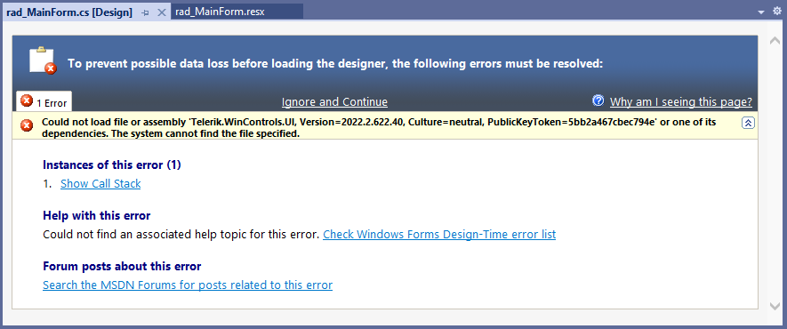
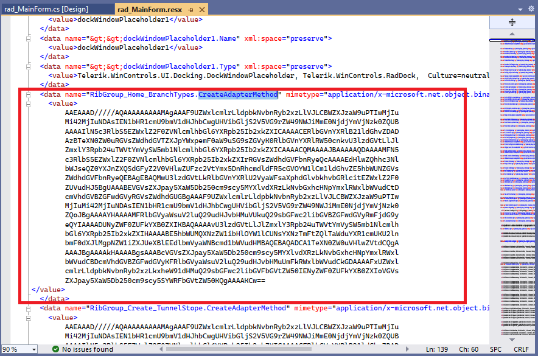
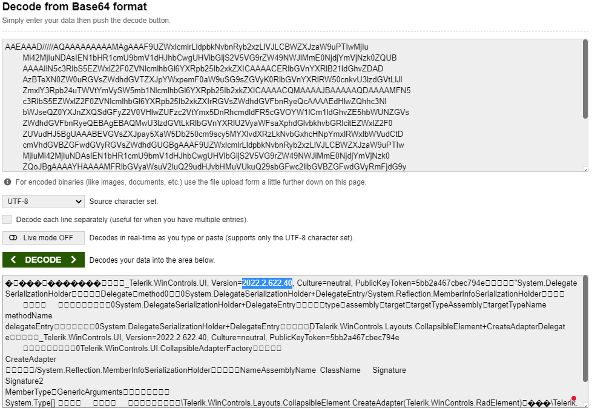

## Environment
 
|Product Version|Product|Author|
|----|----|----|
|2022.2.622|UI for WinForms|[Desislava Yordanova](https://www.telerik.com/blogs/author/desislava-yordanova)|

## Description

After [upgrading]() from version **2022.2.622** to any newer version, the form's designer may not be opened even though the correct assemblies are referred in the project and the license file is deleted.

 
If you have a **RadRibbonBar** on the form, this is a potential reason for the broken design time experience.

## Solution

There was an [issue](https://feedback.telerik.com/winforms/1570989-radribbonbar-invalid-resx-file-could-not-load-type-system-delegateserializationholder-after-adding-a-group-at-design-time) related to RadRibbonBar which used to serialize the **CreateAdapterMethod** property in the resource file:
 

After decoding the serialized base64 content, here comes the assembly version displayed in the failed designer:

The issue has already been addressed and a fix was released in **R3 2022**. The **CreateAdapterMethod** property is not serialized any more. However, all broken resource files need to be manually handled and delete the serialized CreateAdapterMethod property from the .resx.
 
# See Also

* [How to Upgrade a Telerik UI for WinForms Project]()
* [Updating Assemblies in a Project]()
* [Install using NuGet Packages]()
* [Upgrade Wizard]()
* [Download New Version]()