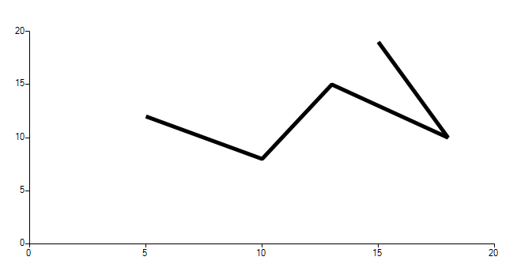

## Environment
 
|Product Version|Product|Author|
|----|----|----|
|2023.1.314|RadChartView for WinForms|[Desislava Yordanova](https://www.telerik.com/blogs/author/desislava-yordanova)|
 

## Description

Consider the case we have a ScatterLineSeries with several data points. When the user clicks on the chart area, we need to detect if the location overlaps an existing ScatterDataPoint and show a tooltip for it or the mouse coordinates belong to the line itself. This article demonstrates a sample approach how to achieve such behavior.
 
>note The red solid dots indicate the clicked location that doesn't overlap an existing ScatterDataPoint. The transparent circles shows actual data points from the series.



## Solution 
 
The actual line path is being calculated in the **ScatterLineSeriesDrawPart** while the CartesianRenderer draws the GraphicsPath according to the added data points. In order to calculate whether the currently clicked location belongs to the ScatterLineSeries itself without hitting actually a ScatterDataPoint, it is required to implement custom logic to do the job.

The custom implementation includes the logic which is used for the rendering the line and now you have the **GraphicsPath** in the **MouseDown** event handler. The **MouseEventArgs** gives you access to the **Location**. Please have in mind that adding a new data point to the series may draw additional lines to the series as the GraphicsPath will be calculated with the new data points included. Instead of adding points to the existing series, a better option is to use a separate ScatterSeries. The above gif file illustrates the achieved result: the solid red dots are the newly added points that are added to the secondary series when the user clicks the line and no data point is hit: 

````C#
        public Form1()
        {
            InitializeComponent();
            this.radChartView1.Anchor = AnchorStyles.Right | AnchorStyles.Bottom | AnchorStyles.Left ;
            ScatterLineSeries scatterLineSeries = new ScatterLineSeries();
            scatterLineSeries.BorderColor = Color.Black ;
            scatterLineSeries.BorderWidth = 5;
            scatterLineSeries.Shape = new CircleShape();
            scatterLineSeries.PointSize = new SizeF(15,15);
            scatterLineSeries.BackColor = Color.Transparent;
            scatterLineSeries.ShowLabels = true; 
            scatterLineSeries.Name = "";
            scatterLineSeries.DataPoints.Add(new ScatterDataPoint(15, 19));
            scatterLineSeries.DataPoints.Add(new ScatterDataPoint(18, 10));
            scatterLineSeries.DataPoints.Add(new ScatterDataPoint(13, 15));
            scatterLineSeries.DataPoints.Add(new ScatterDataPoint(10, 8));
            scatterLineSeries.DataPoints.Add(new ScatterDataPoint(5, 12));
            this.radChartView1.Series.Add(scatterLineSeries);
            this.radChartView1.MouseDown += RadChartView1_MouseDown;
    

            redDots.PointSize = new SizeF(20, 20);
            redDots.BorderWidth = 1;
            redDots.BorderColor = Color.Red; 
            this.radChartView1.Series.Add(redDots);
        }

        ScatterSeries redDots = new ScatterSeries();
        RadToolTip toolTip = new RadToolTip();
        private object GetHorizontalAxisValueFromMouse(MouseEventArgs e)
        {
            LinearAxis axis = radChartView1.Axes[1] as LinearAxis;
            double delta = axis.ActualRange.Maximum - axis.ActualRange.Minimum;
            double totalHeight = axis.Model.LayoutSlot.Height;
            double ratio = 1 - (e.Location.Y - this.radChartView1.Area.View.Viewport.Y - axis.Model.LayoutSlot.Y) / totalHeight;
            double value = axis.ActualRange.Minimum + delta * ratio;

            return value;
        }

        private object GetVerticalAxisValueFromMouse(MouseEventArgs e)
        {
            LinearAxis axis = radChartView1.Axes[0] as LinearAxis;
            double delta = axis.ActualRange.Maximum - axis.ActualRange.Minimum;
            double totalWidth = axis.Model.LayoutSlot.Width;
            double ratio = (e.Location.X - this.radChartView1.Area.View.Viewport.X - axis.Model.LayoutSlot.X) / totalWidth;
            double value = axis.ActualRange.Minimum + delta * ratio;

            return value;
        }
        
        private void RadChartView1_MouseDown(object sender, MouseEventArgs e)
        {
            ScatterLineSeries scatterSeries = this.radChartView1.Series[0] as ScatterLineSeries;
            ScatterDataPoint clickedDataPoint = null;
            DataPoint dp = scatterSeries.HitTest(e.Location.X, e.Location.Y);

            if (scatterSeries != null && dp != null)
            {
                clickedDataPoint = dp as ScatterDataPoint;
                var scatterPointElement = scatterSeries.Children.FirstOrDefault(x => (x as ScatterPointElement).DataPoint == clickedDataPoint);
                if (scatterPointElement != null)
                {
                    scatterPointElement.BorderWidth = 1;
                    scatterPointElement.BorderColor = Color.Red;
                    Point pt = this.radChartView1.PointToScreen(e.Location);
                    toolTip.Show("X: " + clickedDataPoint.XValue + " Y: " + clickedDataPoint.YValue, pt, 2000);
                    this.Text = "Existing Data Point: XValue: " + clickedDataPoint.XValue + " YValue: " + clickedDataPoint.YValue;
                }
            }

            if (clickedDataPoint == null)
            {
                GraphicsPath linePath= GetLinePath(scatterSeries);
                bool isInPath = linePath.IsOutlineVisible(e.Location,new Pen(Brushes.Black,5));
                object hValue = this.GetVerticalAxisValueFromMouse(e);
                object vValue = this.GetHorizontalAxisValueFromMouse(e);
                double horizontalValue = Math.Round(double.Parse(hValue.ToString()),2);
                double verticvalValue = Math.Round(double.Parse(vValue.ToString()), 2);
                this.Text = horizontalValue + " " + verticvalValue;
              
                if (isInPath)
                { 
                    redDots.DataPoints.Add(new ScatterDataPoint(horizontalValue, verticvalValue)); 
                }
            }
        }

        private GraphicsPath GetLinePath(ScatterLineSeries scatterSeries)
        {
            PointF[] points = GetPointsPositionsArray(scatterSeries); 
            return this.GetLinePaths(points, scatterSeries);
        }

        private PointF[] GetPointsPositionsArray(ScatterLineSeries scatterSeries)
        {
            List<PointF> points = new List<PointF>();

            for (int i = 0; i < scatterSeries.Children.Count; i++)
            {
                if (!scatterSeries.Children[i].IsVisible)
                {
                    break;
                }
               float offsetX=(float)(scatterSeries.View.Viewport.X + ((IChartView)scatterSeries.View).PlotOriginX);
                ScatterDataPoint scatterPoint = scatterSeries.DataPoints[i] as ScatterDataPoint;
                RadRect layoutSlot = scatterPoint.LayoutSlot;
                points.Add(new PointF(offsetX + (float)layoutSlot.X, offsetX + (float)layoutSlot.Y));
            }

            return points.ToArray();
        }

        private   GraphicsPath GetLinePaths(PointF[] points, ScatterLineSeries scatterSeries)
        {
            GraphicsPath path = new GraphicsPath();
            
            if (points.Length == 2)
            {
                path.AddLine(points[0], points[1]);
            }
            else if (points.Length > 1)
            {
                path.AddLines(points);  
            }
            else
            {
                return null;
            }

            return path;
        } 
            
       
````
````VB.NET

    Public Sub New()
        InitializeComponent()
        Me.RadChartView1.Anchor = AnchorStyles.Right Or AnchorStyles.Bottom Or AnchorStyles.Left
        Dim scatterLineSeries As ScatterLineSeries = New ScatterLineSeries()
        scatterLineSeries.BorderColor = Color.Black
        scatterLineSeries.BorderWidth = 5
        scatterLineSeries.Shape = New CircleShape()
        scatterLineSeries.PointSize = New SizeF(15, 15)
        scatterLineSeries.BackColor = Color.Transparent
        scatterLineSeries.ShowLabels = True
        scatterLineSeries.Name = ""
        scatterLineSeries.DataPoints.Add(New ScatterDataPoint(15, 19))
        scatterLineSeries.DataPoints.Add(New ScatterDataPoint(18, 10))
        scatterLineSeries.DataPoints.Add(New ScatterDataPoint(13, 15))
        scatterLineSeries.DataPoints.Add(New ScatterDataPoint(10, 8))
        scatterLineSeries.DataPoints.Add(New ScatterDataPoint(5, 12))
        Me.RadChartView1.Series.Add(scatterLineSeries)
        AddHandler Me.RadChartView1.MouseDown, AddressOf RadChartView1_MouseDown
        redDots.PointSize = New SizeF(20, 20)
        redDots.BorderWidth = 1
        redDots.BorderColor = Color.Red
        Me.RadChartView1.Series.Add(redDots)
    End Sub

    Private redDots As ScatterSeries = New ScatterSeries()
    Private toolTip As RadToolTip = New RadToolTip()

    Private Function GetHorizontalAxisValueFromMouse(ByVal e As MouseEventArgs) As Object
        Dim axis As LinearAxis = TryCast(RadChartView1.Axes(1), LinearAxis)
        Dim delta As Double = axis.ActualRange.Maximum - axis.ActualRange.Minimum
        Dim totalHeight As Double = axis.Model.LayoutSlot.Height
        Dim ratio As Double = 1 - (e.Location.Y - Me.RadChartView1.Area.View.Viewport.Y - axis.Model.LayoutSlot.Y) / totalHeight
        Dim value As Double = axis.ActualRange.Minimum + delta * ratio
        Return value
    End Function

    Private Function GetVerticalAxisValueFromMouse(ByVal e As MouseEventArgs) As Object
        Dim axis As LinearAxis = TryCast(RadChartView1.Axes(0), LinearAxis)
        Dim delta As Double = axis.ActualRange.Maximum - axis.ActualRange.Minimum
        Dim totalWidth As Double = axis.Model.LayoutSlot.Width
        Dim ratio As Double = (e.Location.X - Me.RadChartView1.Area.View.Viewport.X - axis.Model.LayoutSlot.X) / totalWidth
        Dim value As Double = axis.ActualRange.Minimum + delta * ratio
        Return value
    End Function

    Private Sub RadChartView1_MouseDown(ByVal sender As Object, ByVal e As MouseEventArgs)
        Dim scatterSeries As ScatterLineSeries = TryCast(Me.RadChartView1.Series(0), ScatterLineSeries)
        Dim clickedDataPoint As ScatterDataPoint = Nothing
        Dim dp As DataPoint = scatterSeries.HitTest(e.Location.X, e.Location.Y)

        If scatterSeries IsNot Nothing AndAlso dp IsNot Nothing Then
            clickedDataPoint = TryCast(dp, ScatterDataPoint)
            Dim scatterPointElement = scatterSeries.Children.FirstOrDefault(Function(x) (TryCast(x, ScatterPointElement)).DataPoint.Equals(clickedDataPoint))

            If scatterPointElement IsNot Nothing Then
                scatterPointElement.BorderWidth = 1
                scatterPointElement.BorderColor = Color.Red
                Dim pt As Point = Me.RadChartView1.PointToScreen(e.Location)
                toolTip.Show("X: " & clickedDataPoint.XValue & " Y: " & clickedDataPoint.YValue, pt, 2000)
                Me.Text = "Existing Data Point: XValue: " & clickedDataPoint.XValue & " YValue: " & clickedDataPoint.YValue
            End If
        End If

        If clickedDataPoint Is Nothing Then
            Dim linePath As GraphicsPath = GetLinePath(scatterSeries)
            Dim isInPath As Boolean = linePath.IsOutlineVisible(e.Location, New Pen(Brushes.Black, 5))
            Dim hValue As Object = Me.GetVerticalAxisValueFromMouse(e)
            Dim vValue As Object = Me.GetHorizontalAxisValueFromMouse(e)
            Dim horizontalValue As Double = Math.Round(Double.Parse(hValue.ToString()), 2)
            Dim verticvalValue As Double = Math.Round(Double.Parse(vValue.ToString()), 2)
            Me.Text = horizontalValue & " " & verticvalValue

            If isInPath Then
                redDots.DataPoints.Add(New ScatterDataPoint(horizontalValue, verticvalValue))
            End If
        End If
    End Sub

    Private Function GetLinePath(ByVal scatterSeries As ScatterLineSeries) As GraphicsPath
        Dim points As PointF() = GetPointsPositionsArray(scatterSeries)
        Return Me.GetLinePaths(points, scatterSeries)
    End Function

    Private Function GetPointsPositionsArray(ByVal scatterSeries As ScatterLineSeries) As PointF()
        Dim points As List(Of PointF) = New List(Of PointF)()

        For i As Integer = 0 To scatterSeries.Children.Count - 1

            If Not scatterSeries.Children(i).IsVisible Then
                Exit For
            End If

            Dim offsetX As Single = CSng((scatterSeries.View.Viewport.X + (CType(scatterSeries.View, IChartView)).PlotOriginX))
            Dim scatterPoint As ScatterDataPoint = TryCast(scatterSeries.DataPoints(i), ScatterDataPoint)
            Dim layoutSlot As RadRect = scatterPoint.LayoutSlot
            points.Add(New PointF(offsetX + CSng(layoutSlot.X), offsetX + CSng(layoutSlot.Y)))
        Next

        Return points.ToArray()
    End Function

    Private Function GetLinePaths(ByVal points As PointF(), ByVal scatterSeries As ScatterLineSeries) As GraphicsPath
        Dim path As GraphicsPath = New GraphicsPath()

        If points.Length = 2 Then
            path.AddLine(points(0), points(1))
        ElseIf points.Length > 1 Then
            path.AddLines(points)
        Else
            Return Nothing
        End If

        Return path
    End Function
   

````


 

 