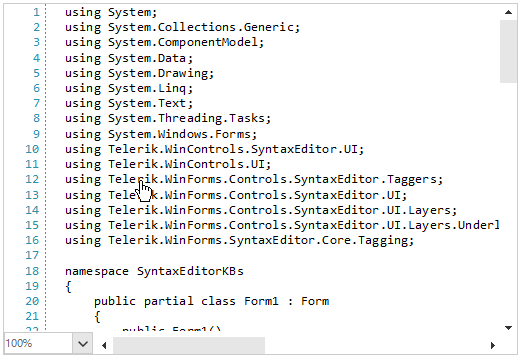

## Environment
 
|Product Version|Product|Author|
|----|----|----|
|2020.3.1020|RadSyntaxEditor for WinForms|[Desislava Yordanova](https://www.telerik.com/blogs/author/desislava-yordanova)|
 
## Description

This tutorial demonstrates how to detect mouse input in [RadSyntaxEditor]() and change the cursor when specific words are hovered (e.g. "Telerik"). In addition, a message box is shown when this specific word is clicked.



## Solution 

[RadSyntaxEditor]() works with the underlying document with the help of [taggers](). Taggers are used to identify spans of text and assign them a specific tag if they match a specific condition. Thus, you can style different words in the document.  

It is necessary to use a [custom tagger]() to classify the desired words (e.g. "Telerik") and mark these words as specific. Since **RadSyntaxEditor** renders its elements on different [layers]() based on the types of tags that are used, we will need a custom layer for the hover detection and showing the message.
 

````C#

public Form1()
{
    InitializeComponent();

    this.radSyntaxEditor1.TaggersRegistry.RegisterTagger(new TelerikTagger(this.radSyntaxEditor1.SyntaxEditorElement)); 
    this.radSyntaxEditor1.SyntaxEditorElement.UILayersBuilder = new CustomUILayersBuilder(); 
}
public class TelerikTagger : WordTaggerBase
{
    public static readonly ClassificationType TelerikClassificationType = new ClassificationType("Telerik");
    public static readonly Dictionary<string, ClassificationType> WordsToClassificationType = new Dictionary<string, ClassificationType>();

    public TelerikTagger(RadSyntaxEditorElement editor) : base(editor)
            {
                WordsToClassificationType.Add("Telerik", TelerikClassificationType);
            }

    protected override Dictionary<string, ClassificationType> GetWordsToClassificationTypes()
    {
        return TelerikTagger.WordsToClassificationType;
    }
}

public class CustomUILayersBuilder : Telerik.WinForms.Controls.SyntaxEditor.UI.Layers.UILayersBuilder
{
    public override void BuildUILayers(UILayerStack uiLayers)
    {
        base.BuildUILayers(uiLayers);
        uiLayers.AddLast(new MouseUILayer());
    }
}

public class MouseUILayer : LineBasedUILayer<ClassificationTag>
{
    public MouseUILayer()
    {
    }

    public override string Name => "TestUILayer";

    protected override FrameworkElement GetLinePartUIElement(ClassificationTag tag, 
        Telerik.WinForms.SyntaxEditor.Core.Text.Span span, UIUpdateContext updateContext)
    { 

        Rect rect = updateContext.Editor.GetLinePartBoundingRectangle(span);

        Telerik.WinControls.SyntaxEditor.UI.Rectangle rectangle = GetElementFromPool<Telerik.WinControls.SyntaxEditor.UI.Rectangle>();
        rectangle.NotifyParentOnMouseInput = false;
        rectangle.ShouldHandleMouseInput = true;
        rectangle.Width = rect.Width;
        rectangle.Height = rect.Height;

        // Need to unhook first otherwise we will get multiple calls to MouseDown.
        rectangle.MouseDown -= this.Rectangle_MouseDown;
        rectangle.MouseDown += this.Rectangle_MouseDown;
        rectangle.MouseMove -= this.Rectangle_MouseMove;
        rectangle.MouseMove += this.Rectangle_MouseMove;

        return rectangle;
    }
    private void Rectangle_MouseMove(object sender, MouseEventArgs e)
    {
        this.AssociatedEditor.ElementTree.Control.Cursor = Cursors.Hand;
    }

    private void Rectangle_MouseDown(object sender, MouseEventArgs e)
    {
        MessageBox.Show("Clicked");
    }

    protected override void ResetPooledElementProperties(object element)
    { 
    }
}
 
````
````VB.NET
Sub New()

    InitializeComponent()

    Me.RadSyntaxEditor1.TaggersRegistry.RegisterTagger(New TelerikTagger(Me.RadSyntaxEditor1.SyntaxEditorElement))
    Me.RadSyntaxEditor1.SyntaxEditorElement.UILayersBuilder = New CustomUILayersBuilder()
End Sub
Public Class TelerikTagger
    Inherits WordTaggerBase

    Public Shared ReadOnly TelerikClassificationType As ClassificationType = New ClassificationType("Telerik")
    Public Shared ReadOnly WordsToClassificationType As Dictionary(Of String, ClassificationType) = New Dictionary(Of String, ClassificationType)()

    Public Sub New(ByVal editor As RadSyntaxEditorElement)
        MyBase.New(editor)
        WordsToClassificationType.Add("Telerik", TelerikClassificationType)
    End Sub

    Protected Overrides Function GetWordsToClassificationTypes() As Dictionary(Of String, ClassificationType)
        Return TelerikTagger.WordsToClassificationType
    End Function
End Class

Public Class CustomUILayersBuilder
    Inherits Telerik.WinForms.Controls.SyntaxEditor.UI.Layers.UILayersBuilder

    Public Overrides Sub BuildUILayers(ByVal uiLayers As UILayerStack)
        MyBase.BuildUILayers(uiLayers)
        uiLayers.AddLast(New MouseUILayer())
    End Sub
End Class

Public Class MouseUILayer
    Inherits LineBasedUILayer(Of ClassificationTag)

    Public Sub New()
    End Sub

    Public Overrides ReadOnly Property Name As String
        Get
            Return "TestUILayer"
        End Get
    End Property

    Protected Overrides Function GetLinePartUIElement(ByVal tag As ClassificationTag,
                      ByVal span As Telerik.WinForms.SyntaxEditor.Core.Text.Span,
                      ByVal updateContext As UIUpdateContext) As FrameworkElement
        Dim rect As Rect = updateContext.Editor.GetLinePartBoundingRectangle(span)
        Dim rectangle As Telerik.WinControls.SyntaxEditor.UI.Rectangle = GetElementFromPool(Of Telerik.WinControls.SyntaxEditor.UI.Rectangle)()
        rectangle.NotifyParentOnMouseInput = False
        rectangle.ShouldHandleMouseInput = True
        rectangle.Width = rect.Width
        rectangle.Height = rect.Height
        RemoveHandler rectangle.MouseDown, AddressOf Me.Rectangle_MouseDown
        AddHandler rectangle.MouseDown, AddressOf Me.Rectangle_MouseDown
        RemoveHandler rectangle.MouseMove, AddressOf Me.Rectangle_MouseMove
        AddHandler rectangle.MouseMove, AddressOf Me.Rectangle_MouseMove
        Return rectangle
    End Function

    Private Sub Rectangle_MouseMove(ByVal sender As Object, ByVal e As MouseEventArgs)
        Me.AssociatedEditor.ElementTree.Control.Cursor = Cursors.Hand
    End Sub

    Private Sub Rectangle_MouseDown(ByVal sender As Object, ByVal e As MouseEventArgs)
        MessageBox.Show("Clicked")
    End Sub

    Protected Overrides Sub ResetPooledElementProperties(ByVal element As Object)
    End Sub
End Class

```` 

# See Also

* [RadSyntaxEditor]()
* [Layers]()
* [Custom Taggers]()
* []()

