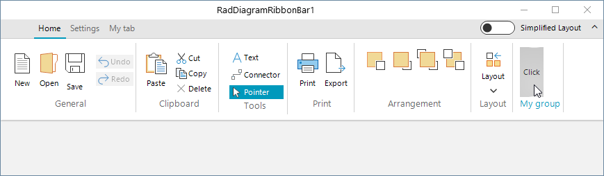

## Environment
 
|Product Version|Product|Author|
|----|----|----|
|2022.2.622|RadDiagram for WinForms|[Desislava Yordanova](https://www.telerik.com/blogs/author/desislava-yordanova)|


## Description

This article demonstrates how to add new groups/items or customize the existing ones (e.g. change the save button with your custom one) in RadDiagramRibbonBar. Thus, you can achieve any custom design for the Ribbon UI according to the specific requirements.




## Solution
 
RadDiagramRibbonBar gives you public access to all of its tabs, groups and buttons/items. Thus, you can easily customize it according to your needs.

 
````C#  

private void MainForm_Load(object sender, EventArgs e)
{ 
	RibbonTab tab = new RibbonTab();
	tab.Text = "My tab";
	this.radDiagramRibbonBar1.CommandTabs.Add(tab);
	//then add the desired groups and buttons to the custom tab

	RibbonTab existingTab = this.radDiagramRibbonBar1.CommandTabs[0] as RibbonTab;
	RadRibbonBarGroup group = new RadRibbonBarGroup();
	group.Text = "My group";
	RadButtonElement button = new RadButtonElement();
	button.Text = "Click";
	group.Items.Add(button);
	existingTab.Items.Add(group);

	RadButtonElement mySaveButton = new RadButtonElement();
	mySaveButton.Text = this.radDiagramRibbonBar1.buttonSave.Text;
	mySaveButton.Image = this.radDiagramRibbonBar1.buttonSave.Image;
	mySaveButton.SvgImage = this.radDiagramRibbonBar1.buttonSave.SvgImage;
	mySaveButton.TextImageRelation = this.radDiagramRibbonBar1.buttonSave.TextImageRelation;
	mySaveButton.Click += MySaveButton_Click;

	this.radDiagramRibbonBar1.groupGeneral.Items.Remove(this.radDiagramRibbonBar1.buttonSave);
	this.radDiagramRibbonBar1.groupGeneral.Items.Insert(2,mySaveButton);

}

private void MySaveButton_Click(object sender, EventArgs e)
{
	RadMessageBox.Show("My save button is clicked!");
}
         
````
````VB.NET

Protected Overrides Sub OnLoad(e As EventArgs)
    MyBase.OnLoad(e)

    Dim tab As RibbonTab = New RibbonTab()
    tab.Text = "My tab"
    Me.RadDiagramRibbonBar1.CommandTabs.Add(tab)
    'then add the desired groups And buttons to the custom tab

    Dim existingTab As RibbonTab = TryCast(Me.RadDiagramRibbonBar1.CommandTabs(0), RibbonTab)
    Dim group As RadRibbonBarGroup = New RadRibbonBarGroup()
    group.Text = "My group"
    Dim button As RadButtonElement = New RadButtonElement()
    button.Text = "Click"
    group.Items.Add(button)
    existingTab.Items.Add(group)

    Dim mySaveButton As RadButtonElement = New RadButtonElement()
    mySaveButton.Text = Me.RadDiagramRibbonBar1.buttonSave.Text
    mySaveButton.Image = Me.RadDiagramRibbonBar1.buttonSave.Image
    mySaveButton.SvgImage = Me.RadDiagramRibbonBar1.buttonSave.SvgImage
    mySaveButton.TextImageRelation = Me.RadDiagramRibbonBar1.buttonSave.TextImageRelation
    AddHandler mySaveButton.Click, AddressOf MySaveButton_Click
    Me.RadDiagramRibbonBar1.groupGeneral.Items.Remove(Me.RadDiagramRibbonBar1.buttonSave)
    Me.RadDiagramRibbonBar1.groupGeneral.Items.Insert(2, mySaveButton)
End Sub
Private Sub MySaveButton_Click(ByVal sender As Object, ByVal e As EventArgs)
    RadMessageBox.Show("My save button is clicked!")
End Sub

````


# See Also

* [RibbonUI]()
