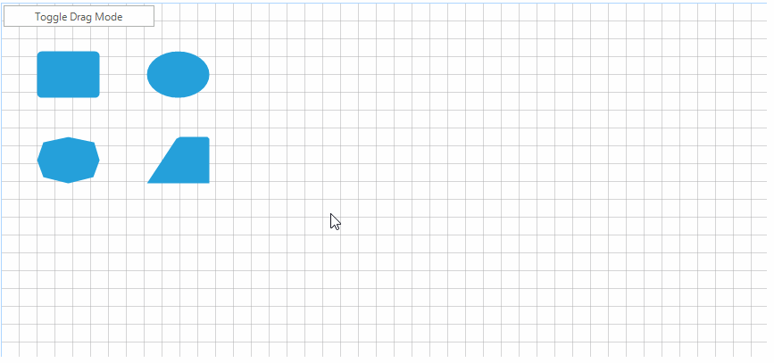

## Environment
<table>
	<tr>
		<td>Product Version</td>
		<td>2018.1 220</td>
	</tr>
	<tr>
		<td>Product</td>
		<td>RadDiagram for WinForms</td>
	</tr>
</table>


## Description

The shapes displayed in **RadDiagram** can be dragged in all directions. This article will suggest a custom implementation how dragging can be restricted to a horizontal or vertical direction. The default behavior with both directions being active at the same time is also preserved.

## Solution

The animation below demonstrates the end result with the restricted direction.

>caption Figure 1: Restrict Dragging


The custom functionality will be achieved with the help of a special drag service class.

1\. Create a **DragMode** enumeration responsible for controlling the allowed drag direction.

#### Drag Mode Enumeration

{{source=..\SamplesCS\KnowledgeBase\CustomDraggingServiceForm.cs region=DragModeEnum}} 
{{source=..\SamplesVB\KnowledgeBase\CustomDraggingServiceForm.vb region=DragModeEnum}}
````C#
public enum DragMode
{
    Both,
    Horizontal,
    Vertical,
}

````
````VB.NET
Public Enum DragMode
    Both
    Horizontal
    Vertical
End Enum

````

{{endregion}}

2\. Inherit the **DraggingService** class.
* Add two fields to be used for saving the drag start point and the currently selected drag mode.
* Override the **InitializeDrag** method and set the initial drag start point.
* Override the **Drag** method and depending on the current **DragMode** create a new drag point. 

#### CustomDraggingService Implementation

{{source=..\SamplesCS\KnowledgeBase\CustomDraggingServiceForm.cs region=CustomDraggingService}} 
{{source=..\SamplesVB\KnowledgeBase\CustomDraggingServiceForm.vb region=CustomDraggingService}}
````C#
public class CustomDraggingService : DraggingService
{
    private Telerik.Windows.Diagrams.Core.Point startDragPoint;
    private DragMode dragMode = DragMode.Both;
    public CustomDraggingService(IGraphInternal graph)
        : base(graph)
    { }
    public DragMode DragMode
    {
        get
        {
            return this.dragMode;
        }
        set
        {
            this.dragMode = value;
        }
    }
    public override void InitializeDrag(Telerik.Windows.Diagrams.Core.Point point)
    {
        this.startDragPoint = point;
        base.InitializeDrag(point);
    }
    public override void Drag(Telerik.Windows.Diagrams.Core.Point newPoint)
    {
        Telerik.Windows.Diagrams.Core.Point dragPoint = newPoint;
        if (this.DragMode == DragMode.Horizontal)
        {
            dragPoint = new Telerik.Windows.Diagrams.Core.Point(newPoint.X, this.startDragPoint.Y);
        }
        else if (this.DragMode == DragMode.Vertical)
        {
            dragPoint = new Telerik.Windows.Diagrams.Core.Point(this.startDragPoint.X, newPoint.Y);
        }
        base.Drag(dragPoint);
    }
}

````
````VB.NET
Public Class CustomDraggingService
    Inherits DraggingService
    Private startDragPoint As Telerik.Windows.Diagrams.Core.Point
    Private _dragMode As DragMode = DragMode.Both
    Public Sub New(ByVal graph As IGraphInternal)
        MyBase.New(graph)
    End Sub
    Public Property DragMode As DragMode
        Get
            Return Me._dragMode
        End Get
        Set(ByVal value As DragMode)
            Me._dragMode = value
        End Set
    End Property
    Public Overrides Sub InitializeDrag(ByVal point As Telerik.Windows.Diagrams.Core.Point)
        Me.startDragPoint = point
        MyBase.InitializeDrag(point)
    End Sub
    Public Overrides Sub Drag(ByVal newPoint As Telerik.Windows.Diagrams.Core.Point)
        Dim dragPoint As Telerik.Windows.Diagrams.Core.Point = newPoint
        If Me.DragMode = DragMode.Horizontal Then
            dragPoint = New Telerik.Windows.Diagrams.Core.Point(newPoint.X, Me.startDragPoint.Y)
        ElseIf Me.DragMode = DragMode.Vertical Then
            dragPoint = New Telerik.Windows.Diagrams.Core.Point(Me.startDragPoint.X, newPoint.Y)
        End If
        MyBase.Drag(dragPoint)
    End Sub
End Class

````


{{endregion}} 

3\. Instantiate the custom dragging service class.

#### Use the Custom Solution

{{source=..\SamplesCS\KnowledgeBase\CustomDraggingServiceForm.cs region=InitialSetup}}
{{source=..\SamplesVB\KnowledgeBase\CustomDraggingServiceForm.vb region=InitialSetup}}
````C#
public partial class CustomDraggingServiceForm : Telerik.WinControls.UI.RadForm
{
    private CustomDraggingService dragService;
    public CustomDraggingServiceForm()
    {
        InitializeComponent();
        this.dragService = new CustomDraggingService(this.radDiagram1.DiagramElement)
        {
            DragMode = DragMode.Horizontal
        };
        this.radDiagram1.DiagramElement.ServiceLocator.Register<IDraggingService>(this.dragService);
    }
    private void radButton1_Click(object sender, System.EventArgs e)
    {
        this.dragService.DragMode = this.dragService.DragMode == DragMode.Horizontal ? DragMode.Vertical : DragMode.Horizontal;
    }
}

````
````VB.NET
Public Class CustomDraggingServiceForm
    Dim dragService As CustomDraggingService
    Sub New()
        InitializeComponent()
        Me.dragService = New CustomDraggingService(Me.RadDiagram1.DiagramElement) With {.DragMode = DragMode.Horizontal}
        Me.RadDiagram1.DiagramElement.ServiceLocator.Register(Of IDraggingService)(Me.dragService)
    End Sub
    Private Sub RadButton1_Click(sender As Object, e As EventArgs) Handles RadButton1.Click
        Me.dragService.DragMode = If(Me.dragService.DragMode = DragMode.Horizontal, DragMode.Vertical, DragMode.Horizontal)
    End Sub
End Class

````


{{endregion}} 

>tip A complete solution providing a C# and VB.NET project is available [here](https://github.com/telerik/winforms-sdk/tree/master/Diagram/CustomDraggingService).

# See Also
* [Drag and Drop from Another Control]()
* [OLE Drag and Drop]()