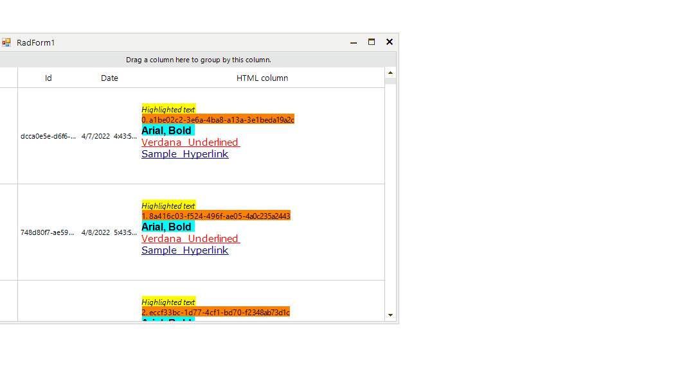

## Environment
 
|Product Version|Product|Author|
|----|----|----|
|2022.1.222|RadGridView for WinForms|[Desislava Yordanova](https://www.telerik.com/blogs/author/desislava-yordanova)|


## Description

A common requirement is to display and edit HTML text in RadGridView. RadGridView offers [rich text formatting]() mechanism that uses plain HTML tags to display formatted text such as font style, font color, font size, etc. This can be used to display plain HTML in the grid cells. However, it is also necessary to provide a convenient editing mechanism for this HTML. This article demonstrates a sample approach how to achieve it.

>caption Display and Edit HTML text



## Solution

It is necessary to create a custom column that uses a specific cell element that shows a [RadMarkupDialog]() for editing.
 
````C#  
          
public RadForm1()
{
    InitializeComponent();
    ThemeResolutionService.ApplicationThemeName = "Fluent";

    this.radGridView1.CellFormatting += radGridView1_CellFormatting;

    this.radGridView1.Columns.Add("Id");
    this.radGridView1.Columns.Add("Date");
    CustomMarkUpColumn customColumn = new CustomMarkUpColumn("HTML column");
    customColumn.MinWidth = 200;
    this.radGridView1.Columns.Add(customColumn);
    this.radGridView1.AutoSizeColumnsMode = GridViewAutoSizeColumnsMode.Fill;
    this.radGridView1.AllowAddNewRow = false;
    this.radGridView1.TableElement.RowHeight = 150;

    this.radGridView1.BeginUpdate();
    for (int i = 0; i < 10000; i++)
    {
        this.radGridView1.Rows.Add(Guid.NewGuid().ToString(), DateTime.Now.AddDays(i).AddHours(i),
        "<html><p><span style=\"font-size: 9pt; background-color: #ffff00\"><em>Highlighted text</em></span></p><p><span style=\"font-size: 9pt; background-color: #ff8000\">" +
        i + ". " + Guid.NewGuid().ToString() + "</span></p><p><span style=\"font-size: 12pt; font-family: arial; background-color: #00ffff\">" +
        "<strong>Arial, Bold</strong></span></p><p><span style=\"font-size: 11pt; font-family: verdana; color: #ff0000\">" +
        "<u>Verdana Underlined </u></span></p><p><span style=\"font-size: 11pt; font-family: verdana; color: #ff0000\"><span style=\"color: #000000\">" +
        "<a href=\"about:www.telerik.com\">Sample Hyperlink</a></span></span></p><p></p>");
    }
    this.radGridView1.EndUpdate();
}

private void radGridView1_CellFormatting(object sender, CellFormattingEventArgs e)
{
    e.CellElement.DisableHTMLRendering = false;
}

public class MarkUpCellElement : GridDataCellElement
{ 
    public MarkUpCellElement(GridViewColumn column, GridRowElement row) : base(column, row)
    {
    }

    protected override Type ThemeEffectiveType
    {
        get
        {
            return typeof(GridDataCellElement);
        }
    }

    protected override void SetContentCore(object value)
    {
        base.SetContentCore(value);
        this.DisableHTMLRendering = false;
        this.UseCompatibleTextRendering = true;
    }

    public override bool IsCompatible(GridViewColumn data, object context)
    {
        return data is CustomMarkUpColumn && context is GridDataRowElement;
    }

    protected override void OnDoubleClick(EventArgs e)
    {
        base.OnDoubleClick(e);
        CustomMarkUpColumn column = this.ColumnInfo as CustomMarkUpColumn;
        column.MarkUpDialog.Value = this.Value + ""; 
        column.MarkUpDialog.Form.Shape = new RoundRectShape(0);
        column.MarkUpDialog.Form.BorderColor = Color.Empty;
        if (column.MarkUpDialog.ShowDialog() == DialogResult.OK)
        {
            this.Value = column.MarkUpDialog.Value;
        }
    }
}

public class CustomMarkUpColumn: GridViewDataColumn
{
    RadMarkupDialog markUpDialog;

    public CustomMarkUpColumn(string fieldName) : base(fieldName)
    {
        markUpDialog = new RadMarkupDialog();
    }

    public RadMarkupDialog MarkUpDialog
    {
        get
        {
            return this.markUpDialog;
        }
    }

    public override Type GetCellType(GridViewRowInfo row)
    {
        if (row is GridViewDataRowInfo)
        {
            return typeof(MarkUpCellElement);
        }
        return base.GetCellType(row);
    }
}

````
````VB.NET

Public Sub New()
    InitializeComponent()
    ThemeResolutionService.ApplicationThemeName = "Fluent"
    AddHandler Me.RadGridView1.CellFormatting, AddressOf radGridView1_CellFormatting
    Me.RadGridView1.Columns.Add("Id")
    Me.RadGridView1.Columns.Add("Date")
    Dim customColumn As CustomMarkUpColumn = New CustomMarkUpColumn("HTML column")
    customColumn.MinWidth = 200
    Me.RadGridView1.Columns.Add(customColumn)
    Me.RadGridView1.AutoSizeColumnsMode = GridViewAutoSizeColumnsMode.Fill
    Me.RadGridView1.AllowAddNewRow = False
    Me.RadGridView1.TableElement.RowHeight = 150
    Me.RadGridView1.BeginUpdate()

    For i As Integer = 0 To 10000 - 1
        Me.RadGridView1.Rows.Add(Guid.NewGuid().ToString(), DateTime.Now.AddDays(i).AddHours(i), _
                                 "<html><p><span style=""font-size: 9pt; background-color: #ffff00""><em>Highlighted text</em></span></p><p>" & _
                                 "<span style=""font-size: 9pt; background-color: #ff8000"">" & i & ". " & Guid.NewGuid().ToString() & _
                                 "</span></p><p><span style=""font-size: 12pt; font-family: arial; background-color: #00ffff"">" & _
                                 "<strong>Arial, Bold</strong></span></p><p><span style=""font-size: 11pt; font-family: verdana; color: #ff0000"">" & _
                                 "<u>Verdana Underlined </u></span></p><p><span style=""font-size: 11pt; font-family: verdana; color: #ff0000""><span style=""color: #000000"">" & _
                                 "<a href=""about:www.telerik.com"">Sample Hyperlink</a></span></span></p><p></p>")
    Next

    Me.RadGridView1.EndUpdate()
End Sub

Private Sub radGridView1_CellFormatting(ByVal sender As Object, ByVal e As CellFormattingEventArgs)
    e.CellElement.DisableHTMLRendering = False
End Sub

Public Class MarkUpCellElement
    Inherits GridDataCellElement

    Public Sub New(ByVal column As GridViewColumn, ByVal row As GridRowElement)
        MyBase.New(column, row)
    End Sub

    Protected Overrides ReadOnly Property ThemeEffectiveType As Type
        Get
            Return GetType(GridDataCellElement)
        End Get
    End Property

    Protected Overrides Sub SetContentCore(ByVal value As Object)
        MyBase.SetContentCore(value)
        Me.DisableHTMLRendering = False
        Me.UseCompatibleTextRendering = True
    End Sub

    Public Overrides Function IsCompatible(ByVal data As GridViewColumn, ByVal context As Object) As Boolean
        Return TypeOf data Is CustomMarkUpColumn AndAlso TypeOf context Is GridDataRowElement
    End Function

    Protected Overrides Sub OnDoubleClick(ByVal e As EventArgs)
        MyBase.OnDoubleClick(e)
        Dim column As CustomMarkUpColumn = TryCast(Me.ColumnInfo, CustomMarkUpColumn)
        column.MarkUpDialog.Value = Me.Value & ""
        column.MarkUpDialog.Form.Shape = New RoundRectShape(0)
        column.MarkUpDialog.Form.BorderColor = Color.Empty

        If column.MarkUpDialog.ShowDialog() = DialogResult.OK Then
            Me.Value = column.MarkUpDialog.Value
        End If
    End Sub
End Class

Public Class CustomMarkUpColumn
    Inherits GridViewDataColumn

    Private _markUpDialog As RadMarkupDialog

    Public Sub New(ByVal fieldName As String)
        MyBase.New(fieldName)
        _markUpDialog = New RadMarkupDialog()
    End Sub

    Public ReadOnly Property MarkUpDialog As RadMarkupDialog
        Get
            Return Me._markUpDialog
        End Get
    End Property

    Public Overrides Function GetCellType(ByVal row As GridViewRowInfo) As Type
        If TypeOf row Is GridViewDataRowInfo Then
            Return GetType(MarkUpCellElement)
        End If

        Return MyBase.GetCellType(row)
    End Function
End Class

````


# See Also

* [Creating custom cells]()
* [How to Embed RadRichTextEditor in GridView Cells]()