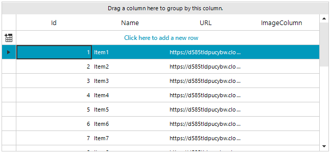
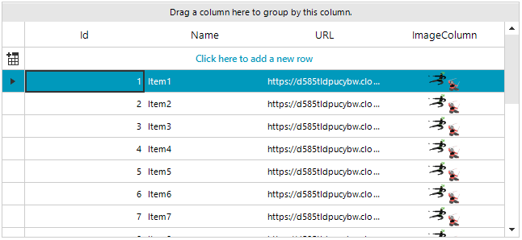

## Environment
 
|Product Version|Product|Author|
|----|----|----|
|2020.3.1020|RadGridView for WinForms|[Desislava Yordanova](https://www.telerik.com/blogs/author/desislava-yordanova)|
 

## Description

A common scenario is to store image URLs in the database instead of the actual image. However, when you bind a **RadGridView** to this DataTable, it generates a **GridViewTextBoxColumn** by default. Even if you add a **GridViewImageColumn** and map the respective column from the DataTable by the **FieldName** column's property, the images are not loaded in the GridViewImageColumn.  This is because the **GridViewImageColumn** expects **Image** values stored in its cells. 



## Solution 

It is necessary to convert the URL text to an image. The easiest way to do it is to use a **TypeConverter**:

#### Image converter 

````C#
public RadForm1()
{
    InitializeComponent();
    DataTable dt = new DataTable();
    dt.Columns.Add("Id", typeof(int));
    dt.Columns.Add("Name", typeof(string));
    dt.Columns.Add("URL", typeof(string));

    for (var index = 1; index <= 20; index++)
        dt.Rows.Add(index, "Item" + index, "https://d585tldpucybw.cloudfront.net/sfimages/default-source/return-of-ui/ninjas-action.png");

    this.radGridView1.DataSource = dt;
    GridViewImageColumn imageColumn = new GridViewImageColumn("ImageColumn");
    imageColumn.FieldName = "URL";
    imageColumn.DataTypeConverter = new MyTypeConverter();
    imageColumn.ImageLayout = ImageLayout.Zoom;
    radGridView1.MasterTemplate.Columns.Add(imageColumn);

    this.radGridView1.AutoSizeColumnsMode = Telerik.WinControls.UI.GridViewAutoSizeColumnsMode.Fill;
}

public class MyTypeConverter : TypeConverter
{
    public override bool CanConvertTo(ITypeDescriptorContext context, Type destinationType)
    {
        if (destinationType.Equals(typeof(Image)))
            return true;

        return base.CanConvertTo(context, destinationType);
    }

    public override object ConvertTo(ITypeDescriptorContext context, 
        System.Globalization.CultureInfo culture, object value, Type destinationType)
    {
        if (destinationType.Equals(typeof(Image)))
        {
            WebRequest request = System.Net.WebRequest.Create(value + "");

            using (var response = request.GetResponse())
            {
                using (var stream = response.GetResponseStream())
                {
                    return Bitmap.FromStream(stream);
                }
            }
        }
        return base.ConvertTo(context, culture, value, destinationType);
    }
}
   

````
````VB.NET
Sub New() 
    InitializeComponent()

    Dim dt As New DataTable
    dt.Columns.Add("Id", GetType(Integer))
    dt.Columns.Add("Name", GetType(String))
    dt.Columns.Add("URL", GetType(String))

    For index = 1 To 20
        dt.Rows.Add(index, "Item" & index, "https://d585tldpucybw.cloudfront.net/sfimages/default-source/return-of-ui/ninjas-action.png")
    Next

    Me.RadGridView1.DataSource = dt
    Dim imageColumn As New GridViewImageColumn("ImageColumn")
    imageColumn.FieldName = "URL"
    imageColumn.DataTypeConverter = New MyTypeConverter()
    imageColumn.ImageLayout = ImageLayout.Zoom
    RadGridView1.MasterTemplate.Columns.Add(imageColumn)

    Me.RadGridView1.AutoSizeColumnsMode = Telerik.WinControls.UI.GridViewAutoSizeColumnsMode.Fill
End Sub

Public Class MyTypeConverter
Inherits TypeConverter

    Public Overrides Function CanConvertTo(context As ITypeDescriptorContext, destinationType As Type) As Boolean
        If destinationType.Equals(GetType(Image)) Then
            Return True
        End If

        Return MyBase.CanConvertTo(context, destinationType)
    End Function

    Public Overrides Function ConvertTo(context As ITypeDescriptorContext, culture As Globalization.CultureInfo, _
                                        value As Object, destinationType As Type) As Object
        If destinationType.Equals(GetType(Image)) Then
            Dim request = WebRequest.Create(value)

            Using response = request.GetResponse()

                Using stream = response.GetResponseStream()
                    Return Bitmap.FromStream(stream)
                End Using
            End Using
        End If
        Return MyBase.ConvertTo(context, culture, value, destinationType)
    End Function
End Class
    

````



# See Also

* [Converting Data Types]() 

