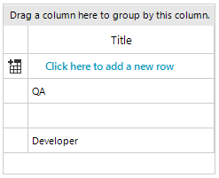
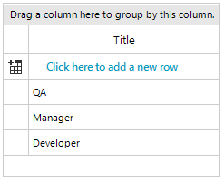
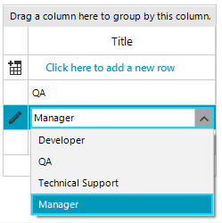

## Environment
|Product Version|Product|Author|
|----|----|----|
|2021.1.223|RadGridView for WinForms|[Desislava Yordanova](https://www.telerik.com/blogs/author/desislava-yordanova)|

## Description

Consider the case where **RadGridView** contains a **GridViewComboBoxColumn**. The column's **DataSource** collections does not contain all of the values coming in the grid cells' values. This causes the cell to display empty text since none of the items in the GridViewComboBoxColumn.**DataSource** collection matches the cell's value. The following code snippet demonstrates a basic example for simplicity and better illustration:


````C#
public RadForm1()
{
    InitializeComponent();

    GridViewComboBoxColumn comboColumn = new GridViewComboBoxColumn("Title");
    comboColumn.DataSource = GetDataSource();
    comboColumn.DisplayMember="Name";
    comboColumn.ValueMember="Name";
    this.radGridView1.Columns.Add(comboColumn);
    this.radGridView1.AutoSizeColumnsMode = GridViewAutoSizeColumnsMode.Fill;

    this.radGridView1.Rows.Add("QA");
    this.radGridView1.Rows.Add("Manager");
    this.radGridView1.Rows.Add("Developer");
}

private object GetDataSource()
{
    DataTable dt = new DataTable();
    dt.Columns.Add("Id", typeof(int));
    dt.Columns.Add("Name", typeof(string));

    dt.Rows.Add(1, "Developer");
    dt.Rows.Add(2, "QA");
    dt.Rows.Add(3, "Technical Support");
    
    return dt;
}


````
````VB.NET
Public Sub New()
    InitializeComponent()
    Dim comboColumn As GridViewComboBoxColumn = New GridViewComboBoxColumn("Title")
    comboColumn.DataSource = GetDataSource()
    comboColumn.DisplayMember = "Name"
    comboColumn.ValueMember = "Name"
    Me.RadGridView1.Columns.Add(comboColumn)
    Me.RadGridView1.AutoSizeColumnsMode = GridViewAutoSizeColumnsMode.Fill
    Me.RadGridView1.Rows.Add("QA")
    Me.RadGridView1.Rows.Add("Manager")
    Me.RadGridView1.Rows.Add("Developer")
End Sub

Private Function GetDataSource() As Object
    Dim dt As DataTable = New DataTable()
    dt.Columns.Add("Id", GetType(Integer))
    dt.Columns.Add("Name", GetType(String))
    dt.Rows.Add(1, "Developer")
    dt.Rows.Add(2, "QA")
    dt.Rows.Add(3, "Technical Support")
    Return dt
End Function


````

>caption Empty cell value for "Manager" value
 


It is expected behavior the cell to remain empty if its value is not present in the GridViewComboBoxColumn.**DataSource** collection. [GridViewComboBoxColumn]() allows only valid values (according to predefined set of items in the DataSource) to be stored in the cells.

This article demonstrates how to handle such cases.

## Solution

There are two general approaches that can be followed in this scenario:

1\. Add the specific values (e.g. "Manager") to the GridViewComboBoxColumn.**DataSource** collection so they will be valid. For example, in the above code snippet, add "Manager" to the DataTable in the **GetDataSource** method. Thus, the GridViewComboBoxColumn.DataSource collection will contain all possible cells' values and the relevant text will be displayed:



2\. Use a [GridViewTextBoxColumn](). Since the default editor for the GridViewTextBoxColumn is RadTextBoxEditor, it is necessary to be replaced with a **RadDropDownListEditor** in the **EditorRequired** event. It is necessary to specify the editor's **DataSource**, **DisplayMember** and **ValueMember** properties in a similar way like you do it for the **GridViewComboBoxColumn**. 

````C#
public RadForm1()
{
    InitializeComponent(); 

    GridViewTextBoxColumn textBoxColumn = new GridViewTextBoxColumn("Title");
    this.radGridView1.Columns.Add(textBoxColumn);
    this.radGridView1.AutoSizeColumnsMode = GridViewAutoSizeColumnsMode.Fill;

    this.radGridView1.Rows.Add("QA");
    this.radGridView1.Rows.Add("Manager");
    this.radGridView1.Rows.Add("Developer");

    this.radGridView1.EditorRequired += radGridView1_EditorRequired;
}

private void radGridView1_EditorRequired(object sender, EditorRequiredEventArgs e)
{
    if (this.radGridView1.CurrentColumn.Name == "Title")
    { 
        RadDropDownListEditor editor = new RadDropDownListEditor();
        RadDropDownListEditorElement element = editor.EditorElement as RadDropDownListEditorElement;
        element.DropDownStyle = RadDropDownStyle.DropDownList;
        element.DataSource = GetDataSource();
        element.DisplayMember = "Name";            
        element.ValueMember = "Name";
        
        e.Editor = editor;
    }
}

private object GetDataSource()
{
    DataTable dt = new DataTable();
    dt.Columns.Add("Id", typeof(int));
    dt.Columns.Add("Name", typeof(string));

    dt.Rows.Add(1, "Developer");
    dt.Rows.Add(2, "QA");
    dt.Rows.Add(3, "Technical Support");
    dt.Rows.Add(4, "Manager");
    
    return dt;
}

````
````VB.NET
Public Sub New()
    InitializeComponent()
    Dim textBoxColumn As GridViewTextBoxColumn = New GridViewTextBoxColumn("Title")
    Me.RadGridView1.Columns.Add(textBoxColumn)
    Me.RadGridView1.AutoSizeColumnsMode = GridViewAutoSizeColumnsMode.Fill
    Me.RadGridView1.Rows.Add("QA")
    Me.RadGridView1.Rows.Add("Manager")
    Me.RadGridView1.Rows.Add("Developer")
    AddHandler Me.RadGridView1.EditorRequired, AddressOf radGridView1_EditorRequired
End Sub

Private Sub radGridView1_EditorRequired(ByVal sender As Object, ByVal e As EditorRequiredEventArgs)
    If Me.RadGridView1.CurrentColumn.Name = "Title" Then
        Dim editor As RadDropDownListEditor = New RadDropDownListEditor()
        Dim element As RadDropDownListEditorElement = TryCast(editor.EditorElement, RadDropDownListEditorElement)
        element.DropDownStyle = RadDropDownStyle.DropDownList
        element.DataSource = GetDataSource()
        element.DisplayMember = "Name"
        element.ValueMember = "Name"
        e.Editor = editor
    End If
End Sub

Private Function GetDataSource() As Object
    Dim dt As DataTable = New DataTable()
    dt.Columns.Add("Id", GetType(Integer))
    dt.Columns.Add("Name", GetType(String))
    dt.Rows.Add(1, "Developer")
    dt.Rows.Add(2, "QA")
    dt.Rows.Add(3, "Technical Support")
    dt.Rows.Add(4, "Manager")
    Return dt
End Function

````



Since the grid cells will display the **ValueMember** in this case, if the editor's **DisplayMember** and **ValueMember** are different, you can handle the [CellFormatting]() event in this case and apply the desired display text to the CellElement.**Text** property.

# See Also

* [GridViewComboBoxColumn]()  


