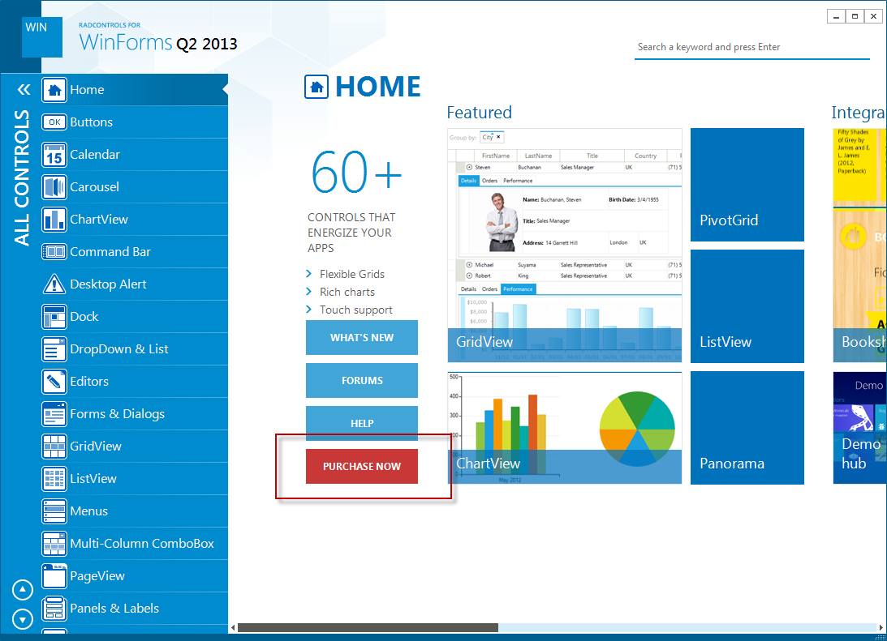
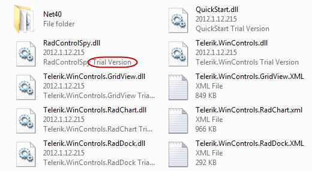
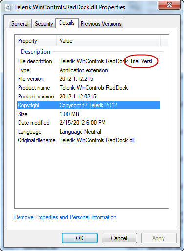
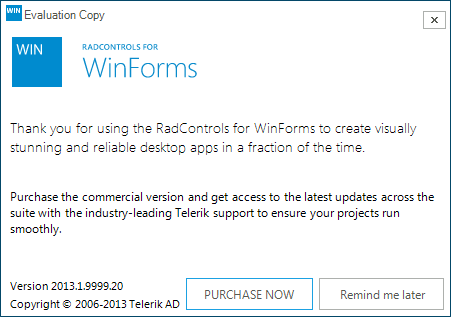

|Product Version|Product|Author|Last modified|
|----|----|----|----|
|Q1 2012|RadControls for WinForms|Nikolay Diyanov|July 16, 2013|

   
## PROBLEM 
   
It may happen that you have installed RadControls for WinForms, but you are unsure which version is that – Dev or Trial. There are no differences between the Trial and Dev versions in terms of features included, so it may become difficult for you to understand which your version is. The purpose of this article is to get you acquainted with the differences between the Dev and Trial versions, so that you know whether you have installed a Trial or a Dev version.  
   
## SOLUTION
 
**Examples application:**
To start off, it will be easier if you check the Home screen of our Demo application that comes with the suite. You can find it at *Start &gt;&gt; Telerik &gt;&gt; RadControls for WinForms [version] &gt;&gt; Run Demos*. The Home screen of the Trial version has a Purchase button:  
   
  
   
The Home screen of the Demo application that comes with the Dev suite does not have a Purchase button.  
   
**Assemblies description:**
Other marker to look for is the file description of the Telerik assembly that come with the suite. The Trial assemblies include the “Trial Version” string in their description while the Dev ones do not do so. Usually, you can find this assemblies at *C:\Program Files (x86)\Telerik\RadControls for WinForms [version]\Bin.*Here is how the Trial assemblies look:  
  
#### Figure 1: Trial assemblies view in the Bin folder
   
  
#### Figure 2: Properties window of Trial assemblies 
   
  
#### Figure 3: Trial assemblies view in the .NET tab of the Add Reference window of Visual Studio 
   
**Trial popup form:  
Last, but not least, if you have the Trial version installed, you should randomly get our Trial popup form shown. Still, this marker may not immediately become available to you, so it would be preferable if you check your version using one of the approaches above.

  
#### Figure 4: Trial popup window

