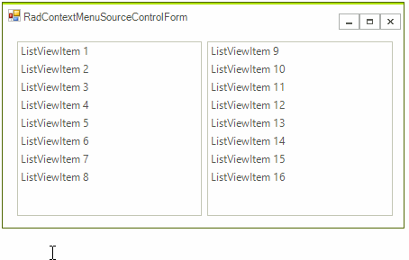

## Environment
<table>
	<tr>
		<td>Product Version</td>
		<td>2018.1 220</td>
	</tr>
	<tr>
		<td>Product</td>
		<td>RadContextMenu for WinForms</td>
	</tr>
</table>


## Description

The **RadContextMenuManager** component allows a single **RadContextMenu** instance to be associated with various controls. This KB article demonstrates a way to distinguish the source control of the menu. It may be useful in a scenario requiring the menu items need to be dynamically changed or different actions be invoked upon clicking the menu items. The example assumes that two different **RadListView** controls are using the same **RadContextMenu**. Additional information about the **RadContextMenuManager** component is available here: https://docs.telerik.com/devtools/winforms/menus/contextmenu/assign-radcontextmenu-to-telerik-and-non-telerik-controls.

## Solution

The source control will be extracted from the element`s visual tree and stored in a variable so that it can be validated upon clicking the menu items.

>caption Figure 1: Single Context Menu


#### Context Menu Events

{{source=..\SamplesCS\KnowledgeBase\RadContextMenuSourceControlForm.cs region=RadContextMenuSourceControlFormCode}} 
{{source=..\SamplesVB\KnowledgeBase\RadContextMenuSourceControlForm.vb region=RadContextMenuSourceControlFormCode}}
````C#
public partial class RadContextMenuSourceControlForm : Telerik.WinControls.UI.RadForm
{
    public RadContextMenuSourceControlForm()
    {
        InitializeComponent();
        this.radContextMenu1.DropDownOpening += RadContextMenu1_DropDownOpening;
        this.radMenuItem1.Click += RadMenuItem1_Click;
    }
    private void RadMenuItem1_Click(object sender, EventArgs e)
    {
        if (this.currentControl == this.radListView1)
        {
            //...
        }
        else if (this.currentControl == this.radListView2)
        {
            //...
        }
        RadMessageBox.Show(this.currentControl.Name);
    }
    RadControl currentControl = null;
    private void RadContextMenu1_DropDownOpening(object sender, CancelEventArgs e)
    {
        RadElement element = sender as RadElement;
        if (element == null)
        {
            return;
        }
        this.currentControl = element.ElementTree.Control as RadControl;
        if (this.currentControl != null)
        {
            Console.WriteLine(this.currentControl.Name);
        }
    }
}

````
````VB.NET
Public Class RadContextMenuSourceControlForm
    Public Sub New()
        InitializeComponent()
        AddHandler Me.radContextMenu1.DropDownOpening, AddressOf RadContextMenu1_DropDownOpening
        AddHandler Me.radMenuItem1.Click, AddressOf RadMenuItem1_Click
    End Sub
    Private Sub RadMenuItem1_Click(ByVal sender As Object, ByVal e As EventArgs)
        If Me.currentControl Is Me.radListView1 Then
            '../
        ElseIf Me.currentControl Is Me.radListView2 Then
            '...
        End If
        RadMessageBox.Show(Me.currentControl.Name)
    End Sub
    Private currentControl As RadControl = Nothing
    Private Sub RadContextMenu1_DropDownOpening(ByVal sender As Object, ByVal e As CancelEventArgs)
        Dim element As RadElement = TryCast(sender, RadElement)
        If element Is Nothing Then
            Return
        End If
        Me.currentControl = TryCast(element.ElementTree.Control, RadControl)
        If Me.currentControl IsNot Nothing Then
            Console.WriteLine(Me.currentControl.Name)
        End If
    End Sub
End Class

````


{{endregion}}

# See Also
* [RadContextMenuManager]()