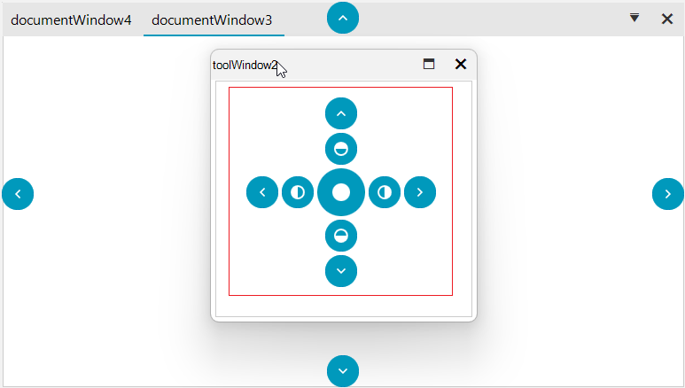
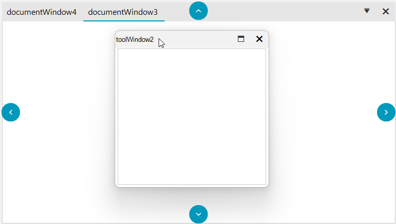

## Environment

|Product Version|Product|Author|
|----|----|----|
|2024.3.806|RadDock for WinForms|[Nadya Todorova](https://www.telerik.com/blogs/author/nadya-karaivanova)|

## Description

By default, when the user starts dragging a window in RadDock, Docking Assistant appears. Docking Assistant uses DockingGuidesTemplates to show hints to help the user to relocate the window. For more information please refer to [Using the DragDropService]()

>caption Figure 1: Before.



A common requirement is to hide some of the docking guide indicators. This article demonstrates how one can manage the docking hints appearance and achieve the look as the image below:

>caption Figure 2: After



## Solution

To achieve this, you should handle the **DragDropService.PreviewDockPosition** event of RadDock. **AllowedDockPosition** property gets or sets the allowed dock position for the hit-tested drop target which you can customize and set only the relevant positions for you.

Please refer to the following code snippet:

````C#

DragDropService service = this.radDock1.GetService<DragDropService>();
service.PreviewDockPosition += Service_PreviewDockPosition;

private void Service_PreviewDockPosition(object sender, DragDropDockPositionEventArgs e)
{
    if (e.GuidePosition == DockingGuidesPosition.Center)
    {
        e.AllowedDockPosition = AllowedDockPosition.None;
    }
}

````
````VB.NET
Dim service As DragDropService = Me.radDock1.GetService(Of DragDropService)()
AddHandler service.PreviewDockPosition, AddressOf Service_PreviewDockPosition

Private Sub Service_PreviewDockPosition(ByVal sender As Object, ByVal e As DragDropDockPositionEventArgs)
        If e.GuidePosition = DockingGuidesPosition.Center Then
            e.AllowedDockPosition = AllowedDockPosition.None
        End If
    End Sub

````

>note Feel free to customize further the **AllowedDockPositions** with different options according to  your needs.


## See Also
                                
[Using the DragDropService]()
[DockingGuidesTemplate]()
