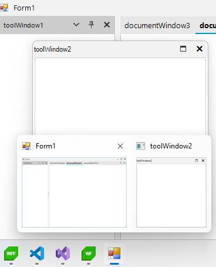

## Environment

|Product Version|Product|Author|
|----|----|----|
|2024.3.806|RadDock for WinForms|[Dinko Krastev](https://www.telerik.com/blogs/author/dinko-krastev)|

## Description

In a WinForms application that uses RadDock, the DocumentWindow can be detached and displayed on the taskbar, but the ToolWindow, when detached, does not show up on the taskbar. This article explains how to make ToolWindows visible on the taskbar.



## Solution

To make detached ToolWindows appear on the taskbar, subscribe to the `FloatingWindowCreated` event of `RadDock` and set the `ShowInTaskbar` property of the window to `true`. 

````C#
public Form1()
{
    InitializeComponent();
    this.radDock1.FloatingWindowCreated += RadDock1_FloatingWindowCreated;
}

private void RadDock1_FloatingWindowCreated(object sender, Telerik.WinControls.UI.Docking.FloatingWindowEventArgs e)
{
    e.Window.ShowInTaskbar = true;
}

````
````VB.NET

Public Sub New()
        InitializeComponent()
        AddHandler Me.radDock1.FloatingWindowCreated, AddressOf RadDock1_FloatingWindowCreated
    End Sub

Private Sub RadDock1_FloatingWindowCreated(ByVal sender As Object, ByVal e As Telerik.WinControls.UI.Docking.FloatingWindowEventArgs)
        e.Window.ShowInTaskbar = True
    End Sub

````

## See Also

* [RadDock Overview](https://docs.telerik.com/devtools/winforms/controls/raddock/overview)
* [Customizing Floating Windows]()
