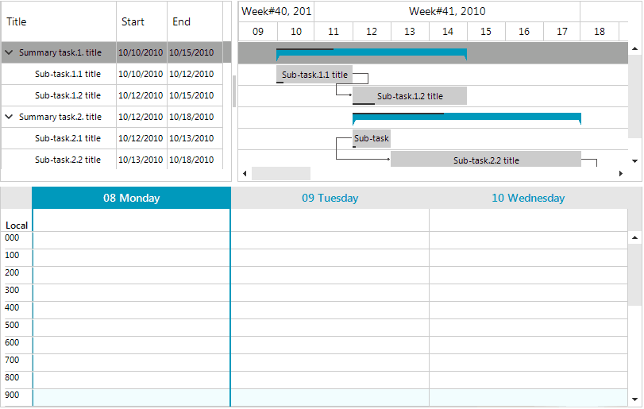

## Environment
 
|Product Version|Product|Author|
|----|----|----|
|2019.2.618|RadGanttView for WinForms|[Desislava Yordanova](https://www.telerik.com/blogs/author/desislava-yordanova)|
 

## Description

**RadGanttView** supports drag and drop functionality for its tasks out of the box. A common requirement is to drag a task outside the ganttview, e.g. to **RadScheduler** and add an appointment after dropping the task to a specific cell.

>caption Drag and Drop from RadGanttView to RadScheduler



## Solution 

This behavior can be achieved by the **GanttViewDragDropService** which is accessed by the GanttViewElement.**DragDropService** property. As a descendant of **RadDragDropService**, [GanttViewDragDropService]() handles the whole drag and drop operation. The **PreviewDragOver** event allows you to control on what targets the task being dragged can be dropped on. The **PreviewDragDrop** event allows you to get a handle on all the aspects of the drag and drop operation, the source (drag) **RadGanttView**, the destination (target) control, as well as the task being dragged.

It is necessary to implement a custom **BaseGanttViewBehavior** in order to start the service on mouse down. Since **RadGanttView** allows only horizontal dragging of a task, the **HandleMouseMove** method of the inherited **GanttViewDragDropService** ensures that you can drag the task outside the associated row.

Consider **RadGanttView** is populated programmatically with **GanttViewDataItems** in the **PopulateGanttView** method.

####  Drag tasks from RadGanttView to RadScheduler

````C#

          public RadForm1()
        {
            InitializeComponent();

            PopulateGanttView();

            this.radGanttView1.GanttViewBehavior = new CustomGanttViewBehavior();
            this.radGanttView1.DragDropService = new CustomGanttViewDragDropService(this.radGanttView1.GanttViewElement);

            this.radGanttView1.DragDropService.PreviewDragOver += GanttViewDragDropService_PreviewDragOver;
            this.radGanttView1.DragDropService.PreviewDragDrop += GanttViewDragDropService_PreviewDragDrop;

            GanttViewTextViewColumn titleColumn = new GanttViewTextViewColumn("Title");
            GanttViewTextViewColumn startColumn = new GanttViewTextViewColumn("Start");
            GanttViewTextViewColumn endColumn = new GanttViewTextViewColumn("End");
            this.radGanttView1.GanttViewElement.Columns.Add(titleColumn);
            this.radGanttView1.GanttViewElement.Columns.Add(startColumn);
            this.radGanttView1.GanttViewElement.Columns.Add(endColumn);

            this.radGanttView1.DragDropService.PreviewDragStart += DragDropService_PreviewDragStart;
        }

        private void GanttViewDragDropService_PreviewDragOver(object sender, Telerik.WinControls.RadDragOverEventArgs e)
        {
            e.CanDrop = e.HitTarget is SchedulerCellElement | e.HitTarget is GanttViewTextViewCellElement;
        }

        public class CustomGanttViewBehavior : BaseGanttViewBehavior
        {
            protected override void ProcessScrolling(Point mousePosition, bool scrollVertical)
            {
            }

            public override bool ProcessMouseDown(MouseEventArgs e)
            {
                GanttViewTextViewCellElement cellElement = this.GanttViewElement.ElementTree.GetElementAtPoint(e.Location) as GanttViewTextViewCellElement;
                if (cellElement != null && e.Button == System.Windows.Forms.MouseButtons.Left)
                    this.GanttViewElement.DragDropService.Start(cellElement);

                return base.ProcessMouseDown(e);
            }
        }

        private void DragDropService_PreviewDragStart(object sender, Telerik.WinControls.PreviewDragStartEventArgs e)
        {
            GanttViewTextViewCellElement cellElement = e.DragInstance as GanttViewTextViewCellElement;
            if (cellElement != null)
                e.CanStart = true;
        }

        private void GanttViewDragDropService_PreviewDragDrop(object sender, Telerik.WinControls.RadDropEventArgs e)
        {
            SchedulerCellElement schedulerCell = e.HitTarget as SchedulerCellElement;
            if (schedulerCell == null)
            {
                DayViewAllDayHeader allDay = ((SchedulerDayViewElement)this.radScheduler1.SchedulerElement.ViewElement).AllDayHeaderElement;
                schedulerCell = SchedulerUIHelper.GetCellAtPoint(e.DropLocation, allDay.Children);
            }
            if (schedulerCell == null)
                return;
            GanttViewTaskElement draggedTaskElement = e.DragInstance as GanttViewTaskElement;
            GanttViewTextViewCellElement cellElement = e.DragInstance as GanttViewTextViewCellElement;
            if (draggedTaskElement == null && cellElement == null)
                return;
            Appointment appointment = new Appointment();
            appointment.Start = schedulerCell.Date;
            appointment.End = schedulerCell.Date.Add(schedulerCell.Duration);

            if (draggedTaskElement != null)
                appointment.Summary = draggedTaskElement.Text;
            else if (cellElement != null
            )
                appointment.Summary = cellElement.DataItem.Title;

            this.radScheduler1.Appointments.Add(appointment);
        }

        public class CustomGanttViewDragDropService : GanttViewDragDropService
        {
            public CustomGanttViewDragDropService(RadGanttViewElement owner)
                : base(owner)
            {
            }

            protected override void HandleMouseMove(Point mousePos)
            {
                var l = this.Location;
                this.Location = mousePos;
                base.HandleMouseMove(mousePos);
                this.Location = l;
            }
        }     
       
````
````VB.NET
    
    Sub New()

        InitializeComponent()

        PopulateGanttView()

        Me.RadGanttView1.GanttViewBehavior = New CustomGanttViewBehavior()
        Me.RadGanttView1.DragDropService = New CustomGanttViewDragDropService(Me.RadGanttView1.GanttViewElement)

        AddHandler Me.RadGanttView1.DragDropService.PreviewDragOver, AddressOf GanttViewDragDropService_PreviewDragOver
        AddHandler Me.RadGanttView1.DragDropService.PreviewDragDrop, AddressOf GanttViewDragDropService_PreviewDragDrop

        Dim titleColumn As New GanttViewTextViewColumn("Title")
        Dim startColumn As New GanttViewTextViewColumn("Start")
        Dim endColumn As New GanttViewTextViewColumn("End")
        Me.RadGanttView1.GanttViewElement.Columns.Add(titleColumn)
        Me.RadGanttView1.GanttViewElement.Columns.Add(startColumn)
        Me.RadGanttView1.GanttViewElement.Columns.Add(endColumn)

        AddHandler Me.RadGanttView1.DragDropService.PreviewDragStart, AddressOf DragDropService_PreviewDragStart
    End Sub
   
    Private Sub GanttViewDragDropService_PreviewDragOver(sender As Object, e As Telerik.WinControls.RadDragOverEventArgs)
        e.CanDrop = TypeOf e.HitTarget Is SchedulerCellElement 
    End Sub

    Public Class CustomGanttViewBehavior
    Inherits BaseGanttViewBehavior
        Protected Overrides Sub ProcessScrolling(mousePosition As Point, scrollVertical As Boolean)

        End Sub

        Public Overrides Function ProcessMouseDown(e As MouseEventArgs) As Boolean
            Dim cellElement As GanttViewTextViewCellElement = TryCast(Me.GanttViewElement.ElementTree.GetElementAtPoint(e.Location), GanttViewTextViewCellElement)
            If cellElement IsNot Nothing AndAlso e.Button = Windows.Forms.MouseButtons.Left Then
                Me.GanttViewElement.DragDropService.Start(cellElement)
            End If

            Return MyBase.ProcessMouseDown(e)
        End Function
    End Class

    Private Sub DragDropService_PreviewDragStart(sender As Object, e As Telerik.WinControls.PreviewDragStartEventArgs)
        Dim cellElement As GanttViewTextViewCellElement = TryCast(e.DragInstance, GanttViewTextViewCellElement)
        If cellElement IsNot Nothing Then
            e.CanStart = True
        End If

    End Sub
    Private Sub GanttViewDragDropService_PreviewDragDrop(sender As Object, e As Telerik.WinControls.RadDropEventArgs)
        Dim schedulerCell As SchedulerCellElement = TryCast(e.HitTarget, SchedulerCellElement)
        If schedulerCell Is Nothing Then
            Dim allDay As DayViewAllDayHeader = TryCast(Me.RadScheduler1.SchedulerElement.ViewElement, SchedulerDayViewElement).AllDayHeaderElement
            schedulerCell = SchedulerUIHelper.GetCellAtPoint(e.DropLocation, allDay.Children)
        End If
        If schedulerCell Is Nothing Then
            Return
        End If
        Dim draggedTaskElement As GanttViewTaskElement = TryCast(e.DragInstance, GanttViewTaskElement)
        Dim cellElement As GanttViewTextViewCellElement = TryCast(e.DragInstance, GanttViewTextViewCellElement)
        If draggedTaskElement Is Nothing andalso cellElement is Nothing Then
            Return
        End If
        Dim appointment As New Appointment()
        appointment.Start = schedulerCell.Date
        appointment.[End] = schedulerCell.Date.Add(schedulerCell.Duration)
      
        If draggedTaskElement isnot Nothing  Then
            appointment.Summary = draggedTaskElement.Text
        Else If cellElement isnot Nothing 
            appointment.Summary = cellElement.DataItem .Title 
        End If

        Me.RadScheduler1.Appointments.Add(appointment)
    End Sub

    Public Class CustomGanttViewDragDropService
    Inherits GanttViewDragDropService
        Public Sub New(owner As RadGanttViewElement)
            MyBase.New(owner)

        End Sub

        Protected Overrides Sub HandleMouseMove(mousePos As Point)
            Dim l = Me.Location
            Me.Location = mousePos
            MyBase.HandleMouseMove(mousePos)
            Me.Location = l
        End Sub
    End Class
  
    
````


# See Also

 * [GanttViewDragDropService]()
