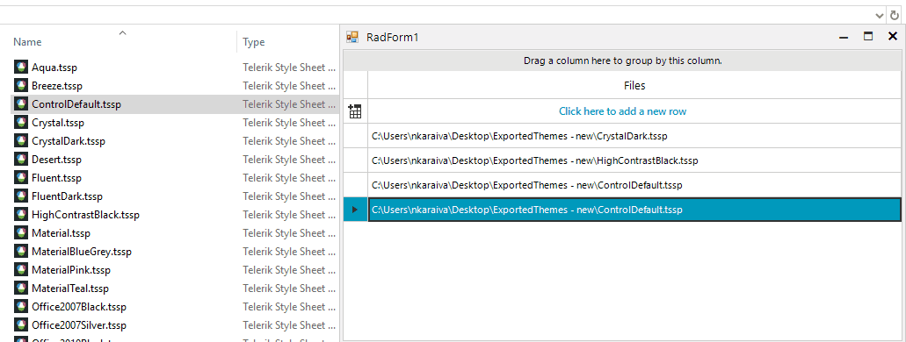

## Environment
 
|Product Version|Product|Author|
|----|----|----|
|2020.3.915|RadGridView for WinForms|[Nadya Karaivanova](https://www.telerik.com/blogs/author/nadya-karaivanova)|
 
## Description

A common requirement is to implement drag-drop behavior between controls. The first approach is to implement drag-drop operations between RadControls, e.g. between two **RadGridViews** or between **RadGridView** and **RadTreeView**, etc. In this case you can use the respective **RadDragDropService**. **RadDragDropService** represents a service that manages drag and drop actions in RadControls. According to the used control you can find the appropriate **RadDragDropService**, for example **RadGridView** handles the whole drag and drop operations by its [RadGridViewDragDropService](https://docs.telerik.com/devtools/winforms/controls/gridview/drag-and-drop/radgridviewdragdropservice), **RadTreeView** offers [TreeViewDragDropService](https://docs.telerik.com/devtools/winforms/controls/treeview/drag-and-drop/treeviewdragdropservice), etc. A table with the respective RadControl and its **RadDragDropService** is available [here](https://docs.telerik.com/devtools/winforms/telerik-presentation-framework/raddragdropservice)

The second approach it to implement drag-drop operations between RadControls, e.g. **RadGridView** and a standart MS control, e.g. GridView, TreeView or File Explorer. In this case, it is suitable to use the [Ole drag-and-drop](https://docs.microsoft.com/en-us/dotnet/desktop/winforms/advanced/walkthrough-performing-a-drag-and-drop-operation-in-windows-forms?view=netframeworkdesktop-4.8) functionality that Microsoft offers. 

In this tutorial, I will demonstrate how you can achieve drag-and-drop functionality between File Explorer and **RadGridView**.




## Solution 

In order to achieve this, you should carefully follow the steps described [here](https://docs.microsoft.com/en-us/dotnet/desktop/winforms/advanced/walkthrough-performing-a-drag-and-drop-operation-in-windows-forms?view=netframeworkdesktop-4.8#to-perform-a-drop).

**To perform a drop:**

1. Set the [AllowDrop](https://docs.microsoft.com/en-us/dotnet/api/system.windows.forms.control.allowdrop?view=netcore-3.1) property to true.

2. In the [DragEnter](https://docs.microsoft.com/en-us/dotnet/api/system.windows.forms.control.dragenter?view=net-5.0) event for the control where the drop will occur, ensure that the data being dragged is of an acceptable type by using the respective effect from [DragDropEffects](https://docs.microsoft.com/en-us/dotnet/api/system.windows.forms.dragdropeffects?view=netcore-3.1) enumeration.

3. In the [DragDrop](https://docs.microsoft.com/en-us/dotnet/api/system.windows.forms.control.dragdrop?view=net-5.0) event for the control is where the drop will occur. In order to detect which is the row the file is dropped to you can use the GetElementAtPoint method to check if the element is **GridDataCellElement** and get the row as well as the row index.

A full code snippet is demonstrated below

#### Drag a file from File Explorer and drop it to RadGridView

````C#
public RadForm1()
{
    InitializeComponent();
    this.radGridView1.Columns.Add("Files");
    this.radGridView1.AutoSizeColumnsMode = GridViewAutoSizeColumnsMode.Fill;
    this.radGridView1.AllowDrop = true;
    this.radGridView1.DragEnter += this.RadGridView1_DragEnter;
    this.radGridView1.DragDrop += this.RadGridView1_DragDrop;
}
private void RadGridView1_DragDrop(object sender, DragEventArgs e)
{
    if (e.Data.GetDataPresent(DataFormats.FileDrop))
    {
        Point pt = this.radGridView1.PointToClient(new Point(e.X, e.Y));
        GridDataCellElement cellElement = this.radGridView1.ElementTree.GetElementAtPoint(pt) as GridDataCellElement;
        if (cellElement != null)
        {
            GridViewRowInfo row = cellElement.RowInfo;
            int rowIndex = cellElement.RowIndex;
        }
        string[] files = (string[])e.Data.GetData(DataFormats.FileDrop);

        foreach (var file in files)
        {
            this.radGridView1.Rows.Add(file);
        }
    }
}

private void RadGridView1_DragEnter(object sender, DragEventArgs e)
{
    e.Effect = DragDropEffects.All;
}


````
````VB.NET
 Public Sub New()
     InitializeComponent()
     Me.RadGridView1.Columns.Add("Files")
     Me.RadGridView1.AutoSizeColumnsMode = GridViewAutoSizeColumnsMode.Fill
     Me.RadGridView1.AllowDrop = True
     AddHandler Me.RadGridView1.DragEnter, AddressOf Me.RadGridView1_DragEnter
     AddHandler Me.RadGridView1.DragDrop, AddressOf Me.RadGridView1_DragDrop
 End Sub

 Private Sub RadGridView1_DragDrop(ByVal sender As Object, ByVal e As DragEventArgs)
     If e.Data.GetDataPresent(DataFormats.FileDrop) Then
         Dim pt As Point = Me.RadGridView1.PointToClient(New Point(e.X, e.Y))
         Dim cellElement As GridDataCellElement = TryCast(Me.RadGridView1.ElementTree.GetElementAtPoint(pt), GridDataCellElement)

         If cellElement IsNot Nothing Then
             Dim row As GridViewRowInfo = cellElement.RowInfo
             Dim rowIndex As Integer = cellElement.RowIndex
         End If
         Dim files As String() = CType(e.Data.GetData(DataFormats.FileDrop), String())
         For Each file In files
             Me.RadGridView1.Rows.Add(file)
         Next
     End If
 End Sub

 Private Sub RadGridView1_DragEnter(ByVal sender As Object, ByVal e As DragEventArgs)
     e.Effect = DragDropEffects.All
 End Sub


````

