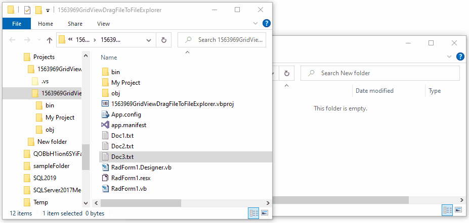

## Environment
 
|Product Version|Product|Author|
|----|----|----|
|2022.2.510|RadGridView for WinForms|[Desislava Yordanova](https://www.telerik.com/blogs/author/desislava-yordanova)|


## Description

This article demonstrates how to drag a file that is stored as a file path in RadGridView and drop it onto the Windows File Explorer. As a result, the file is copied. 
 


## Solution

In order to drag a file, stored in the appropriate way in RadGridView and drop it onto the FileExplorer, it would be necessary to use the standard [OLE drag and drop](https://docs.microsoft.com/en-us/dotnet/desktop/winforms/advanced/walkthrough-performing-a-drag-and-drop-operation-in-windows-forms?view=netframeworkdesktop-4.8).

>note If you want to move the file instead of copying it, feel free to use DragDropEffects.[Move](https://docs.microsoft.com/en-us/dotnet/api/system.windows.forms.dragdropeffects?view=windowsdesktop-6.0) when starting the drag operation.

````C#  

public RadForm1()
{
    InitializeComponent(); 
    this.radGridView1.Columns.Add("FilePath");
    this.radGridView1.AutoSizeColumnsMode = Telerik.WinControls.UI.GridViewAutoSizeColumnsMode.Fill;
    this.radGridView1.Rows.Add(@"C:\Projects\1563969GridViewDragFileToFileExplorer\1563969GridViewDragFileToFileExplorer\Doc1.txt");
    this.radGridView1.Rows.Add(@"C:\Projects\1563969GridViewDragFileToFileExplorer\1563969GridViewDragFileToFileExplorer\Doc2.txt");
    this.radGridView1.Rows.Add(@"C:\Projects\1563969GridViewDragFileToFileExplorer\1563969GridViewDragFileToFileExplorer\Doc3.txt");

    this.radGridView1.MouseDown += radGridView1_MouseDown;
}

private void radGridView1_MouseDown(object sender, MouseEventArgs e)
{
    if (e.Button == MouseButtons.Left && this.radGridView1.CurrentRow != null)
    {
        string filePath = this.radGridView1.CurrentRow.Cells["FilePath"].Value.ToString();
        string[] files = new string[] { filePath };
        this.DoDragDrop(new DataObject(DataFormats.FileDrop, files), DragDropEffects.Copy);
    }
}
   

````
````VB.NET

Sub New()
    InitializeComponent()

    Me.RadGridView1.Columns.Add("FilePath")
    Me.RadGridView1.AutoSizeColumnsMode = Telerik.WinControls.UI.GridViewAutoSizeColumnsMode.Fill
    Me.RadGridView1.Rows.Add("C:\Projects\1563969GridViewDragFileToFileExplorer\1563969GridViewDragFileToFileExplorer\Doc1.txt")
    Me.RadGridView1.Rows.Add("C:\Projects\1563969GridViewDragFileToFileExplorer\1563969GridViewDragFileToFileExplorer\Doc2.txt")
    Me.RadGridView1.Rows.Add("C:\Projects\1563969GridViewDragFileToFileExplorer\1563969GridViewDragFileToFileExplorer\Doc3.txt")

    AddHandler Me.RadGridView1.MouseDown, AddressOf RadGridView1_MouseDown
End Sub

Private Sub RadGridView1_MouseDown(sender As Object, e As MouseEventArgs)
    If e.Button = Windows.Forms.MouseButtons.Left AndAlso Me.RadGridView1.CurrentRow IsNot Nothing Then
        Dim filePath As String = Me.RadGridView1.CurrentRow.Cells("FilePath").Value.ToString()
        Dim files As String() = New String() {filePath}
        Me.DoDragDrop(New DataObject(DataFormats.FileDrop, files), DragDropEffects.Copy)
    End If
End Sub

````

# See Also

* [RadGridViewDragDropService]()
