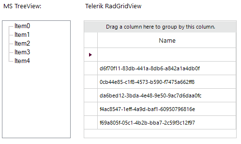

### Environment
 
|Product Version|Product|Author|
|----|----|----|
|2023.2.718|RadGridView for WinForms|[Desislava Yordanova](https://www.telerik.com/blogs/author/desislava-yordanova)|
 
## Description

 This article demonstartes how to achieve dragging of nodes from the standard TreeView and dropping over RadGridView to insert a new row at the respective position.



## Solution

If you need to drag an item from a non-Telerik control and drop it onto the RadGridView, the drag and drop operation is entirely managed outside the RadGridViewDragDropService. 

The OLE drag and drop is a suitable functionality for covering drag and drop scenarios between different WinForms controls like it is demonstarte din the following tutorial:

https://learn.microsoft.com/en-us/dotnet/desktop/winforms/advanced/walkthrough-performing-a-drag-and-drop-operation-in-windows-forms?view=netframeworkdesktop-4.8 

The OLE drag and drop is a standard functionality supported by the MS WinForms controls as well as the Telerik controls. Hence, we will use it in this example as well to achieve the illustrated functionality from the gif file:
 
````C#

        public RadForm1()
        {
            InitializeComponent();

            for (int i = 0; i < 5; i++)
            {
                this.treeView1.Nodes.Add("Item" + i);
            }

            this.radGridView1.Columns.Add("Name");
            this.radGridView1.AutoSizeColumnsMode = GridViewAutoSizeColumnsMode.Fill;
            for (int i = 0; i < 5; i++)
            {
                this.radGridView1.Rows.Add(Guid.NewGuid().ToString());
            }

            this.radGridView1.AllowDrop = true;

            this.treeView1.ItemDrag += TreeView1_ItemDrag; 
            this.radGridView1.DragOver += RadGridView1_DragOver;
            this.radGridView1.DragDrop += RadGridView1_DragDrop;
        }

        private void RadGridView1_DragDrop(object sender, DragEventArgs e)
        {
            var targetLocation = this.radGridView1.PointToClient(new Point(e.X, e.Y));
            GridDataCellElement elementUnderMouse = this.radGridView1.ElementTree.GetElementAtPoint(targetLocation) as GridDataCellElement;
            if (elementUnderMouse != null)
            {
                int rowIndex = this.radGridView1.Rows.IndexOf(elementUnderMouse.RowInfo);
                GridViewRowInfo row = this.radGridView1.Rows.NewRow();
                // Retrieve the node that was dragged.  
                TreeNode draggedNode = (TreeNode)e.Data.GetData(typeof(TreeNode));
                row.Cells["Name"].Value = draggedNode.Text;
                this.radGridView1.Rows.Insert(rowIndex, row);
            }
        }

        private void RadGridView1_DragOver(object sender, DragEventArgs e)
        {
            var targetLocation = this.radGridView1.PointToClient(new Point(e.X, e.Y));
            GridDataCellElement elementUnderMouse = this.radGridView1.ElementTree.GetElementAtPoint(targetLocation) as GridDataCellElement;
            if (elementUnderMouse != null)
            {
                Console.WriteLine(elementUnderMouse);
                e.Effect = e.AllowedEffect;
            }
            else
            {
                e.Effect = DragDropEffects.None;
            }
        } 
        private void TreeView1_ItemDrag(object sender, ItemDragEventArgs e)
        {
            // Move the dragged node when the left mouse button is used.  
            if (e.Button == MouseButtons.Left)
            {
                DoDragDrop(e.Item, DragDropEffects.Move);
            }

            // Copy the dragged node when the right mouse button is used.  
            else if (e.Button == MouseButtons.Right)
            {
                DoDragDrop(e.Item, DragDropEffects.Copy);
            }
        } 

        private void TreeView1_MouseDown(object sender, MouseEventArgs e)
        {
            throw new NotImplementedException();
        }

        private void TreeView1_MouseMove(object sender, MouseEventArgs e)
        {
            if (e.Button == MouseButtons.Left && this.treeView1.SelectedNode != null)
            {
                this.treeView1.DoDragDrop(this.treeView1.SelectedNode.Text, 
                    DragDropEffects.Copy | DragDropEffects.Move);
            }
        }

````
````VB.NET

    Public Sub New()
        InitializeComponent()

        For i As Integer = 0 To 5 - 1
            Me.TreeView1.Nodes.Add("Item" & i)
        Next

        Me.RadGridView1.Columns.Add("Name")
        Me.RadGridView1.AutoSizeColumnsMode = GridViewAutoSizeColumnsMode.Fill

        For i As Integer = 0 To 5 - 1
            Me.RadGridView1.Rows.Add(Guid.NewGuid().ToString())
        Next

        Me.RadGridView1.AllowDrop = True
        AddHandler Me.TreeView1.ItemDrag, AddressOf TreeView1_ItemDrag
        AddHandler Me.RadGridView1.DragOver, AddressOf RadGridView1_DragOver
        AddHandler Me.RadGridView1.DragDrop, AddressOf RadGridView1_DragDrop
    End Sub

    Private Sub RadGridView1_DragDrop(ByVal sender As Object, ByVal e As DragEventArgs)
        Dim targetLocation = Me.RadGridView1.PointToClient(New Point(e.X, e.Y))
        Dim elementUnderMouse As GridDataCellElement = TryCast(Me.RadGridView1.ElementTree.GetElementAtPoint(targetLocation), GridDataCellElement)

        If elementUnderMouse IsNot Nothing Then
            Dim rowIndex As Integer = Me.RadGridView1.Rows.IndexOf(elementUnderMouse.RowInfo)
            Dim row As GridViewRowInfo = Me.RadGridView1.Rows.NewRow()
            Dim draggedNode As TreeNode = CType(e.Data.GetData(GetType(TreeNode)), TreeNode)
            row.Cells("Name").Value = draggedNode.Text
            Me.RadGridView1.Rows.Insert(rowIndex, row)
        End If
    End Sub

    Private Sub RadGridView1_DragOver(ByVal sender As Object, ByVal e As DragEventArgs)
        Dim targetLocation = Me.RadGridView1.PointToClient(New Point(e.X, e.Y))
        Dim elementUnderMouse As GridDataCellElement = TryCast(Me.RadGridView1.ElementTree.GetElementAtPoint(targetLocation), GridDataCellElement)

        If elementUnderMouse IsNot Nothing Then
            Console.WriteLine(elementUnderMouse)
            e.Effect = e.AllowedEffect
        Else
            e.Effect = DragDropEffects.None
        End If
    End Sub

    Private Sub TreeView1_ItemDrag(ByVal sender As Object, ByVal e As ItemDragEventArgs)
        If e.Button = MouseButtons.Left Then
            DoDragDrop(e.Item, DragDropEffects.Move)
        ElseIf e.Button = MouseButtons.Right Then
            DoDragDrop(e.Item, DragDropEffects.Copy)
        End If
    End Sub

    Private Sub TreeView1_MouseDown(ByVal sender As Object, ByVal e As MouseEventArgs)
        Throw New NotImplementedException()
    End Sub

    Private Sub TreeView1_MouseMove(ByVal sender As Object, ByVal e As MouseEventArgs)
        If e.Button = MouseButtons.Left AndAlso Me.TreeView1.SelectedNode IsNot Nothing Then
            Me.TreeView1.DoDragDrop(Me.TreeView1.SelectedNode.Text, DragDropEffects.Copy Or DragDropEffects.Move)
        End If
    End Sub
    
````

# See Also

 * [RadGridViewDragDropService]()
 * [Rows Reordering in Self-reference Hierarchy]()

