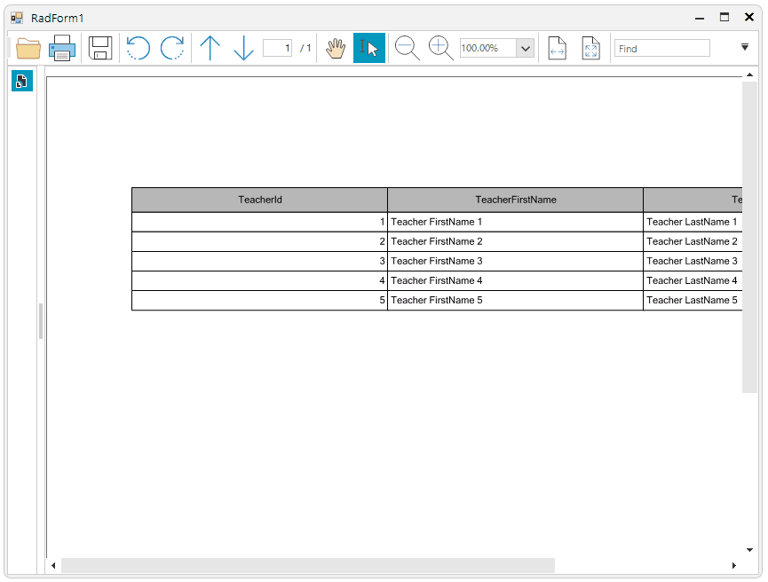

## Environment
|Product Version|Product|Author|
|----|----|----|
|2023.2.718|RadPdfViewer for WinForms|[Desislava Yordanova](https://www.telerik.com/blogs/author/desislava-yordanova)|

## Problem

For a regular WinForms control painting a rectangle would be a straightforward task assuming you have calculated the coordinates. In the RadPdfViewer, however, this is more complex because the control works with a document, and any custom rendering must be applied to the document itself. This way these settings will be preserved and still available when you save or print the document.
This article shows how you can get the top left location of the context menu and draw a rectangle in the WinForms PdfViewer.

  

## Solution

We can achieve this task with the help of the RadPdfProcessing library. The library exposes convenient APIs for creating and editing PDF documents: [PdfProcessing - Overview - Telerik Document Processing](https://docs.telerik.com/devtools/document-processing/libraries/radpdfprocessing/overview). For your actual scenario it will be necessary to work with the loaded inside the UI control document and modify it with the FixedContentEditor class. We can use the editor to paint a rectangle at a desired location. 

[PdfProcessing - FixedContentEditor - Telerik Document Processing](https://docs.telerik.com/devtools/document-processing/libraries/radpdfprocessing/editing/fixedcontenteditor)

[PdfProcessing - Colors and Color Spaces - Telerik Document Processing](https://docs.telerik.com/devtools/document-processing/libraries/radpdfprocessing/concepts/colors-and-color-spaces)

After we edit the document, we need to reload it inside the control so that the changes are reflected. This is a sample implementation of the context menu item Click event: 


````C#

public partial class RadForm1 : Telerik.WinControls.UI.RadForm
{
    int paginaCurenta = 0; //the current pdf page
    float pozitiaX = 0; // the mouse down X position
    float pozitiaY = 0; // the mouse down Y position

    public RadForm1()
    {
        InitializeComponent();

        this.radPdfViewer1.LoadDocument(@"..\..\sample.pdf");

        this.radPdfViewer1.MouseDown += this.RadPdfViewer1_MouseDown;
        this.CreateContextMenu();
        this.radPdfViewer1.PdfViewerElement.Mode = FixedDocumentViewerMode.TextSelection;
    }

    private void RadPdfViewer1_MouseDown(object sender, MouseEventArgs e)
    {
        var element = this.radPdfViewer1.ElementTree.GetElementAtPoint(e.Location) as RadFixedPageElement;

        if (element != null)
        {

            var mouseLocation = e.Location;
            var tt = element.TotalTransform;
            tt.Invert();

            var pointInDoc = tt.TransformPoint(mouseLocation);

            var currentPageIndex = this.radPdfViewer1.Document.Pages.IndexOf(element.Page);
            var zoom = this.radPdfViewer1.PdfViewerElement.ScaleFactor;


            paginaCurenta = currentPageIndex;
            pozitiaX = (pointInDoc.X / zoom);
            pozitiaY = (pointInDoc.Y / zoom);
        }
    }

    private void CreateContextMenu()
    {
        RadMenuItem item = new RadMenuItem("Semneaza aici");
        item.ToolTipText = "plaseaza semnatura in pozitia curenta";

        item.Click += item_Click;

        RadItem[] items = new RadItem[this.radPdfViewer1.PdfViewerElement.ContextMenu.Items.Count];

        this.radPdfViewer1.PdfViewerElement.ContextMenu.Items.CopyTo(items, 0);

        this.radPdfViewer1.PdfViewerElement.ContextMenu.Items.Clear();
        this.radPdfViewer1.PdfViewerElement.ContextMenu.Items.Add(item);

        for (int w = 0; w < items.Length; w++)
        {
            this.radPdfViewer1.PdfViewerElement.ContextMenu.Items.Add(items[w]);
        }
    }

    private void item_Click(object sender, EventArgs e)
    {
        Telerik.Windows.Documents.Fixed.FormatProviders.Pdf.PdfFormatProvider provider = new Telerik.Windows.Documents.Fixed.FormatProviders.Pdf.PdfFormatProvider();
        MemoryStream ms = new MemoryStream();
        this.radPdfViewer1.PdfViewerElement.SaveDocument(ms);
        ms.Seek(0, SeekOrigin.Begin);
        RadFixedDocument doc = provider.Import(ms);

        var page = doc.Pages[paginaCurenta];
        FixedContentEditor editor = new FixedContentEditor(page);
        editor.Position = new MatrixPosition();
        var rotation = page.Rotation;

        if (rotation == Rotation.Rotate90)
        {
            editor.Position.Rotate(90);
        }
        else if (rotation == Rotation.Rotate270)
        {
            editor.Position.Rotate(270);
        }

        editor.Position.Translate(pozitiaX, pozitiaY);

        editor.GraphicProperties.FillColor = new RgbColor(67, 123, 123, 123);
        editor.DrawRectangle(new System.Windows.Rect(0, 0, 320, 80));

        MemoryStream newFile = new MemoryStream();
        provider.Export(doc, newFile);
        this.radPdfViewer1.UnloadDocument();
        newFile.Seek(0, SeekOrigin.Begin);
        this.radPdfViewer1.LoadDocument(newFile);
    }
}


````
````VB.NET
 
Private paginaCurenta As Integer = 0
Private pozitiaX As Single = 0
Private pozitiaY As Single = 0

Public Sub New()
    InitializeComponent()
    Me.RadPdfViewer1.LoadDocument("..\..\sample.pdf")
    AddHandler Me.RadPdfViewer1.MouseDown, AddressOf Me.RadPdfViewer1_MouseDown
    Me.CreateContextMenu()
    Me.RadPdfViewer1.PdfViewerElement.Mode = FixedDocumentViewerMode.TextSelection
End Sub

Private Sub RadPdfViewer1_MouseDown(ByVal sender As Object, ByVal e As MouseEventArgs)
    Dim element = TryCast(Me.RadPdfViewer1.ElementTree.GetElementAtPoint(e.Location), RadFixedPageElement)

    If element IsNot Nothing Then
        Dim mouseLocation = e.Location
        Dim tt = element.TotalTransform
        tt.Invert()
        Dim pointInDoc = tt.TransformPoint(mouseLocation)
        Dim currentPageIndex = Me.RadPdfViewer1.Document.Pages.IndexOf(element.Page)
        Dim zoom = Me.RadPdfViewer1.PdfViewerElement.ScaleFactor
        paginaCurenta = currentPageIndex
        pozitiaX = (pointInDoc.X / zoom)
        pozitiaY = (pointInDoc.Y / zoom)
    End If
End Sub

Private Sub CreateContextMenu()
    Dim item As RadMenuItem = New RadMenuItem("Semneaza aici")
    item.ToolTipText = "plaseaza semnatura in pozitia curenta"
    AddHandler item.Click, AddressOf item_Click
    Dim items As RadItem() = New RadItem(Me.RadPdfViewer1.PdfViewerElement.ContextMenu.Items.Count - 1) {}
    Me.RadPdfViewer1.PdfViewerElement.ContextMenu.Items.CopyTo(items, 0)
    Me.RadPdfViewer1.PdfViewerElement.ContextMenu.Items.Clear()
    Me.RadPdfViewer1.PdfViewerElement.ContextMenu.Items.Add(item)

    For w As Integer = 0 To items.Length - 1
        Me.RadPdfViewer1.PdfViewerElement.ContextMenu.Items.Add(items(w))
    Next
End Sub

Private Sub item_Click(ByVal sender As Object, ByVal e As EventArgs)
    Dim provider As Telerik.Windows.Documents.Fixed.FormatProviders.Pdf.PdfFormatProvider = New Telerik.Windows.Documents.Fixed.FormatProviders.Pdf.PdfFormatProvider()
    Dim ms As MemoryStream = New MemoryStream()
    Me.RadPdfViewer1.PdfViewerElement.SaveDocument(ms)
    ms.Seek(0, SeekOrigin.Begin)
    Dim doc As RadFixedDocument = provider.Import(ms)
    Dim page = doc.Pages(paginaCurenta)
    Dim editor As FixedContentEditor = New FixedContentEditor(page)
    editor.Position = New MatrixPosition()
    Dim rotation = page.Rotation

    If rotation = Rotation.Rotate90 Then
        editor.Position.Rotate(90)
    ElseIf rotation = Rotation.Rotate270 Then
        editor.Position.Rotate(270)
    End If

    editor.Position.Translate(pozitiaX, pozitiaY)
    editor.GraphicProperties.FillColor = New RgbColor(67, 123, 123, 123)
    editor.DrawRectangle(New System.Windows.Rect(0, 0, 320, 80))
    Dim newFile As MemoryStream = New MemoryStream()
    provider.Export(doc, newFile)
    Me.RadPdfViewer1.UnloadDocument()
    newFile.Seek(0, SeekOrigin.Begin)
    Me.RadPdfViewer1.LoadDocument(newFile)
End Sub

````

#№ See Also

* [RadPdfViewer]()


