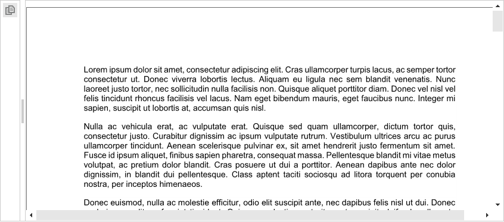

## Environment
 
|Product Version|Product|Author|
|----|----|----|
|2019.3.1022|RadPdfViewer for WinForms|[Desislava Yordanova](https://www.telerik.com/blogs/author/desislava-yordanova)|
 
## Description

**RadPdfViewer** in the Telerik UI for WinForms suite is purposed to display pdf files. By default, it is not intended to offer drawing functionality over the pdf content. This article demonstrates how you can draw a rectangle using the mouse.



## Solution 

**RadPdfViewer** exposes two events indicating when a page starts and completes a rendering operation. You have access to the **Graphics** object in the event handler, so you can perform any rendering you need. Additional information is available [here]()

We will use the **PageElementCreating** event in order to handle the PageElement.**ElementPainted** event and draw the rectangles. The **MouseMove** and **MouseUp** events of the **PageElement** will be used to store the location of the mouse for the rectangles. You can find below a sample code snippet:

````C#

public RadForm1()
{
    InitializeComponent();

    this.radPdfViewer1.LoadDocument(@"..\..\Book1.pdf");
    this.radPdfViewer1.ViewerMode = FixedDocumentViewerMode.None;
    this.radPdfViewer1.PageElementCreating += radPdfViewer1_PageElementCreating; 
}

List<Rectangle> rectangles = new List<Rectangle>();

private void radPdfViewer1_PageElementCreating(object sender, RadFixedPageElementEventArgs e)
{
    e.PageElement.ElementPainted += PageElement_ElementPainted;  
    e.PageElement.MouseMove += PageElement_MouseMove;
    e.PageElement.MouseUp += PageElement_MouseUp;
}

private void PageElement_MouseUp(object sender, MouseEventArgs e)
{
    RadFixedPageElement page = (sender as RadFixedPageElement);
    Rectangle pageRect = page.ControlBoundingRectangle;
    Rectangle rectInitial = new Rectangle(downLocation, new Size(Math.Abs(location.X - downLocation.X), Math.Abs(location.Y - downLocation.Y)));
    RectangleF rect = new RectangleF(new PointF(-pageRect.X + rectInitial.Location.X, -pageRect.Y + rectInitial.Location.Y), rectInitial.Size);
    
    rectangles.Add(Rectangle.Ceiling(rect));

    location = Point.Empty;
    downLocation = Point.Empty;

    this.radPdfViewer1.Invalidate(); 
}

Point location = Point.Empty;
Point downLocation = Point.Empty;
Graphics g = null;

private void PageElement_MouseMove(object sender, MouseEventArgs e)
{
    if (Control.MouseButtons == System.Windows.Forms.MouseButtons.Left)
    {
        if (downLocation == Point.Empty)
        {
            downLocation = e.Location;
        }
        location = e.Location;
        this.radPdfViewer1.Invalidate(); 
    }
}

private void PageElement_ElementPainted(object sender, PaintEventArgs e)
{ 
    RadFixedPageElement page = (sender as RadFixedPageElement);
    Rectangle rect = page.ControlBoundingRectangle; 
    SolidBrush semiTransBrush = new SolidBrush(Color.FromArgb(128, 255, 0, 0));

    if (location != Point.Empty && downLocation != Point.Empty)
    {
        e.Graphics.ResetTransform(); 
        Rectangle r = new Rectangle(downLocation, new Size(Math.Abs(location.X - downLocation.X),
            Math.Abs(location.Y - downLocation.Y)));
        e.Graphics.FillRectangle(semiTransBrush, r);
    }
    
    foreach (Rectangle r in rectangles)
    {
        e.Graphics.ResetTransform();  
        e.Graphics.FillRectangle(semiTransBrush, new Rectangle(new Point(rect.X + r.Location.X, rect.Y + r.Location.Y), r.Size)); 
    }
}
        
````
````VB.NET

Public Sub New()
    InitializeComponent()
    Me.RadPdfViewer1.LoadDocument("..\..\Book1.pdf")
    Me.RadPdfViewer1.ViewerMode = FixedDocumentViewerMode.None
    AddHandler Me.RadPdfViewer1.PageElementCreating, AddressOf radPdfViewer1_PageElementCreating
End Sub

Private rectangles As List(Of Rectangle) = New List(Of Rectangle)()

Private Sub radPdfViewer1_PageElementCreating(ByVal sender As Object, ByVal e As RadFixedPageElementEventArgs)
    AddHandler e.PageElement.ElementPainted, AddressOf PageElement_ElementPainted
    AddHandler e.PageElement.MouseMove, AddressOf PageElement_MouseMove
    AddHandler e.PageElement.MouseUp, AddressOf PageElement_MouseUp
End Sub

Private Sub PageElement_MouseUp(ByVal sender As Object, ByVal e As MouseEventArgs)
    Dim page As RadFixedPageElement = (TryCast(sender, RadFixedPageElement))
    Dim pageRect As Rectangle = page.ControlBoundingRectangle
    Dim rectInitial As Rectangle = New Rectangle(downLocation, New Size(Math.Abs(location.X - downLocation.X), Math.Abs(location.Y - downLocation.Y)))
    Dim rect As RectangleF = New RectangleF(New PointF(-pageRect.X + rectInitial.Location.X, -pageRect.Y + rectInitial.Location.Y), rectInitial.Size)
    rectangles.Add(Rectangle.Ceiling(rect))
    location = Point.Empty
    downLocation = Point.Empty
    Me.RadPdfViewer1.Invalidate()
End Sub

Private location As Point = Point.Empty
Private downLocation As Point = Point.Empty
Private g As Graphics = Nothing

Private Sub PageElement_MouseMove(ByVal sender As Object, ByVal e As MouseEventArgs)
    If Control.MouseButtons = System.Windows.Forms.MouseButtons.Left Then

        If downLocation = Point.Empty Then
            downLocation = e.Location
        End If

        location = e.Location
        Me.RadPdfViewer1.Invalidate()
    End If
End Sub

Private Sub PageElement_ElementPainted(ByVal sender As Object, ByVal e As PaintEventArgs)
    Dim page As RadFixedPageElement = (TryCast(sender, RadFixedPageElement))
    Dim rect As Rectangle = page.ControlBoundingRectangle
    Dim semiTransBrush As SolidBrush = New SolidBrush(Color.FromArgb(128, 255, 0, 0))

    If location <> Point.Empty AndAlso downLocation <> Point.Empty Then
        e.Graphics.ResetTransform()
        Dim r As Rectangle = New Rectangle(downLocation, New Size(Math.Abs(location.X - downLocation.X), Math.Abs(location.Y - downLocation.Y)))
        e.Graphics.FillRectangle(semiTransBrush, r)
    End If

    For Each r As Rectangle In rectangles
        e.Graphics.ResetTransform()
        e.Graphics.FillRectangle(semiTransBrush, New Rectangle(New Point(rect.X + r.Location.X, rect.Y + r.Location.Y), r.Size))
    Next
End Sub
  

```` 

>caution Note that this is just a sample implementation and it may not cover all possible cases. Feel free to modify and extend it in a way which suits your requirements best. 


    
   
  
    
 
