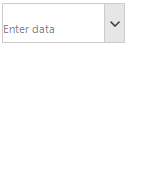

## Environment
 
|Product Version|Product|Author|
|----|----|----|
|2022.1.222|RadDropDownList for WinForms|[Desislava Yordanova](https://www.telerik.com/blogs/author/desislava-yordanova)|


## Description

Since [R2 2021](https://www.telerik.com/support/whats-new/winforms/release-history/ui-for-winforms-r2-2021-(version-2021-2-511)) **RadTextBox** and **RadTextBoxControl** support embedded labels. The embedded label shows a text in the text box field usually to indicate what text should the user enter in the text box. When RadTextBox  or RadTextBoxControl gets focus the embedded label will go up, so the user can type in the text box field. 


A common requirement is to achieve a similar functionality for **RadDropDownList**. This article demonstrates how to do it.

## Solution

**RadDropDownList** internally uses a TextBox as well. The following sample code snippet demonstrates how to enable the embedded label for it. The below gif file illustrates the achieved result:

````C#   
         
this.radDropDownList1.DropDownStyle = RadDropDownStyle.DropDown;
this.radDropDownList1.DropDownListElement.TextBox.ShowEmbeddedLabel = true;
this.radDropDownList1.DropDownListElement.TextBox.EmbeddedLabel.Text = "Enter data";

for (int i = 0; i < 10; i++)
{
    this.radDropDownList1.Items.Add("Item" + i);
}
this.radDropDownList1.SelectedItem = null;

````
````VB.NET

Me.RadDropDownList1.DropDownStyle = RadDropDownStyle.DropDown
Me.RadDropDownList1.DropDownListElement.TextBox.ShowEmbeddedLabel = True
Me.RadDropDownList1.DropDownListElement.TextBox.EmbeddedLabel.Text = "Enter data"

For i As Integer = 0 To 10 - 1
    Me.RadDropDownList1.Items.Add("Item" & i)
Next

Me.RadDropDownList1.SelectedItem = Nothing

```` 



# See Also

* [Embedded Labels](https://docs.telerik.com/devtools/winforms/controls/editors/textbox/programming-radtextbox#embedded-labels)