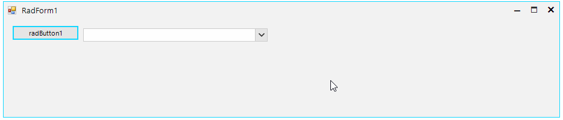

## Environment
<table>
	<tr>
		<td>Product Version</td>
		<td>2019.3.911</td>
	</tr>
	<tr>
		<td>Product</td>
		<td>RadDropDownList for WinForms</td>
	</tr>
</table>


## Description

**RadDropDownList** [defines two styles]() affecting the editor and determining whether the end user can type in it or not. A common requirement is to set the **DropDownStyle** to *DropDownList* which will disable the input in the editor. In this kind of setup, the control shows that it has the focus by painting a border around the textbox in most of the themes. The example here will demonstrate how the focus cues can be enabled, and additionally, how the fore-color and back color of the editor can be changed when it receives and looses the focus.

## Solution

The **AllowShowFocusCues** property of the control needs to be set to true. The control also needs to be subscribed to its **GotFocus** and **LostFocus** where the its *Back* and *Fore* colors will be changed using the [Override Theme Settings at Run-time API](). 

>caption Figure 1: Indicating Focus


#### Form`s class

````C#            
public partial class RadForm1 : Telerik.WinControls.UI.RadForm
{
    private BindingList<DataObject> data;
    public RadForm1()
    {
        InitializeComponent();

        this.radDropDownList1.AllowShowFocusCues = true;
        this.radDropDownList1.DropDownStyle = Telerik.WinControls.RadDropDownStyle.DropDownList;

        this.data = new BindingList<DataObject>();
        this.data.Add(new DataObject() { Name = "Item 0" });
        this.data.Add(new DataObject() { Name = "Item 1" });
        this.data.Add(new DataObject() { Name = "Item 2" });

        this.radDropDownList1.DataSource = this.data;
        this.radDropDownList1.DisplayMember = "Name";

        this.radDropDownList1.GotFocus += RadDropDownList1_GotFocus;
        this.radDropDownList1.LostFocus += RadDropDownList1_LostFocus;
    }

    private void RadDropDownList1_LostFocus(object sender, EventArgs e)
    {
        this.radDropDownList1.DropDownListElement.EditableElement.ResetThemeValueOverrides();
    }

    private void RadDropDownList1_GotFocus(object sender, EventArgs e)
    {
        this.radDropDownList1.DropDownListElement.EditableElement.SetThemeValueOverride(RadItem.BackColorProperty, Color.FromArgb(51, 153, 255), "RadDropDownListEditableAreaElement");
        this.radDropDownList1.DropDownListElement.EditableElement.SetThemeValueOverride(RadItem.ForeColorProperty, Color.White, "RadDropDownListEditableAreaElement");
    }
}

````
````VB.NET
Public Class RadForm1

    Private data As BindingList(Of DataObject)

    Public Sub New()
        InitializeComponent()

        Me.radDropDownList1.AllowShowFocusCues = True
        Me.radDropDownList1.DropDownStyle = Telerik.WinControls.RadDropDownStyle.DropDownList

        Me.data = New BindingList(Of DataObject)()
        Me.data.Add(New DataObject() With {
            .Name = "Item 0"
        })
        Me.data.Add(New DataObject() With {
            .Name = "Item 1"
        })
        Me.data.Add(New DataObject() With {
            .Name = "Item 2"
        })

        Me.radDropDownList1.DataSource = Me.data
        Me.radDropDownList1.DisplayMember = "Name"
        AddHandler Me.radDropDownList1.GotFocus, AddressOf RadDropDownList1_GotFocus
        AddHandler Me.radDropDownList1.LostFocus, AddressOf RadDropDownList1_LostFocus
    End Sub

    Private Sub RadDropDownList1_LostFocus(ByVal sender As Object, ByVal e As EventArgs)
        Me.radDropDownList1.DropDownListElement.EditableElement.ResetThemeValueOverrides()
    End Sub

    Private Sub RadDropDownList1_GotFocus(ByVal sender As Object, ByVal e As EventArgs)
        Me.radDropDownList1.DropDownListElement.EditableElement.SetThemeValueOverride(RadItem.BackColorProperty, Color.FromArgb(51, 153, 255), "RadDropDownListEditableAreaElement")
        Me.radDropDownList1.DropDownListElement.EditableElement.SetThemeValueOverride(RadItem.ForeColorProperty, Color.White, "RadDropDownListEditableAreaElement")
    End Sub
End Class

````

# See Also
* [Drop Down Style]()