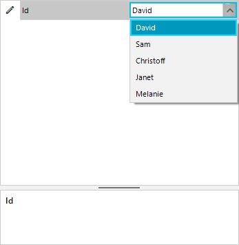

## Environment
 
|Product Version|Product|Author|
|----|----|----|
|2019.1.219|RadGridView for WinForms|[Dimitar Karamfilov](https://www.telerik.com/blogs/author/Dimitar-Karamfilov)|
 

## Description

 You want to use RadDropDownList as editor for a specific property in RadPropertyGrid. In addition the a proper value should be displayed when the user is not editing as well. The below image shows how this will look when ready.

 

## Solution 

There a built-in editor that can be used for this PropertyGridDropDownListEditor but this editor is not used by for the standard types. First you need to use the __EditorRequired__ event to change the editor. Then you can use the __EditorInitialized__ event to set the data source. The final step is to format the when not in edit mode and the drop down list is not visible. The following snippet a complete example for this:

````C#
public partial class RadForm1 : Telerik.WinControls.UI.RadForm
{
    DataTable table = GetTable();
    public RadForm1()
    {
        InitializeComponent();
        new RadControlSpyForm().Show();
        PropertyStoreItem intItem = new PropertyStoreItem(typeof(int), "Id", 1);

        RadPropertyStore store = new RadPropertyStore();
        store.Add(intItem);

        this.radPropertyGrid1.SelectedObject = store;

        radPropertyGrid1.EditorRequired += RadPropertyGrid1_EditorRequired;
        radPropertyGrid1.EditorInitialized += RadPropertyGrid1_EditorInitialized;
        radPropertyGrid1.ItemFormatting += RadPropertyGrid1_ItemFormatting;
    }

    private void RadPropertyGrid1_ItemFormatting(object sender, PropertyGridItemFormattingEventArgs e)
    {
        if (e.Item.Name == "Id")
        {
            var visualItem = e.VisualElement as PropertyGridItemElement;
            var valueElememt = visualItem.ValueElement;
            var value = (int)(visualItem.Data as PropertyGridItem).Value;
            valueElememt.Text = GetValueById(value, "Id", "Name");
        }

    }

    private string GetValueById(int value, string valueMember, string displayMember)
    {
        for (int i = 0; i < table.Rows.Count; i++)
        {
            var row = table.Rows[i];
            if (value.Equals(row[valueMember]))
            {
                return row[displayMember].ToString();
            }
        }
        return string.Empty;
    }
    private void RadPropertyGrid1_EditorInitialized(object sender, PropertyGridItemEditorInitializedEventArgs e)
    {
        if (e.Item.Name == "Id")
        {
            var editor = e.Editor as PropertyGridDropDownListEditor;
            var element = editor.EditorElement as BaseDropDownListEditorElement;
            element.DisplayMember = "Name";
            element.ValueMember = "Id";
            element.DataSource = GetTable();
        }
    }
    private void RadPropertyGrid1_EditorRequired(object sender, PropertyGridEditorRequiredEventArgs e)
    {
        if (e.Item.Name == "Id")
        {
            e.EditorType = typeof(PropertyGridDropDownListEditor);
        }
    }
    static DataTable GetTable()
    {
        DataTable table = new DataTable();
        table.Columns.Add("Id", typeof(int));
        table.Columns.Add("Name", typeof(string)); 

        table.Rows.Add(1, "David");
        table.Rows.Add(2, "Sam");
        table.Rows.Add(3, "Christoff");
        table.Rows.Add(4, "Janet");
        table.Rows.Add(5, "Melanie");
        return table;
    }
}
````
````VB 
Partial Public Class RadForm1
	Inherits Telerik.WinControls.UI.RadForm

	Private table As DataTable = GetTable()
	Public Sub New()
		InitializeComponent()
		Call (New RadControlSpyForm()).Show()
		Dim intItem As New PropertyStoreItem(GetType(Integer), "Id", 1)

		Dim store As New RadPropertyStore()
		store.Add(intItem)

		Me.radPropertyGrid1.SelectedObject = store

		AddHandler radPropertyGrid1.EditorRequired, AddressOf RadPropertyGrid1_EditorRequired
		AddHandler radPropertyGrid1.EditorInitialized, AddressOf RadPropertyGrid1_EditorInitialized
		AddHandler radPropertyGrid1.ItemFormatting, AddressOf RadPropertyGrid1_ItemFormatting
	End Sub

	Private Sub RadPropertyGrid1_ItemFormatting(ByVal sender As Object, ByVal e As PropertyGridItemFormattingEventArgs)
		If e.Item.Name = "Id" Then
			Dim visualItem = TryCast(e.VisualElement, PropertyGridItemElement)
			Dim valueElememt = visualItem.ValueElement
			Dim value = CInt(Math.Truncate((TryCast(visualItem.Data, PropertyGridItem)).Value))
			valueElememt.Text = GetValueById(value, "Id", "Name")
		End If

	End Sub

	Private Function GetValueById(ByVal value As Integer, ByVal valueMember As String, ByVal displayMember As String) As String
		For i As Integer = 0 To table.Rows.Count - 1
			Dim row = table.Rows(i)
			If value.Equals(row(valueMember)) Then
				Return row(displayMember).ToString()
			End If
		Next i
		Return String.Empty
	End Function
	Private Sub RadPropertyGrid1_EditorInitialized(ByVal sender As Object, ByVal e As PropertyGridItemEditorInitializedEventArgs)
		If e.Item.Name = "Id" Then
			Dim editor = TryCast(e.Editor, PropertyGridDropDownListEditor)
			Dim element = TryCast(editor.EditorElement, BaseDropDownListEditorElement)
			element.DisplayMember = "Name"
			element.ValueMember = "Id"
			element.DataSource = GetTable()
		End If
	End Sub
	Private Sub RadPropertyGrid1_EditorRequired(ByVal sender As Object, ByVal e As PropertyGridEditorRequiredEventArgs)
		If e.Item.Name = "Id" Then
			e.EditorType = GetType(PropertyGridDropDownListEditor)
		End If
	End Sub
	Private Shared Function GetTable() As DataTable
		Dim table As New DataTable()
		table.Columns.Add("Id", GetType(Integer))
		table.Columns.Add("Name", GetType(String))

		table.Rows.Add(1, "David")
		table.Rows.Add(2, "Sam")
		table.Rows.Add(3, "Christoff")
		table.Rows.Add(4, "Janet")
		table.Rows.Add(5, "Melanie")
		Return table
	End Function
End Class

````


