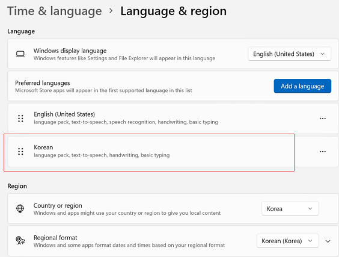
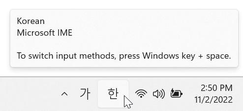
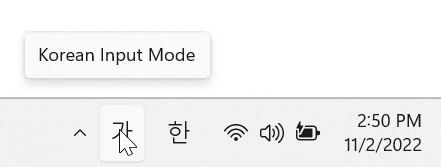
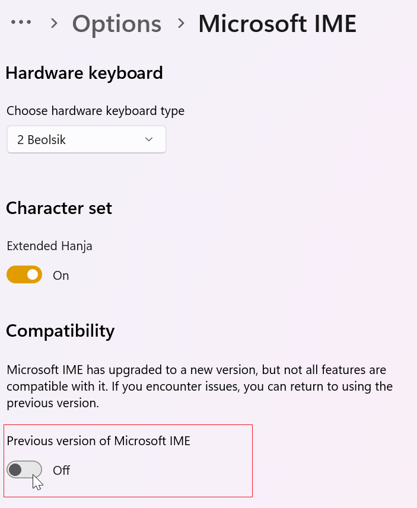
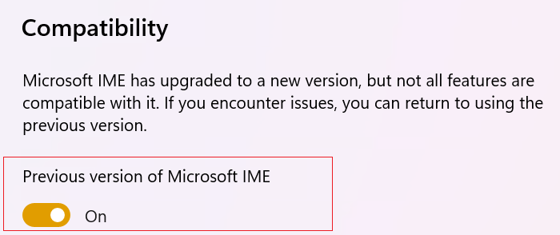

## Environment
|Product Version|Product|Author|
|----|----|----|
|2022.3.913|RadRichTextEditor for WinForms|[Desislava Yordanova](https://www.telerik.com/blogs/author/desislava-yordanova)|

## Description

Add Korean language to your Windows 11 machine:

Press keys in the following order with the __English__ keyboard, e.g.**rkskekfk**. In Korean IME you are expected to get Korean letters:

 

However, on some Windows versions, the Korean symbols may be duplicated:

 

## Solution

Microsoft IME has upgraded to a new version, but not all features are compatible with it. If you encounter issues, you can return to using the previous version:

Make sure that you switch to the previous Microsoft IME:

Now, the Korean characters doesn't seem to be duplicated.

