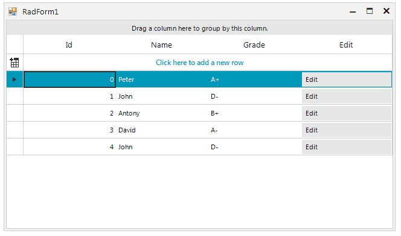

## Environment
 
|Product Version|Product|Author|
|----|----|----|
|2019.1.117|RadGridView for WinForms|[Desislava Yordanova](https://www.telerik.com/blogs/author/desislava-yordanova)|
 

## Description

This article aims to show you a sample approach how to edit a row in **RadGridView** by using a separate input dialog with pre-loaded data from the associated row info.  
 


## Solution 

Let's consider that the **RadGridView** control is bound to a collection of custom objects (class **Student**) and the columns are automatically generated. Each cell can enter edit mode in order to modify the respective value. However, a common requirement is to pop up a separate dialog with the pre-loaded data for the entire row. Thus, the row's data can be updated in a more user-friendly manner. 

For this purpose, we will add a [GridViewCommandColumn]() which displays a button element that responds to users' input mouse clicks and keyboard key presses. The next step is to handle the **CommandCommandCellClick** event, show the custom dialog and validate the data before submitting the values to the underlying data object.

For the **EditForm**, we have a **RadSpinEditor** for the **Id** field, a **RadTextBox** for the **Name** and a **RadDropDownList** for the **Grade**:

#### Edit Form  

````C#
    public partial class EditForm : Telerik.WinControls.UI.RadForm
    {
        private MainForms.Student student;

        public EditForm()
        {
            InitializeComponent();
        }

        public EditForm(MainForms.Student student) : this()
        {
            this.student = student;

            this.radDropDownList1.Items.AddRange(new List<string>() { "A", "A+", "A-", "B", "B+", "B-", "C", "C+", "C-", "D", "D+", "D-", "E", "E+", "E-", "F", "F+", "F-" });
            this.radDropDownList1.DropDownStyle = RadDropDownStyle.DropDownList;
            this.radDropDownList1.DropDownListElement.SyncSelectionWithText = true;

            this.radSpinEditor1.Value = this.student.Id;
            this.radTextBox1.Text = this.student.Name;
            this.radDropDownList1.SelectedValue = this.student.Grade;
        }

        private void save_Button_Click(object sender, EventArgs e)
        {
            if (IsValidData())
            {
                this.student.Id = (int)this.radSpinEditor1.Value;
                this.student.Name = this.radTextBox1.Text;
                this.student.Grade = this.radDropDownList1.SelectedItem.Text;
                this.Close();
            }
        }

        private bool IsValidData()
        {
            this.errorProvider1.Clear();

            if (this.radTextBox1.Text == string.Empty)
            {
                this.errorProvider1.SetError(this.radTextBox1, "Invalid name!");
                return false;
            }

            return true;
        }

        private void cancel_Button_Click(object sender, EventArgs e)
        {
            this.Close();
        }
    }         

       
````
````VB.NET
	Partial Public Class EditForm
		Inherits Telerik.WinControls.UI.RadForm
		Private student As MainForms.Student

		Public Sub New()
			InitializeComponent()
		End Sub

		Public Sub New(ByVal student As MainForms.Student)
			Me.New()
			Me.student = student

			Me.radDropDownList1.Items.AddRange(New List(Of String)() From {"A", "A+", "A-", "B", "B+", "B-", "C", "C+", "C-", "D", "D+", "D-", "E", "E+", "E-", "F", "F+", "F-"})
			Me.radDropDownList1.DropDownStyle = RadDropDownStyle.DropDownList
			Me.radDropDownList1.DropDownListElement.SyncSelectionWithText = True

			Me.radSpinEditor1.Value = Me.student.Id
			Me.radTextBox1.Text = Me.student.Name
			Me.radDropDownList1.SelectedValue = Me.student.Grade
		End Sub

		Private Sub save_Button_Click(ByVal sender As Object, ByVal e As EventArgs) Handles save_Button.Click
			If IsValidData() Then
				Me.student.Id = CInt(Fix(Me.radSpinEditor1.Value))
				Me.student.Name = Me.radTextBox1.Text
				Me.student.Grade = Me.radDropDownList1.SelectedItem.Text
				Me.Close()
			End If
		End Sub

		Private Function IsValidData() As Boolean
			Me.errorProvider1.Clear()

			If Me.radTextBox1.Text = String.Empty Then
				Me.errorProvider1.SetError(Me.radTextBox1, "Invalid name!")
				Return False
			End If

			Return True
		End Function

		Private Sub cancel_Button_Click(ByVal sender As Object, ByVal e As EventArgs) Handles cancel_Button.Click
			Me.Close()
		End Sub
	End Class
      

````

The following code snippet shows how to populate the grid with data and display the edit form in the **CommandCommandCellClick** event:

#### Main Form with the RadGridView control  

````C#
        public MainForms()
        {
            InitializeComponent();

            ThemeResolutionService.ApplicationThemeName = "Fluent";
        }

        public class Student : System.ComponentModel.INotifyPropertyChanged
        {
            int m_id;
            string m_name;
            string m_grade;

            public event PropertyChangedEventHandler PropertyChanged;

            public Student(int m_id, string m_name, string m_grade)
            {
                this.m_id = m_id;
                this.m_name = m_name;
                this.m_grade = m_grade;
            }

            public int Id
            {
                get
                {
                    return m_id;
                }
                set
                {
                    if (this.m_id != value)
                    {
                        this.m_id = value;
                        OnPropertyChanged("Id");
                    }
                }
            }

            public string Name
            {
                get
                {
                    return m_name;
                }
                set
                {
                    if (this.m_name != value)
                    {
                        this.m_name = value;
                        OnPropertyChanged("Name");
                    }
                }
            }

            public string Grade
            {
                get
                {
                    return m_grade;
                }
                set
                {
                    if (this.m_grade != value)
                    {
                        this.m_grade = value;
                        OnPropertyChanged("Grade");
                    }
                }
            }

            protected virtual void OnPropertyChanged(string propertyName)
            {
                if (PropertyChanged != null)
                {
                    PropertyChanged(this, new PropertyChangedEventArgs(propertyName));
                }
            }
        }

        BindingList<Student> collectionOfStudents = new BindingList<Student>();

        private void RadForm1_Load(object sender, EventArgs e)
        {
            collectionOfStudents.Add(new Student(0, "Peter", "A+"));
            collectionOfStudents.Add(new Student(1, "John", "D-"));
            collectionOfStudents.Add(new Student(2, "Antony", "B+"));
            collectionOfStudents.Add(new Student(3, "David", "A-"));
            collectionOfStudents.Add(new Student(4, "John", "D-"));
            this.radGridView1.DataSource = collectionOfStudents;

            GridViewCommandColumn editColumn = new GridViewCommandColumn("Edit");
            editColumn.UseDefaultText = true;
            editColumn.DefaultText = "Edit";
            radGridView1.MasterTemplate.Columns.Add(editColumn);

            this.radGridView1.AutoSizeColumnsMode = GridViewAutoSizeColumnsMode.Fill;
            this.radGridView1.CommandCellClick += radGridView1_CommandCellClick;
        }

        private void radGridView1_CommandCellClick(object sender, GridViewCellEventArgs e)
        {
            EditForm f = new EditForm(this.radGridView1.CurrentRow.DataBoundItem as Student);
            f.StartPosition = FormStartPosition.Manual;
            f.Location = new Point(this.Location.X + this.Size.Width / 2 - f.Size.Width / 2, this.Location.Y + this.Size.Height / 2 - f.Size.Height / 2);
            f.ShowDialog();
        }
    }

       
````
````VB.NET
	Partial Public Class MainForms
		Inherits Telerik.WinControls.UI.RadForm
		Public Sub New()
			InitializeComponent()

			ThemeResolutionService.ApplicationThemeName = "Fluent"
		End Sub

		Public Class Student
			Implements System.ComponentModel.INotifyPropertyChanged
			Private m_id As Integer
			Private m_name As String
			Private m_grade As String

			Public Event PropertyChanged As PropertyChangedEventHandler Implements System.ComponentModel.INotifyPropertyChanged.PropertyChanged

			Public Sub New(ByVal m_id As Integer, ByVal m_name As String, ByVal m_grade As String)
				Me.m_id = m_id
				Me.m_name = m_name
				Me.m_grade = m_grade
			End Sub

			Public Property Id() As Integer
				Get
					Return m_id
				End Get
				Set(ByVal value As Integer)
					If Me.m_id <> value Then
						Me.m_id = value
						OnPropertyChanged("Id")
					End If
				End Set
			End Property

			Public Property Name() As String
				Get
					Return m_name
				End Get
				Set(ByVal value As String)
					If Me.m_name <> value Then
						Me.m_name = value
						OnPropertyChanged("Name")
					End If
				End Set
			End Property

			Public Property Grade() As String
				Get
					Return m_grade
				End Get
				Set(ByVal value As String)
					If Me.m_grade <> value Then
						Me.m_grade = value
						OnPropertyChanged("Grade")
					End If
				End Set
			End Property

			Protected Overridable Sub OnPropertyChanged(ByVal propertyName As String)
				RaiseEvent PropertyChanged(Me, New PropertyChangedEventArgs(propertyName))
			End Sub
		End Class

		Private collectionOfStudents As New BindingList(Of Student)()

		Private Sub RadForm1_Load(ByVal sender As Object, ByVal e As EventArgs) Handles MyBase.Load
			collectionOfStudents.Add(New Student(0, "Peter", "A+"))
			collectionOfStudents.Add(New Student(1, "John", "D-"))
			collectionOfStudents.Add(New Student(2, "Antony", "B+"))
			collectionOfStudents.Add(New Student(3, "David", "A-"))
			collectionOfStudents.Add(New Student(4, "John", "D-"))
			Me.radGridView1.DataSource = collectionOfStudents

			Dim editColumn As New GridViewCommandColumn("Edit")
			editColumn.UseDefaultText = True
			editColumn.DefaultText = "Edit"
			radGridView1.MasterTemplate.Columns.Add(editColumn)

			Me.radGridView1.AutoSizeColumnsMode = GridViewAutoSizeColumnsMode.Fill
			AddHandler Me.radGridView1.CommandCellClick, AddressOf radGridView1_CommandCellClick
		End Sub

		Private Sub radGridView1_CommandCellClick(ByVal sender As Object, ByVal e As GridViewCellEventArgs)
			Dim f As New EditForm(TryCast(Me.radGridView1.CurrentRow.DataBoundItem, Student))
			f.StartPosition = FormStartPosition.Manual
			f.Location = New Point(Me.Location.X + Me.Size.Width \ 2 - f.Size.Width \ 2, Me.Location.Y + Me.Size.Height \ 2 - f.Size.Height \ 2)
			f.ShowDialog()
		End Sub
	End Class
      

````

>tip A complete solution providing a C# and VB.NET project is available [here](https://github.com/telerik/winforms-sdk/tree/master/GridView/GridViewEditDialog).

>note You can refer to the [Create pop-up user control for row editing](https://www.telerik.com/support/kb/winforms/gridview/details/create-pop-up-user-control-for-row-editing) KB article which demonstrates an alternative solution that pops up a UserControl underneath the current row after clicking "Edit" button. 

 

 