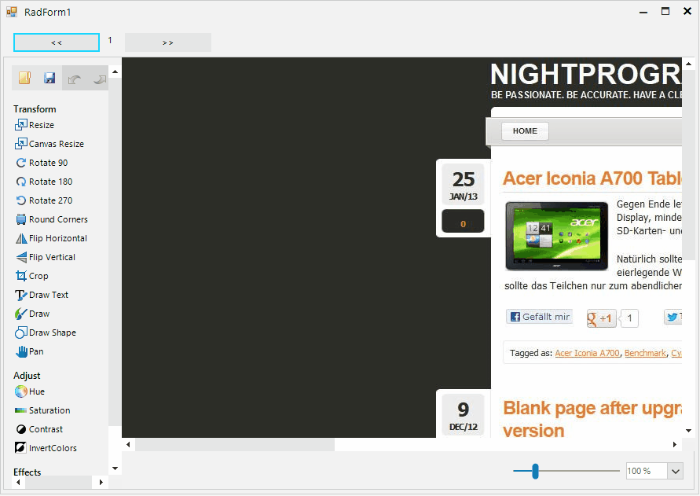

## Environment
 
|Product Version|Product|Author|
|----|----|----|
|2022.1.222|RadImageEditor for WinForms|[Desislava Yordanova](https://www.telerik.com/blogs/author/desislava-yordanova)|


## Description

**RadImageEditor** supports Tiff images. However, support for multi-page Tiff images is not available at the moment. The following tutorial demonstrates a sample approach how achieve it.



## Solution

This solution creates a list of images out of the frames of the Tiff image and works with them. Every time you want to navigate to the next frame, you can save and update the initial image and then load a new bitmap with the correct frame and the updated image. 
 

````C#      
      
    public partial class RadForm1 : Telerik.WinControls.UI.RadForm
    {
        Image tiffImage;
        Bitmap editedImage;
        int currentPage = 0;
        List<Image> images;
        string path = @"..\..\multipage_tif_example.tif";

        public RadForm1()
        {
            InitializeComponent();
            this.tiffImage = Image.FromFile(@"..\..\multipage_tif_example.tif");
            this.images = this.GetAllPages(tiffImage);

            this.tiffImage.SelectActiveFrame(FrameDimension.Page, this.currentPage);
            this.editedImage = new Bitmap(this.tiffImage);
            this.radImageEditor1.OpenImage(this.editedImage);
            this.radLabel1.Text = Convert.ToString(this.currentPage + 1);
        }

        private List<Image> GetAllPages(Image multiPageImage)
        {
            List<Image> images = new List<Image>();
            int count = multiPageImage.GetFrameCount(FrameDimension.Page);
            for (int i = 0; i < count; i++)
            {
                multiPageImage.SelectActiveFrame(FrameDimension.Page, i);
                MemoryStream byteStream = new MemoryStream();
                multiPageImage.Save(byteStream, ImageFormat.Tiff);
                images.Add(Image.FromStream(byteStream));
                byteStream.Dispose();
            }
            return images;
        }

        private void radButton1_Click(object sender, EventArgs e)
        {
            if (this.currentPage > 0)
            {
                MemoryStream byteStream = new MemoryStream();
                this.radImageEditor1.SaveImage(byteStream, ImageFormat.Tiff);
                this.images[this.currentPage] = Image.FromStream(byteStream);
                byteStream.Dispose();

                this.currentPage--;
                this.UpdateImage(this.currentPage);
            }
        }

        private void UpdateImage(int page)
        {
            this.editedImage = new Bitmap(this.images[page]);
            this.radImageEditor1.OpenImage(this.editedImage);
            this.radLabel1.Text = Convert.ToString(page + 1);

            this.radImageEditor1.Invalidate();
        }

        private void radButton2_Click(object sender, EventArgs e)
        {
            if (this.currentPage < this.images.Count - 1)
            {
                MemoryStream byteStream = new MemoryStream();
                this.radImageEditor1.SaveImage(byteStream, ImageFormat.Tiff);
                this.images[this.currentPage] = Image.FromStream(byteStream);
                byteStream.Dispose();

                this.currentPage++;
                this.UpdateImage(this.currentPage);
            }
        }
    }

````
````VB.NET

Public Class RadForm1
    Private tiffImage As Image
    Private editedImage As Bitmap
    Private currentPage As Integer = 0
    Private images As List(Of Image)
    Private path As String = "..\..\multipage_tif_example.tif"

    Public Sub New()
        InitializeComponent()
        Me.tiffImage = Image.FromFile("..\..\multipage_tif_example.tif")
        Me.images = Me.GetAllPages(tiffImage)
        Me.tiffImage.SelectActiveFrame(FrameDimension.Page, Me.currentPage)
        Me.editedImage = New Bitmap(Me.tiffImage)
        Me.RadImageEditor1.OpenImage(Me.editedImage)
        Me.RadLabel1.Text = Convert.ToString(Me.currentPage + 1)
    End Sub

    Private Function GetAllPages(ByVal multiPageImage As Image) As List(Of Image)
        Dim images As List(Of Image) = New List(Of Image)()
        Dim count As Integer = multiPageImage.GetFrameCount(FrameDimension.Page)

        For i As Integer = 0 To count - 1
            multiPageImage.SelectActiveFrame(FrameDimension.Page, i)
            Dim byteStream As MemoryStream = New MemoryStream()
            multiPageImage.Save(byteStream, ImageFormat.Tiff)
            images.Add(Image.FromStream(byteStream))
            byteStream.Dispose()
        Next

        Return images
    End Function

    Private Sub radButton1_Click(ByVal sender As Object, ByVal e As EventArgs) Handles RadButton1.Click
        If Me.currentPage > 0 Then
            Dim byteStream As MemoryStream = New MemoryStream()
            Me.RadImageEditor1.SaveImage(byteStream, ImageFormat.Tiff)
            Me.images(Me.currentPage) = Image.FromStream(byteStream)
            byteStream.Dispose()
            Me.currentPage -= 1
            Me.UpdateImage(Me.currentPage)
        End If
    End Sub

    Private Sub UpdateImage(ByVal page As Integer)
        Me.editedImage = New Bitmap(Me.images(page))
        Me.RadImageEditor1.OpenImage(Me.editedImage)
        Me.RadLabel1.Text = Convert.ToString(page + 1)
        Me.RadImageEditor1.Invalidate()
    End Sub

    Private Sub radButton2_Click(ByVal sender As Object, ByVal e As EventArgs) Handles RadButton2.Click
        If Me.currentPage < Me.images.Count - 1 Then
            Dim byteStream As MemoryStream = New MemoryStream()
            Me.RadImageEditor1.SaveImage(byteStream, ImageFormat.Tiff)
            Me.images(Me.currentPage) = Image.FromStream(byteStream)
            byteStream.Dispose()
            Me.currentPage += 1
            Me.UpdateImage(Me.currentPage)
        End If
    End Sub
End Class

````

A complete C# and VB.NET projects are available [here](https://github.com/telerik/winforms-sdk/tree/master/ImageEditor/RadImageEditorMultiPageTiff).

# See Also

* [RadImageEditor - Getting Started]()