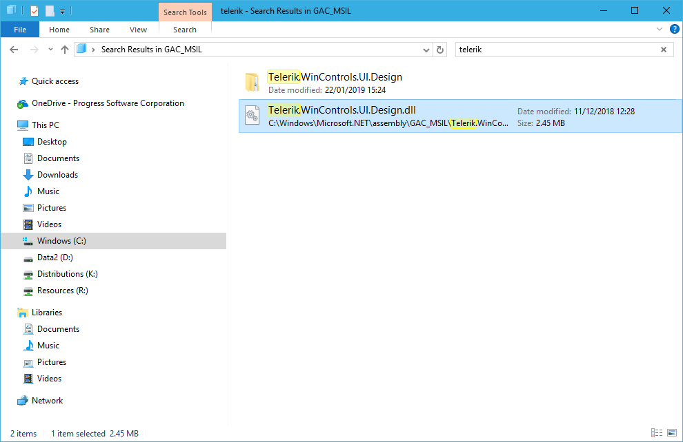

|Product Version|Product|Author|
|----|----|----|
|2019.1.117 (.NET 4.0 or later)|RadControls for WinForms|[Dimitar](https://www.telerik.com/blogs/author/dimitar-karamfilov)|

# Description 

You want to examine the GAC in order to check if the Telerik UI for WinForms are installed or perhaps more that one version exists. 

# Solution 

Open the .NET 4.0 GAC folder in the explorer. The GAC is located in the following folder: __C:\Windows\Microsoft.NET\assembly\GAC_MSIL__. Search for the Telerik assemblies.

That is all, you can remove the old assemblies directly from the search results. 