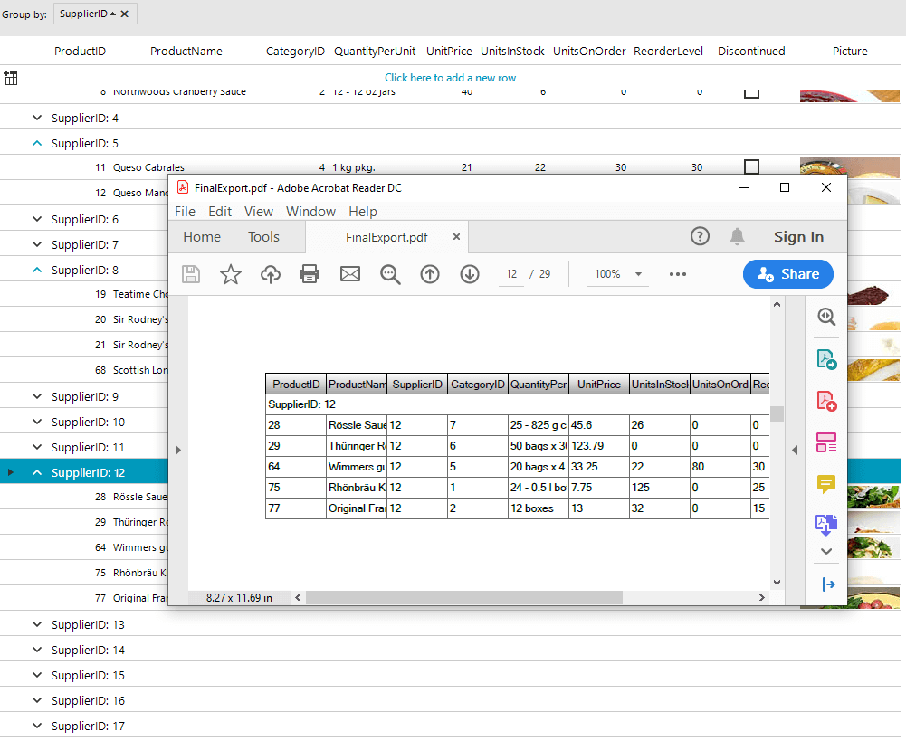

## Environment
 
|Product Version|Product|Author|
|----|----|----|
|2020.1.113|RadGridView for WinForms|[Desislava Yordanova](https://www.telerik.com/blogs/author/desislava-yordanova)|
 
## Description

By default, [GridViewPdfExport]() is not intended to export the groups in **RadGridView** on separate pages. Hence, it doesn't provide a public API for achieving this behavior. 

This article aims to demonstrates a sample approach how each group can be exported on a single PDF page.
 


## Solution 

Iterate all groups in the original **RadGridView** and create a dummy grid for each group which is populated with the rows for the respective group. Then, add a **GroupDescriptor** to the dummy grid and export it to PDF. Thus, you will have N number of PDF files each containing the respective group with the group rows.

Eventually, if you want to combine all pages into one PDF document, using a [PdfStreamWriter](https://docs.telerik.com/devtools/document-processing/libraries/radpdfprocessing/formats-and-conversion/pdf/pdfstreamwriter/pdfstreamwriter) is a suitable approach:
 

````C#

private void radButton1_Click(object sender, EventArgs e)
{
    foreach (DataGroup group in this.radGridView1.Groups)
    {
        RadGridView dummyGrid = new RadGridView();
        foreach (GridViewDataColumn col in this.radGridView1.Columns)
            dummyGrid.Columns.Add(col.Name);
        foreach (GridViewDataRowInfo rowInGroup in group.GroupRow.ChildRows)
        {
            var newRow = dummyGrid.Rows.NewRow();
            foreach (GridViewDataColumn col in this.radGridView1.Columns)
                newRow.Cells[col.Name].Value = rowInGroup.Cells[col.Name].Value;
            dummyGrid.Rows.Add(newRow);
        }

        dummyGrid.GroupDescriptors.Add(new GroupDescriptor(group.GroupDescriptor.Expression));
        Telerik.WinControls.Export.GridViewPdfExport pdfExporter = new Telerik.WinControls.Export.GridViewPdfExport(dummyGrid);
        pdfExporter.FileExtension = "pdf";
        pdfExporter.ExportVisualSettings = true;
        string fileName = @"..\..\ExportedData" + this.radGridView1.Groups.IndexOf(group) + ".pdf";
        pdfExporter.RunExport(fileName, new Telerik.WinControls.Export.PdfExportRenderer());
    }

    using (Telerik.Windows.Documents.Fixed.FormatProviders.Pdf.Streaming.PdfStreamWriter fileWriter =
        new PdfStreamWriter(System.IO.File.OpenWrite(@"..\..\FinalExport.pdf")))
    {
        foreach (DataGroup group in this.radGridView1.Groups)
        {
            string fileName = @"..\..\ExportedData" + this.radGridView1.Groups.IndexOf(group) + ".pdf";
            using (PdfFileSource fileSource = new PdfFileSource(File.OpenRead(fileName)))
            {
                foreach (PdfPageSource pageSource in fileSource.Pages)
                    fileWriter.WritePage(pageSource);
            }
        }
    }
}
 
   
````
````VB.NET

Private Sub RadButton1_Click(sender As Object, e As EventArgs) Handles RadButton1.Click

    For Each group As DataGroup In Me.RadGridView1.Groups
        Dim dummyGrid As New RadGridView
        For Each col As GridViewDataColumn In Me.RadGridView1.Columns
            dummyGrid.Columns.Add(col.Name)
        Next
        For Each rowInGroup As GridViewDataRowInfo In group.GroupRow.ChildRows
            Dim newRow = dummyGrid.Rows.NewRow()
            For Each col As GridViewDataColumn In Me.RadGridView1.Columns
                newRow.Cells(col.Name).Value = rowInGroup.Cells(col.Name).Value
            Next
            dummyGrid.Rows.Add(newRow)
        Next

        dummyGrid.GroupDescriptors.Add(New GroupDescriptor(group.GroupDescriptor.Expression))
        Dim pdfExporter As New Telerik.WinControls.Export.GridViewPdfExport(dummyGrid)
        pdfExporter.FileExtension = "pdf"
        pdfExporter.ExportVisualSettings = True
        Dim fileName As String = "..\..\ExportedData" & Me.RadGridView1.Groups.IndexOf(group) & ".pdf"
        pdfExporter.RunExport(fileName, New Telerik.WinControls.Export.PdfExportRenderer())
    Next

    Using fileWriter As PdfStreamWriter = New PdfStreamWriter(File.OpenWrite("..\..\FinalExport.pdf"))


        For Each group As DataGroup In Me.RadGridView1.Groups
            Dim fileName As String = "..\..\ExportedData" & Me.RadGridView1.Groups.IndexOf(group) & ".pdf"
            Using fileSource As PdfFileSource = New PdfFileSource(File.OpenRead(fileName))
                For Each pageSource As PdfPageSource In fileSource.Pages
                    fileWriter.WritePage(pageSource)
                Next pageSource
            End Using

        Next
    End Using
End Sub

````

# See Also

* [Grouping in RadGridView]()
* [Export to PDF]() 


