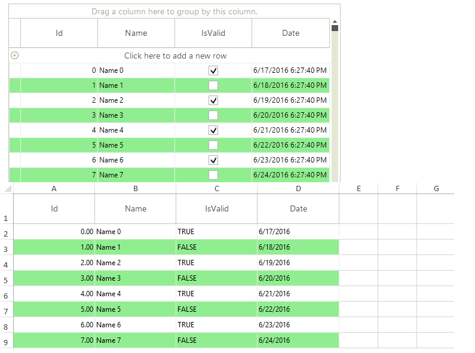

|Product Version|Product|Author|Last modified|
|----|----|----|----|
|2016.2.608|RadGridView for WinForms|[Hristo Merdjanov](https://www.telerik.com/blogs/author/hristo-merdjanov)|June 21, 2016|


## Problem

**RadGridView** provides *async* exporting capabilities out of the box. However, due to the background threads we are using and the target framework against which our assemblies are built (.NET 4.0) we are not exporting the visual settings with the existing *async* API.

## Solution

Luckily in .NET 4.5 Microsoft introduced the *async* methods accompanied by the *await* statement. Essentially this allows heavy work to be done without freezing the UI. By definition the new *async* methods do not run on a separate thread so we should not worry about cross thread exceptions. The following MSDN article provides detailed information: [Asynchronous Programming with Async and Await](https://msdn.microsoft.com/en-us/library/hh191443.aspx).

## Requirements

**.NET 4.5** and **UI for WinForms Q2 2015 (version 2015.2.623)** or later.

We are going to use the newly introduced *async* functionality and export **RadGridView** asynchronously preserving all of its visual settings.

The picture below compares the *Excel* output with the grid in our application  
  



We will start the exporting process in the *Click* event handler of a **RadButton**. Since only *async* methods can be *awaited*, we need to mark our event handler as *async*. The actual export job will be also separated in its own *async* method. If you prefer you can instead use a lambda expression.

````C#
private async void radButton1_Click(object sender, EventArgs e)
{  
    await this.ExportGridVisuallyAsync();
}
private async Task ExportGridVisuallyAsync()
{
    Action job = new Action(this.ExportData);
    Task task = new Task(job);
    task.Start();
    await task;
}
private void ExportData()
{
    GridViewSpreadExport spreadExporter = new GridViewSpreadExport(this.radGridView1);
    spreadExporter.ExportVisualSettings = true;
    SpreadExportRenderer exportRenderer = new SpreadExportRenderer();
    spreadExporter.RunExport(@"..\..\exported-grid.xlsx", exportRenderer);
    RadMessageBox.Show("Export completed!");
}

````
````VB.NET
Private Async Sub RadButton1_Click(sender As Object, e As EventArgs) Handles radButton1.Click
    Await Me.ExportGridVisuallyAsync()
End Sub
Private Async Function ExportGridVisuallyAsync() As Task
    Dim job As New Action(AddressOf Me.ExportData)
    Dim task As New Task(job)
    task.Start()
    Await task
End Function
Private Sub ExportData()
    Dim spreadExporter As New GridViewSpreadExport(Me.radGridView1)
    spreadExporter.ExportVisualSettings = True
    Dim exportRenderer As New SpreadExportRenderer()
    spreadExporter.RunExport("..\..\exported-grid.xlsx", exportRenderer)
    RadMessageBox.Show("Export completed!")
End Sub

````

The **GridViewSpreadExport** object defines a **CellFormatting** event and if needed you can subscribe to it and perform custom styling only to the *Excel* cells: [GridViewSpreadExport | Events](http://docs.telerik.com/devtools/winforms/gridview/exporting-data/spread-export#events).


>note You can download a VB and C# project from the following [link](https://github.com/telerik/winforms-sdk/tree/master/GridView/ExportVisualSettingsAsync).