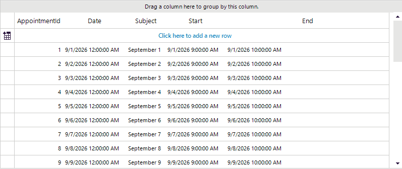

## Environment

|Product Version|Product|Author|
|----|----|----|
|2026.3.812|RadGridView for WinForms|[Desislava Yordanova](https://www.telerik.com/blogs/author/desislava-yordanova)|

## Description

Setting `AutoSizeColumnsMode` to `GridViewAutoSizeColumnsMode.None` prevents column widths from automatically expanding to take up the full control width. A common approach to simulate filling the control is to best-fit the columns and programmatically adjust the last column to take up the remaining space (as demonstrated in [Mixing BestFit and Fill Modes for the GridView's Columns]()).

However, when **RadGridView** is grouped by one or more columns:
1. Each group descriptor inserts an indent column (`GridViewIndentColumn`) into the rendered row layout, whose width corresponds to `radGridView1.TableElement.GroupIndent`.
2. Grouped columns may be hidden from the data rows when `ShowGroupedColumns = false` (default behavior).
3. The last visible column may not be the last column in the `Columns` collection, because grouped or hidden columns must be excluded from the width calculation.

This article shows how to calculate and extend the last visible column width to fill the grid width while properly subtracting grouping indents and accounting for grouped/hidden columns.



## Solution

To properly adjust the last visible column when grouping is applied:

1. Filter the `Columns` collection to identify only visible columns, accounting for whether grouped columns are displayed (`ShowGroupedColumns`).
2. Sum the widths of all visible columns except the last one.
3. Calculate the total width of all group indent columns by multiplying `GroupDescriptors.Count` by `TableElement.GroupIndent`.
4. Subtract the row header column width (if shown), vertical scrollbar width (if visible), and the group indent width from the grid's total width.
5. Assign the remaining width to the last visible column.
6. Reapply this recalculation whenever the grid size changes (`SizeChanged`) or whenever grouping changes (`GroupByChanged`).

````C#
public RadForm1()
{
    InitializeComponent(); 
    this.radGridView1.ShowGroupedColumns = false;

    this.radGridView1.AutoSizeColumnsMode = GridViewAutoSizeColumnsMode.None;
    this.radGridView1.BestFitColumns(BestFitColumnMode.AllCells);
    AdjustLastColumnSize();
    this.radGridView1.SizeChanged += radGridView1_SizeChanged;
    this.radGridView1.GroupByChanged += (s, e) => AdjustLastColumnSize();
}

private void radGridView1_SizeChanged(object sender, EventArgs e)
{
    AdjustLastColumnSize();
}

private void AdjustLastColumnSize()
{
    AdjustLastColumnSize(this.radGridView1.MasterTemplate);
}

private void AdjustLastColumnSize(GridViewTemplate template)
{
    this.radGridView1.BestFitColumns(BestFitColumnMode.AllCells);
    var visibleColumns = this.radGridView1.Columns
        .Where(c => c.IsVisible && (this.radGridView1.ShowGroupedColumns || !c.IsGrouped))
        .ToList();

    if (visibleColumns.Count == 0) return;

    var totalColumnsWidth = 0;
    for (var index = 0; index < visibleColumns.Count - 1; index++)
    {
        totalColumnsWidth += visibleColumns[index].Width;
    }

    var groupIndentWidth = this.radGridView1.GroupDescriptors.Count * this.radGridView1.TableElement.GroupIndent;
    var rowHeaderWidth = this.radGridView1.ShowRowHeaderColumn ? this.radGridView1.TableElement.RowHeaderColumnWidth : 0;
    var scrollBarWidth = this.radGridView1.TableElement.VScrollBar.Visibility == ElementVisibility.Visible ?
        this.radGridView1.TableElement.VScrollBar.Size.Width : 0;

    var calculatedLastColWidth = this.radGridView1.Width - totalColumnsWidth -
        rowHeaderWidth - scrollBarWidth - groupIndentWidth;

if (calculatedLastColWidth > 10)
{
    visibleColumns.Last().Width = calculatedLastColWidth - 10;
}
````

## See Also

* [Mixing BestFit and Fill Modes for the GridView's Columns]()
* [Resizing columns programmatically]()
* [Basic Grouping]()
* [GridViewIndentColumn]()
