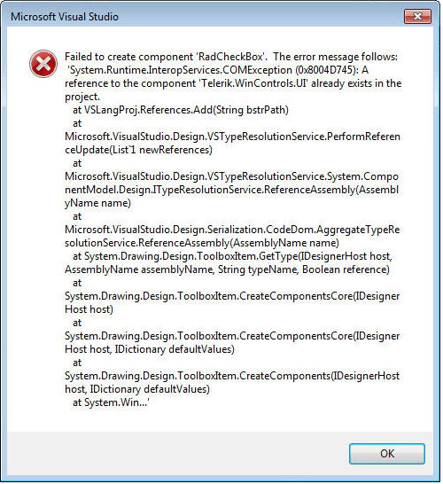

|Product Version|Product|Author|Last modified|
|----|----|----|----|
|Q1 2014|RadControls for WinForms|Georgi Georgiev|March 13, 2014|

## Problem:  

*Failed to create component. The error message follows: “System.Runtime.InteropServices.COMException”*
    
  
 
If you have used UI for WinForms and have changed your versions at some (you have installed more than one version of the suite on your computer) point you may have encountered this exception. It is caused when you have referenced Telerik assemblies in your project versioned different than the ones in your Toolbox e.g your project references Q1 2013 while in your toolbox you have Q2 2014. When you drag an item from the Toolbox Visual Studio automatically attempts to add references to your project needed for the dragged component. However, since you already have this assembly referenced, but with different version, exception is thrown.  
   
## Solution:  

Before taking any actions you should know what versions are your assemblies. To see the version of the items in the Visual Studio Toolbox it is enough to move your mouse over any Telerik UI for WinForms item and a tool tip with the version information will appear. To get the version of your referenced assemblies you should expand the References of your project, click any Telerik dll and press F4, this will display a window which contains information about the version of the file.  

Basically you need make both versions of the assemblies to match. From this point on there are a few options:  
   
1. Remove all versions of Telerik UI for WinForms from your computer and install just the latest one. Than update your project references to this. This should fix all issues by replacing the assemblies in your [GAC](http://msdn.microsoft.com/en-us/library/yf1d93sz%28v=vs.110%29.aspx) and Toolbox.
2. Update the items in your Toolbox. This can be done automatically or manually:
    1. The automatic process is described in the following article VSX – [Toolbox Configurator](https://docs.telerik.com/devtools/winforms/visual-studio-integration/visual-studio-extensions/toolbox-configurator).
    2. Description of the manual process can be found in the following KB article - [Manually add RadControls for WinForms to the VS Toolbox](/support/kb/winforms/details/manually-add-radcontrols-for-winforms-to-the-vs-toolbox).
3. Change the referenced assemblies in your project to match the ones in your Toolbox. Information about this is available in the MSDN article [Managing Project References](http://msdn.microsoft.com/en-us/library/ez524kew.aspx).

