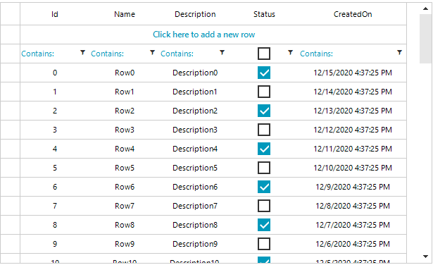

## Environment
 
|Product Version|Product|Author|
|----|----|----|
|2020.3.1020|RadVirtualGrid for WinForms|[Desislava Yordanova](https://www.telerik.com/blogs/author/desislava-yordanova)|
 
## Description

[RadVirtualGrid]() loads its data on demand. Hence, it doesn't know what data will be displayed and it shows the data as text. If you want to show Boolean data (true/false), it would be more appropriate to show check boxes that store the true/false value. The [Creating custom cells]() help article demonstrates a sample approach how to create a check box data cell. 

However, once the [filtering]() functionality is enabled, we will need a check box in the filter cell to filter the data easily. This article demonstrates a sample approach how to extend the approach explained in the referred article and achieve the filtering.  
 


## Solution 

First, make sure that you have already implemented the custom data cells with check boxes: [Creating custom cells]().

The above illustrated result can be accomplished by following the steps below:

1\. Create a derivative of **VirtualGridFilterCellElement** and add a **RadCheckBoxElement** to it in order to filter the data by its **ToggleState**.

2\. Handle the **CreateCellElement** event and replace the default filter cell with the custom defined one.

3\. In the **ContextMenuOpening** event you can add a menu item for clearing the **FilterDescriptor**.
 

````C#
DataTable dt = new DataTable();
DataView dv = new DataView();
DataTable filteredTable = new DataTable();

public RadForm1()
{
    InitializeComponent();

    dt.Columns.Add("Id",typeof(int));
    dt.Columns.Add("Name", typeof(string));
    dt.Columns.Add("Description", typeof(string));
    dt.Columns.Add("Status", typeof(bool));
    dt.Columns.Add("CreatedOn", typeof(DateTime));

    for (int i = 0; i < 50; i++)
    {
        dt.Rows.Add(i, "Row" + i, "Description" + i, i % 2 == 0, DateTime.Now.AddDays(-i));
    }
    dv = new DataView(dt);
    filteredTable = dv.ToTable();

    this.radVirtualGrid1.ColumnCount = dt.Columns.Count;
    this.radVirtualGrid1.RowCount = dt.Rows.Count;
    this.radVirtualGrid1.CellValueNeeded += radVirtualGrid1_CellValueNeeded;
    this.radVirtualGrid1.CreateCellElement += radVirtualGrid1_CreateCellElement;
    this.radVirtualGrid1.CellFormatting += RadVirtualGrid1_CellFormatting;

    this.radVirtualGrid1.MasterViewInfo.SetColumnDataType(3, typeof(int));

   this.radVirtualGrid1.ContextMenuOpening += radVirtualGrid1_ContextMenuOpening; 
    this.radVirtualGrid1.FilterChanged += RadVirtualGrid1_FilterChanged;
}

private void RadVirtualGrid1_FilterChanged(object sender, VirtualGridEventArgs e)
{ 
    dv.RowFilter = this.radVirtualGrid1.FilterDescriptors.Expression;
    filteredTable = dv.ToTable();
    dt.DefaultView.RowStateFilter = DataViewRowState.ModifiedCurrent;
    this.radVirtualGrid1.RowCount = filteredTable.Rows.Count;
} 
private void RadVirtualGrid1_CellFormatting(object sender, VirtualGridCellElementEventArgs e)
{
    if (e.CellElement.RowIndex == -3 && e.CellElement.ColumnIndex > -1)
    {
        VirtualGridFilterCellElement filterCell = e.CellElement as VirtualGridFilterCellElement;
        if (e.CellElement.ColumnIndex == 3)
        {
            filterCell.FilterOperatorText.Visibility = ElementVisibility.Collapsed;
        }
        else
        {
            filterCell.FilterOperatorText.Visibility = ElementVisibility.Visible;
        }
    }
}

private void radVirtualGrid1_CreateCellElement(object sender, VirtualGridCreateCellEventArgs e)
{
    if (e.ColumnIndex == 3)
    {
        if (e.RowIndex == -3)
        {
            e.CellElement = new MyFilterVirtualGridCheckBoxCellElement();
        }
        else if (e.RowIndex >= 0)
        {
            e.CellElement = new MyVirtualGridCheckBoxCellElement();
        }
    }
  
}

private void radVirtualGrid1_ContextMenuOpening(object sender, VirtualGridContextMenuOpeningEventArgs e)
{
    if (e.ColumnIndex == 3 && e.RowIndex == -3)
    { 
        e.ContextMenu.Items.Clear();

        RadMenuItem item = new RadMenuItem("Clear Filter");
        item.Click += Item_Click;
        item.Tag = e.ColumnIndex;
        e.ContextMenu.Items.Add(item);
    }

} 
private void Item_Click(object sender, EventArgs e)
{
    RadMenuItem item = sender as RadMenuItem;  
    this.radVirtualGrid1.FilterDescriptors.Remove("Status"); 
    this.radVirtualGrid1.TableElement.SynchronizeRows();
}

private void radVirtualGrid1_CellValueNeeded(object sender, VirtualGridCellValueNeededEventArgs e)
{
    if (e.ColumnIndex > -1 && e.RowIndex > -1)
    {
        e.FieldName = dt.Columns[e.ColumnIndex].ColumnName;
        e.Value = filteredTable.Rows[e.RowIndex][e.ColumnIndex];

    }
    else if (e.RowIndex == -1 && e.ColumnIndex > -1)
    {
        e.FieldName = dt.Columns[e.ColumnIndex].ColumnName;
        e.Value = filteredTable.Columns[e.ColumnIndex].ColumnName; 
    }
}

public class MyFilterVirtualGridCheckBoxCellElement : VirtualGridFilterCellElement
{
    private RadCheckBoxElement checkBox;

    protected override void CreateChildElements()
    {
        base.CreateChildElements();

        this.checkBox = new RadCheckBoxElement();
        this.Children.Add(this.checkBox);
    }

    
    protected override void UpdateInfo(VirtualGridCellValueNeededEventArgs args)
    {
        base.UpdateInfo(args);

        if (args.Value is bool)
        {
            this.checkBox.Checked = (bool)args.Value;
        }

        this.Text = String.Empty;
    }

    public override bool IsCompatible(int data, object context)
    {
        VirtualGridRowElement rowElement = context as VirtualGridRowElement;

        return data == 3 && rowElement.RowIndex >= 0;
    }

    public override void Attach(int data, object context)
    {
        base.Attach(data, context);

        this.checkBox.ToggleStateChanged += checkBox_ToggleStateChanged;
    }

    public override void Detach()
    {
        this.checkBox.ToggleStateChanged -= checkBox_ToggleStateChanged;

        base.Detach();
    }

    protected override SizeF ArrangeOverride(SizeF finalSize)
    {
        SizeF size = base.ArrangeOverride(finalSize);

        this.checkBox.Arrange(new RectangleF((finalSize.Width - this.checkBox.DesiredSize.Width) / 2f,
            (finalSize.Height - this.checkBox.DesiredSize.Height) / 2f, this.checkBox.DesiredSize.Width, this.checkBox.DesiredSize.Height));

        return size;
    }

    protected override Type ThemeEffectiveType
    {
        get
        {
            return typeof(VirtualGridCellElement);
        }
    }

    private void checkBox_ToggleStateChanged(object sender, StateChangedEventArgs args)
    {
        this.TableElement.GridElement.SetCellValue(this.checkBox.Checked, this.RowIndex, this.ColumnIndex, this.ViewInfo);

        FilterDescriptor descriptor;
        if (this.TableElement.GridElement.FilterDescriptors.Contains("Status"))
        {
            this.TableElement.GridElement.FilterDescriptors.Remove("Status");

        }

        descriptor = new FilterDescriptor("Status", FilterOperator.IsEqualTo, this.checkBox.Checked);
        this.SetFilterDescriptor(descriptor);

    }
}

 
````
````VB.NET
Private dt As DataTable = New DataTable()
Private dv As DataView = New DataView()
Private filteredTable As DataTable = New DataTable()

Public Sub New()
    InitializeComponent()
    dt.Columns.Add("Id", GetType(Integer))
    dt.Columns.Add("Name", GetType(String))
    dt.Columns.Add("Description", GetType(String))
    dt.Columns.Add("Status", GetType(Boolean))
    dt.Columns.Add("CreatedOn", GetType(DateTime))

    For i As Integer = 0 To 50 - 1
        dt.Rows.Add(i, "Row" & i, "Description" & i, i Mod 2 = 0, DateTime.Now.AddDays(-i))
    Next

    dv = New DataView(dt)
    filteredTable = dv.ToTable()
    Me.RadVirtualGrid1.ColumnCount = dt.Columns.Count
    Me.RadVirtualGrid1.RowCount = dt.Rows.Count
    AddHandler Me.RadVirtualGrid1.CellValueNeeded, AddressOf radVirtualGrid1_CellValueNeeded
    AddHandler Me.RadVirtualGrid1.CreateCellElement, AddressOf radVirtualGrid1_CreateCellElement
    AddHandler Me.RadVirtualGrid1.CellFormatting, AddressOf RadVirtualGrid1_CellFormatting
    Me.RadVirtualGrid1.MasterViewInfo.SetColumnDataType(3, GetType(Integer))
    AddHandler Me.RadVirtualGrid1.ContextMenuOpening, AddressOf radVirtualGrid1_ContextMenuOpening
    AddHandler Me.RadVirtualGrid1.FilterChanged, AddressOf RadVirtualGrid1_FilterChanged
End Sub

Private Sub RadVirtualGrid1_FilterChanged(ByVal sender As Object, ByVal e As VirtualGridEventArgs)
    dv.RowFilter = Me.RadVirtualGrid1.FilterDescriptors.Expression
    filteredTable = dv.ToTable()
    dt.DefaultView.RowStateFilter = DataViewRowState.ModifiedCurrent
    Me.RadVirtualGrid1.RowCount = filteredTable.Rows.Count
End Sub

Private Sub RadVirtualGrid1_CellFormatting(ByVal sender As Object, ByVal e As VirtualGridCellElementEventArgs)
    If e.CellElement.RowIndex = -3 AndAlso e.CellElement.ColumnIndex > -1 Then
        Dim filterCell As VirtualGridFilterCellElement = TryCast(e.CellElement, VirtualGridFilterCellElement)

        If e.CellElement.ColumnIndex = 3 Then
            filterCell.FilterOperatorText.Visibility = ElementVisibility.Collapsed
        Else
            filterCell.FilterOperatorText.Visibility = ElementVisibility.Visible
        End If
    End If
End Sub

Private Sub radVirtualGrid1_CreateCellElement(ByVal sender As Object, ByVal e As VirtualGridCreateCellEventArgs)
    If e.ColumnIndex = 3 Then

        If e.RowIndex = -3 Then
            e.CellElement = New MyFilterVirtualGridCheckBoxCellElement()
        ElseIf e.RowIndex >= 0 Then
            e.CellElement = New MyVirtualGridCheckBoxCellElement()
        End If
    End If
End Sub

Private Sub radVirtualGrid1_ContextMenuOpening(ByVal sender As Object, ByVal e As VirtualGridContextMenuOpeningEventArgs)
    If e.ColumnIndex = 3 AndAlso e.RowIndex = -3 Then
        e.ContextMenu.Items.Clear()
        Dim item As RadMenuItem = New RadMenuItem("Clear Filter")
        AddHandler item.Click, AddressOf Item_Click
        item.Tag = e.ColumnIndex
        e.ContextMenu.Items.Add(item)
    End If
End Sub

Private Sub Item_Click(ByVal sender As Object, ByVal e As EventArgs)
    Dim item As RadMenuItem = TryCast(sender, RadMenuItem)
    Me.RadVirtualGrid1.FilterDescriptors.Remove("Status")
    Me.RadVirtualGrid1.TableElement.SynchronizeRows()
End Sub

Private Sub radVirtualGrid1_CellValueNeeded(ByVal sender As Object, ByVal e As VirtualGridCellValueNeededEventArgs)
    If e.ColumnIndex > -1 AndAlso e.RowIndex > -1 Then
        e.FieldName = dt.Columns(e.ColumnIndex).ColumnName
        e.Value = filteredTable.Rows(e.RowIndex)(e.ColumnIndex)
    ElseIf e.RowIndex = -1 AndAlso e.ColumnIndex > -1 Then
        e.FieldName = dt.Columns(e.ColumnIndex).ColumnName
        e.Value = filteredTable.Columns(e.ColumnIndex).ColumnName
    End If
End Sub

Public Class MyFilterVirtualGridCheckBoxCellElement
    Inherits VirtualGridFilterCellElement

    Private checkBox As RadCheckBoxElement

    Protected Overrides Sub CreateChildElements()
        MyBase.CreateChildElements()
        Me.checkBox = New RadCheckBoxElement()
        Me.Children.Add(Me.checkBox)
    End Sub

    Protected Overrides Sub UpdateInfo(ByVal args As VirtualGridCellValueNeededEventArgs)
        MyBase.UpdateInfo(args)

        If TypeOf args.Value Is Boolean Then
            Me.checkBox.Checked = CBool(args.Value)
        End If

        Me.Text = String.Empty
    End Sub

    Public Overrides Function IsCompatible(ByVal data As Integer, ByVal context As Object) As Boolean
        Dim rowElement As VirtualGridRowElement = TryCast(context, VirtualGridRowElement)
        Return data = 3 AndAlso rowElement.RowIndex >= 0
    End Function

    Public Overrides Sub Attach(ByVal data As Integer, ByVal context As Object)
        MyBase.Attach(data, context)
        AddHandler Me.checkBox.ToggleStateChanged, AddressOf checkBox_ToggleStateChanged
    End Sub

    Public Overrides Sub Detach()
        RemoveHandler Me.checkBox.ToggleStateChanged, AddressOf checkBox_ToggleStateChanged
        MyBase.Detach()
    End Sub

    Protected Overrides Function ArrangeOverride(ByVal finalSize As SizeF) As SizeF
        Dim size As SizeF = MyBase.ArrangeOverride(finalSize)
        Me.checkBox.Arrange(New RectangleF((finalSize.Width - Me.checkBox.DesiredSize.Width) / 2.0F,
                                           (finalSize.Height - Me.checkBox.DesiredSize.Height) / 2.0F,
                                           Me.checkBox.DesiredSize.Width, Me.checkBox.DesiredSize.Height))
        Return size
    End Function

    Protected Overrides ReadOnly Property ThemeEffectiveType As Type
        Get
            Return GetType(VirtualGridCellElement)
        End Get
    End Property

    Private Sub checkBox_ToggleStateChanged(ByVal sender As Object, ByVal args As StateChangedEventArgs)
        Me.TableElement.GridElement.SetCellValue(Me.checkBox.Checked, Me.RowIndex, Me.ColumnIndex, Me.ViewInfo)
        Dim descriptor As FilterDescriptor

        If Me.TableElement.GridElement.FilterDescriptors.Contains("Status") Then
            Me.TableElement.GridElement.FilterDescriptors.Remove("Status")
        End If

        descriptor = New FilterDescriptor("Status", FilterOperator.IsEqualTo, Me.checkBox.Checked)
        Me.SetFilterDescriptor(descriptor)
    End Sub
End Class
 

```` 

# See Also

* [RadVirtualGrid]()
* [Creating custom cells]()
* [Filtering]() 

